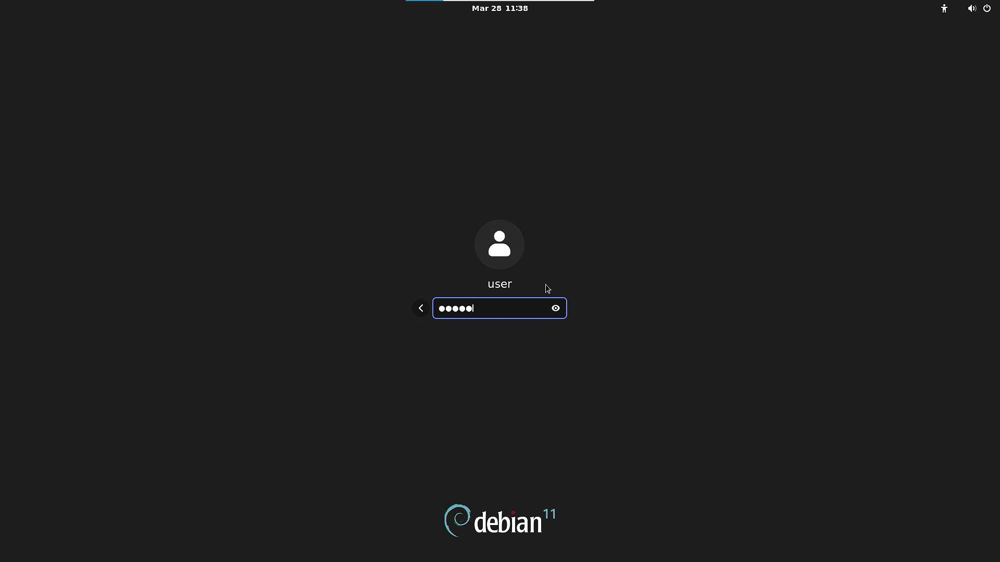

# Debian Milk-V Mars 测试报告

## 测试环境

### 操作系统信息

- 系统版本：Debian 12 (bookworm/sid，Milk-V官方定制的版本)
- 下载链接：<https://github.com/milkv-mars/mars-buildroot-sdk/releases/> (Milk-V 官方提供的 Debian 镜像)
- 参考安装文档：<https://milkv.io/zh/docs/mars/getting-started/boot>

### 硬件开发板信息

- Milk-V Mars (8GB RAM)
- USB 电源适配器和USB-A to C 或 C to C 线缆一条
- microSD 卡一张
- USB to UART 调试器一个（如：CH340, CH341, FT2232 等）
- HDMI线缆、USB鼠标、USB键盘

## 安装步骤

### 刷写镜像

使用 `unzip` 解压镜像。然后使用 `dd`命令或者使用 `balenaEther` 软件将镜像写入 microSD 卡 (假设 `/dev/sdc` 为 microSD卡设备)

```bash
unzip mars_debian-desktop_sdk-v3.6.1_sdcard_v1.0.6.img.zip

sudo dd if=mars_debian-desktop_sdk-v3.6.1_sdcard_v1.0.6.img of=/dev/sdX bs=1M status=progress

sync
```

### 登录系统

通过串口登录系统。

默认用户名： `user`

默认密码： `milkv`

## 预期结果

系统正常启动，能够通过串口登录，连接HDMI至显示屏能够正常显示登录图像，并支持USB鼠标和USB键盘。

## 实际结果

系统正常启动，成功通过串口查看输出，连接HDMI至显示屏能够正常显示登录图像，并支持USB鼠标和USB键盘。

### 启动信息

```log
Debian GNU/LinuxDebian GNU/Linux bookworm/sid milkv hvc0

milkv login:  bookworm/sid milkv ttyS0

milkv login: user
Password: 
Linux milkv 5.15.0 #1 SMP Mon Nov 13 18:56:24 CST 2023 riscv64

The programs included with the Debian GNU/Linux system are free software;
the exact distribution terms for each program are described in the
individual files in /usr/share/doc/*/copyright.

Debian GNU/Linux comes with ABSOLUTELY NO WARRANTY, to the extent
permitted by applicable law.
user@milkv:~$ cat /etc/os-release 
PRETTY_NAME="Debian GNU/Linux bookworm/sid"
NAME="Debian GNU/Linux"
VERSION_CODENAME=bookworm
ID=debian
HOME_URL="https://www.debian.org/"
SUPPORT_URL="https://www.debian.org/support"
BUG_REPORT_URL="https://bugs.debian.org/"
BUILD_ID=40
user@milkv:~$ uname -a
Linux milkv 5.15.0 #1 SMP Mon Nov 13 18:56:24 CST 2023 riscv64 GNU/Linux
user@milkv:~$ 

```

登录的图形界面：



> [!Note]
> 由于刷入的镜像为Milk-V官方定制的系统，此处登录界面显示的是`Debian 11`，而不是`Debian 12`。

桌面的图形界面：


## 测试判定标准

测试成功：实际结果与预期结果相符。

测试失败：实际结果与预期结果不符。

## 测试结论

测试成功
