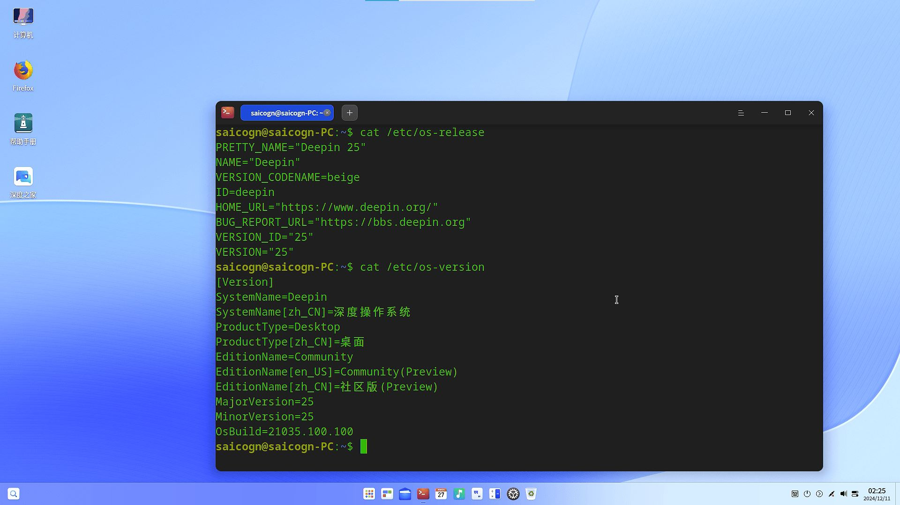

# Deepin Milk-V Mars Test Report

## Test Environment

### Operating System Information

- System Version: Deepin 25 preview
- Download Link: <https://cdimage.deepin.com/RISC-V/preview-20240613-riscv64/deepin-23-beige-preview-riscv64-milkv-mars-20240613-123442.tar.xz>
- Reference Installation Document:
  1. <https://milkv.io/zh/docs/mars/getting-started/boot>
  2. <https://deepin-community.github.io/sig-deepin-ports/docs/install/riscv/jh7110>

### Hardware Information

- Milk-V Mars (8GB RAM)
- A USB power adapter and A USB-A to C or C to C cable
- A microSD card
- A USB to UART debugger (e.g., CH340, CH341, FT2232, etc.)
- A HDMI cable, A USB Mouse and A USB Keyboard

## Installation Steps

### Decompress and Flash Image to microSD Card

- Merhod 1: Use `tar` to decompress the image,  and then use `dd` to flash the image to the microSD card. (Assuming `/dev/sdc` is the microSD card device)

    ```bash
    tar -xvf deepin-25-beige-preview-riscv64-jh7110-20250122-110620.tar.xz
    sudo dd if=deepin-jh7110-riscv64-25-desktop-installer.img of=/dev/sdc bs=4M status=progress
    sync
    ```

- Method 2: After extracting the image, use the `balenaEtcher` software to write the image to the microSD card.

  (The software may prompt verification failure when writing data. This does not affect the system startup)

#### Issue: unable to mount root file system

The image written by the `dd` command may fail to mount the file system when Mars is started, and the log output from the serial port is similar to:

```log
Failed to mount /dev/mmcblk1p4 as root file system.
```

or

```log
Kernel panic - not syncing: VFS: Unable to mount root fs on unknown-block(0,0)
```

A fix in the boot file is needed.

Run `sudo blkid` on your machine, you shall see something like:

```log
(base) saicogn-rk@saicogn-rk:~$ sudo blkid
···
/dev/sdc2: PARTLABEL="uboot" PARTUUID="9e4d5fa7-f661-47a8-b030-11716a2c8ce0"
/dev/sdc3: UUID="FD25-40C1" BLOCK_SIZE="512" TYPE="vfat" PARTLABEL="image" PARTUUID="32c1a23d-90dc-474a-8b66-5311eaedd664"
/dev/sdc1: PARTLABEL="spl" PARTUUID="9901194f-ec08-46c5-9a37-eb16fe970169"
/dev/sdc4: LABEL="root" UUID="341baff8-3ca3-41a7-b75d-3f49703f8948" BLOCK_SIZE="4096" TYPE="ext4" PARTLABEL="root" PARTUUID="cffa6d69-9765-4e90-be7c-208562d41b87"
···
```

Remember the PARTUUID of the `root` partition, as the log above `/dec/sdc4`, it's `PARTUUID="cffa6d69-9765-4e90-be7c-208562d41b87"`

Modify the `extlinux/extlinux.conf` file in the third partition `FD25-40C1`. Replace `root=LABEL=root` with `root=PARTUUID=$(your partuuid)`

Umount and reboot on the board, now you should boot up normally.

### Logging into the System

Log into the system via the serial port.

Default username: `root`

Default password: `deepin`

## Expected Results

The system should boot up normally and allow login via the serial port. After connect HDMI to the display screen can normally display the login image, and supports USB mouse and USB keyboard.

## Actual Results

The system starts normally and the output is successfully viewed through the serial port. After connect HDMI to the display screen can normally display the login image, and supports USB mouse and USB keyboard.

### Boot Log

```log
Deepin GNU/Linux 23 deepin-riscv64-jh7110 ttyS0

deepin-riscv64-jh7110 login: root
Password:
Verification successful
Linux deepin-riscv64-jh7110 6.6.20-jh7110-starfive-66y #1 SMP Tue Oct 15 05:00:45 UTC 2024 riscv64
Welcome to deepin 25 GNU/Linux

    * Homepage: https://www.deepin.org/

    * Bugreport: https://bbs.deepin.org/


root@deepin-riscv64-jh7110:~# cat /etc/os-release
PRETTY_NAME="Deepin 25"
NAME="Deepin"
VERSION_CODENAME=beige
ID=deepin
HOME_URL="https://www.deepin.org/"
BUG_REPORT_URL="https://bbs.deepin.org"
VERSION_ID="25"
VERSION="25"

root@deepin-riscv64-jh7110:~# cat /etc/os-version
[Version]
SystemName=Deepin
SystemName[zh_CN]=深度操作系统
ProductType=Desktop
ProductType[zh_CN]=桌面
EditionName=Community
EditionName[en_US]=Community(Preview)
EditionName[zh_CN]=社区版(Preview)
MajorVersion=25
MinorVersion=25
OsBuild=21035.100.100

root@deepin-riscv64-jh7110:~# cat /proc/cpuinfo
processor       : 0
hart            : 1
isa             : rv64imafdc_zicntr_zicsr_zifencei_zihpm_zba_zbb
mmu             : sv39
uarch           : sifive,u74-mc
mvendorid       : 0x489
marchid         : 0x8000000000000007
mimpid          : 0x4210427

processor       : 1
hart            : 2
isa             : rv64imafdc_zicntr_zicsr_zifencei_zihpm_zba_zbb
mmu             : sv39
uarch           : sifive,u74-mc
mvendorid       : 0x489
marchid         : 0x8000000000000007
mimpid          : 0x4210427

processor       : 2
hart            : 3
isa             : rv64imafdc_zicntr_zicsr_zifencei_zihpm_zba_zbb
mmu             : sv39
uarch           : sifive,u74-mc
mvendorid       : 0x489
marchid         : 0x8000000000000007
mimpid          : 0x4210427

processor       : 3
hart            : 4
isa             : rv64imafdc_zicntr_zicsr_zifencei_zihpm_zba_zbb
mmu             : sv39
uarch           : sifive,u74-mc
mvendorid       : 0x489
marchid         : 0x8000000000000007
mimpid          : 0x4210427

root@deepin-riscv64-jh7110:~#
```

GUI for login ：



GUI for desktop：


## Test Criteria

Successful: The actual result matches the expected result.

Failed: The actual result does not match the expected result.

## Test Conclusion

Test successful.
