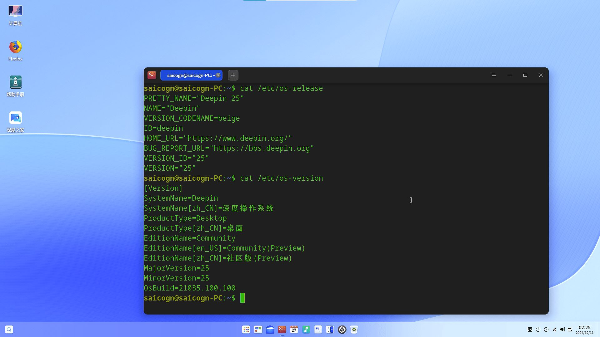
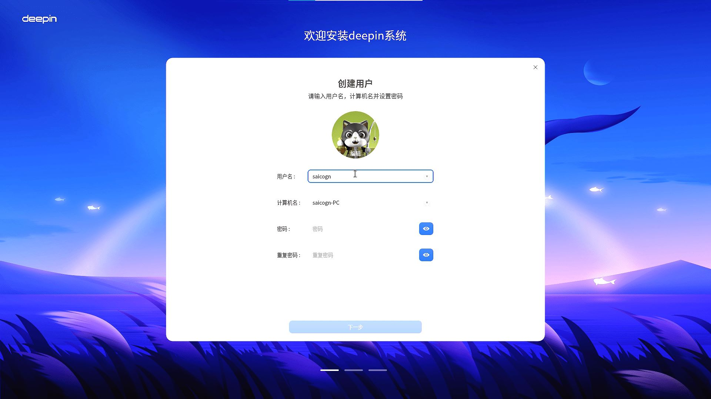

# Deepin Milk-V Mars 测试报告

## 测试环境

### 操作系统信息

- 系统版本：Deepin 25 preview (20250122-110620更新版本)
- 下载链接：<https://ci.deepin.com/repo/deepin/deepin-ports/cdimage/20250122/riscv64/deepin-25-beige-preview-riscv64-jh7110-20250122-110620.tar.xz>
- 参考安装文档：
  1. <https://milkv.io/zh/docs/mars/getting-started/boot>
  2. <https://deepin-community.github.io/sig-deepin-ports/docs/install/riscv/jh7110>

### 硬件信息

- Milk-V Mars (8GB RAM)
- USB 电源适配器和USB-A to C 或 C to C 线缆一条
- microSD 卡一张
- USB to UART 调试器一个（如：CH340, CH341, FT2232 等）
- HDMI线缆、USB鼠标、USB键盘

## 安装步骤

### 解压并刷写镜像到 microSD 卡

- 方法1：使用 `tar` 解压镜像，并使用 `dd` 将镜像写入 microSD 卡。（假定`/dev/sdc`为microSD 卡设备）

    ```bash
    tar -xvf deepin-25-beige-preview-riscv64-jh7110-20250122-110620.tar.xz
    sudo dd if=deepin-jh7110-riscv64-25-desktop-installer.img of=/dev/sdX bs=4M status=progress
    sync
    ```

- 方法2：解压镜像后使用 `balenaEtcher` 软件将镜像写入microSD 卡。
  
  （写入时软件可能提示验证失败，不影响系统正常启动）

#### Issue: unable to mount root file system

使用 `dd`命令写入的镜像，在Mars启动时可能会出现无法挂载文件系统的问题，串口输出的log类似于:

```log
Failed to mount /dev/mmcblk1p4 as root file system.
```

或者

```log
Kernel panic - not syncing: VFS: Unable to mount root fs on unknown-block(0,0)
```

此处可以手动修复镜像中的启动文件。挂载SD卡至PC，运行 `sudo blkid`，查找所有挂载的文件系统，部分log如下：

```log
(base) saicogn-rk@saicogn-rk:~$ sudo blkid
···
/dev/sdc2: PARTLABEL="uboot" PARTUUID="9e4d5fa7-f661-47a8-b030-11716a2c8ce0"
/dev/sdc3: UUID="FD25-40C1" BLOCK_SIZE="512" TYPE="vfat" PARTLABEL="image" PARTUUID="32c1a23d-90dc-474a-8b66-5311eaedd664"
/dev/sdc1: PARTLABEL="spl" PARTUUID="9901194f-ec08-46c5-9a37-eb16fe970169"
/dev/sdc4: LABEL="root" UUID="341baff8-3ca3-41a7-b75d-3f49703f8948" BLOCK_SIZE="4096" TYPE="ext4" PARTLABEL="root" PARTUUID="cffa6d69-9765-4e90-be7c-208562d41b87"
···
```

记下SD卡 `root`分区的 `PARTUUID`，如上是 `/dec/sdc4` 分区的 `PARTUUID="cffa6d69-9765-4e90-be7c-208562d41b87"`。

修改第三分区`FD25-40C1`下的 `extlinux/extlinux.conf` 文件。将其中的 `root=LABEL=root` 替换为 `root=PARTUUID=$(your partuuid)`

将SD卡解挂载后重新在开发板上启动，现在它应该正常了。

### 登录系统

通过串口登录系统。

默认用户名：`root`

默认密码：`deepin`

## 预期结果

系统正常启动，能够通过串口登录，连接HDMI至显示屏能够正常显示登录图像，并支持USB鼠标和USB键盘。

## 实际结果

系统正常启动，成功通过串口查看输出，连接HDMI至显示屏能够正常显示登录图像，并支持USB鼠标和USB键盘。

### 启动信息

```log
Deepin GNU/Linux 23 deepin-riscv64-jh7110 ttyS0

deepin-riscv64-jh7110 login: root
Password:
Verification successful
Linux deepin-riscv64-jh7110 6.6.20-jh7110-starfive-66y #1 SMP Tue Oct 15 05:00:45 UTC 2024 riscv64
Welcome to deepin 25 GNU/Linux

    * Homepage: https://www.deepin.org/

    * Bugreport: https://bbs.deepin.org/


root@deepin-riscv64-jh7110:~# cat /etc/os-release
PRETTY_NAME="Deepin 25"
NAME="Deepin"
VERSION_CODENAME=beige
ID=deepin
HOME_URL="https://www.deepin.org/"
BUG_REPORT_URL="https://bbs.deepin.org"
VERSION_ID="25"
VERSION="25"

root@deepin-riscv64-jh7110:~# cat /etc/os-version
[Version]
SystemName=Deepin
SystemName[zh_CN]=深度操作系统
ProductType=Desktop
ProductType[zh_CN]=桌面
EditionName=Community
EditionName[en_US]=Community(Preview)
EditionName[zh_CN]=社区版(Preview)
MajorVersion=25
MinorVersion=25
OsBuild=21035.100.100

root@deepin-riscv64-jh7110:~# cat /proc/cpuinfo
processor       : 0
hart            : 1
isa             : rv64imafdc_zicntr_zicsr_zifencei_zihpm_zba_zbb
mmu             : sv39
uarch           : sifive,u74-mc
mvendorid       : 0x489
marchid         : 0x8000000000000007
mimpid          : 0x4210427

processor       : 1
hart            : 2
isa             : rv64imafdc_zicntr_zicsr_zifencei_zihpm_zba_zbb
mmu             : sv39
uarch           : sifive,u74-mc
mvendorid       : 0x489
marchid         : 0x8000000000000007
mimpid          : 0x4210427

processor       : 2
hart            : 3
isa             : rv64imafdc_zicntr_zicsr_zifencei_zihpm_zba_zbb
mmu             : sv39
uarch           : sifive,u74-mc
mvendorid       : 0x489
marchid         : 0x8000000000000007
mimpid          : 0x4210427

processor       : 3
hart            : 4
isa             : rv64imafdc_zicntr_zicsr_zifencei_zihpm_zba_zbb
mmu             : sv39
uarch           : sifive,u74-mc
mvendorid       : 0x489
marchid         : 0x8000000000000007
mimpid          : 0x4210427

root@deepin-riscv64-jh7110:~#
```

登录的图形界面：



桌面的图形界面：



## 测试判定标准

测试成功：实际结果与预期结果相符。

测试失败：实际结果与预期结果不符。

## 测试结论

测试成功
