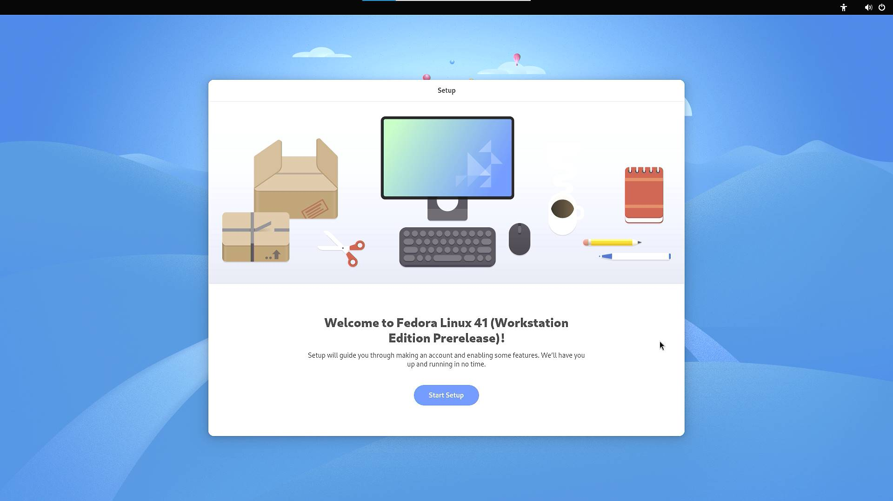
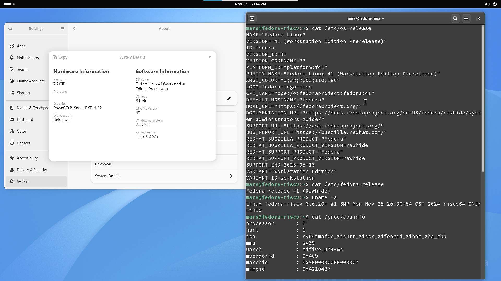

# Fedora Milk-V Mars Test Report

## Test Environment

### Operating System Information

- System Version: Fedora 41 Workstation (20241201-091200 update version)
- Download Link: <https://mirror.iscas.ac.cn/fedora-riscv/dl/StarFive/visionfive2/images/fedora-disk-gnome-workstation_starfive_vf2_f41_20241201091200.raw.gz>
- Reference Installation Document:
  1. <https://milkv.io/zh/docs/mars/getting-started/boot>
  2. <https://images.fedoravforce.org/Mars>

### Hardware Information

- Milk-V Mars (8GB RAM)
- A USB power adapter and A USB-A to C or C to C cable
- A microSD card
- A USB to UART debugger (e.g., CH340, CH341, FT2232, etc.)
- A HDMI cable, A USB Mouse and A USB Keyboard

## Installation Steps

### Decompress and Flash Image to microSD Card

- Use `gzip` to decompress the image,  and then use `dd` command or `balenaEtcher` software to flash the image to the microSD card. (Assuming `/dev/sdc` is the microSD card device)

    ```bash
    wget https://mirror.iscas.ac.cn/fedora-riscv/dl/StarFive/visionfive2/images/fedora-disk-gnome-workstation_starfive_vf2_f41_20241201091200.raw.gz

    gzip -d fedora-disk-gnome-workstation_starfive_vf2_f41_20241201091200.raw.gz

    sudo dd if=fedora-disk-gnome-workstation_starfive_vf2-sda.raw of=/dev/sdc bs=1M status=progress

    sync
    ```

### Logging into the System

Log into the system via the serial port.

Default username: `root`

Default password: `riscv`

## Expected Results

The system should boot up normally and allow login via the serial port. After connect HDMI to the display screen can normally display the login image, and supports USB mouse and USB keyboard.

## Actual Results

The system starts normally and the output is successfully viewed through the serial port. After connect HDMI to the display screen can normally display the login image, and supports USB mouse and USB keyboard.

### Boot Log

```log
Welcome to the Fedora RISC-V disk image
https://openkoji.iscas.ac.cn/koji/

Build date: Sat Nov 30 15:56:44 UTC 2024

Kernel 6.6.20+ on an riscv64 (ttyS0)

The root password is 'riscv'.
root password logins are disabled in SSH starting Fedora.

If DNS isn’t working, try editing ‘/etc/yum.repos.d/fedora-riscv.repo’.

For updates and latest information read:
https://fedoraproject.org/wiki/Architectures/RISC-V

Fedora RISC-V
-------------
fedora-riscv login: root
Password:
[root@fedora-riscv ~]# cat /etc/os-release
NAME="Fedora Linux"
VERSION="41 (Workstation Edition Prerelease)"
ID=fedora
VERSION_ID=41
VERSION_CODENAME=""
PLATFORM_ID="platform:f41"
PRETTY_NAME="Fedora Linux 41 (Workstation Edition Prerelease)"
ANSI_COLOR="0;38;2;60;110;180"
LOGO=fedora-logo-icon
CPE_NAME="cpe:/o:fedoraproject:fedora:41"
DEFAULT_HOSTNAME="fedora"
HOME_URL="https://fedoraproject.org/"
DOCUMENTATION_URL="https://docs.fedoraproject.org/en-US/fedora/rawhide/system-administrators-guide/"
SUPPORT_URL="https://ask.fedoraproject.org/"
BUG_REPORT_URL="https://bugzilla.redhat.com/"
REDHAT_BUGZILLA_PRODUCT="Fedora"
REDHAT_BUGZILLA_PRODUCT_VERSION=rawhide
REDHAT_SUPPORT_PRODUCT="Fedora"
REDHAT_SUPPORT_PRODUCT_VERSION=rawhide
SUPPORT_END=2025-05-13
VARIANT="Workstation Edition"
VARIANT_ID=workstation

[root@fedora-riscv ~]# cat /etc/fedora-release
Fedora release 41 (Rawhide)

[root@fedora-riscv ~]# uname -a
Linux fedora-riscv 6.6.20+ #1 SMP Mon Nov 25 20:30:54 CST 2024 riscv64 GNU/Linux

[root@fedora-riscv ~]# cat /proc/cpuinfo
processor       : 0
hart            : 1
isa             : rv64imafdc_zicntr_zicsr_zifencei_zihpm_zba_zbb
mmu             : sv39
uarch           : sifive,u74-mc
mvendorid       : 0x489
marchid         : 0x8000000000000007
mimpid          : 0x4210427

processor       : 1
hart            : 2
isa             : rv64imafdc_zicntr_zicsr_zifencei_zihpm_zba_zbb
mmu             : sv39
uarch           : sifive,u74-mc
mvendorid       : 0x489
marchid         : 0x8000000000000007
mimpid          : 0x4210427

processor       : 2
hart            : 3
isa             : rv64imafdc_zicntr_zicsr_zifencei_zihpm_zba_zbb
mmu             : sv39
uarch           : sifive,u74-mc
mvendorid       : 0x489
marchid         : 0x8000000000000007
mimpid          : 0x4210427

processor       : 3
hart            : 4
isa             : rv64imafdc_zicntr_zicsr_zifencei_zihpm_zba_zbb
mmu             : sv39
uarch           : sifive,u74-mc
mvendorid       : 0x489
marchid         : 0x8000000000000007
mimpid          : 0x4210427

[root@fedora-riscv ~]#
```

GUI for login ：



GUI for desktop：



## Test Criteria

Successful: The actual result matches the expected result.

Failed: The actual result does not match the expected result.

## Test Conclusion

Test successful.
