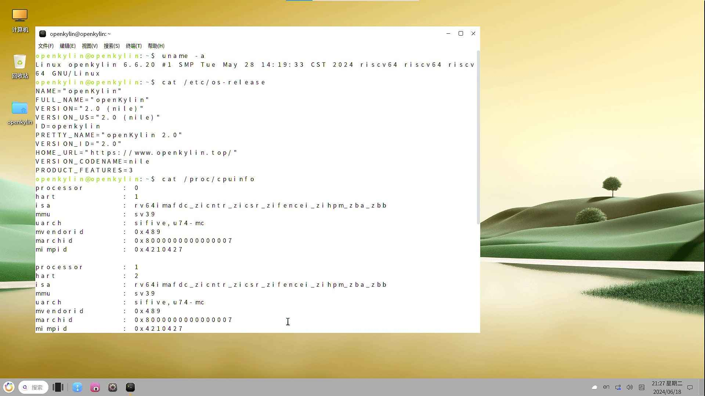

# openKylin 2.0 SP1 Milk-V Mars 测试报告

## 测试环境

### 操作系统信息

- 系统版本：openKylin 2.0 SP1
- 下载链接：<https://www.openkylin.top/downloads/>
- 参考安装文档：
  - <https://milkv.io/zh/docs/mars/getting-started/boot>
  - <https://docs.openkylin.top/zh/01_%E5%AE%89%E8%A3%85%E5%8D%87%E7%BA%A7%E6%8C%87%E5%8D%97/%E5%9C%A8riscv%E4%B8%8A%E5%AE%89%E8%A3%85/%E5%9C%A8VisionFive2%E4%B8%8A%E5%AE%89%E8%A3%85openKylin>

### 硬件信息

- Milk-V Mars (8GB RAM)
- USB 电源适配器和USB-A to C 或 C to C 线缆一条
- microSD 卡一张
- USB to UART 调试器一个（如：CH340, CH341, FT2232 等）
- HDMI线缆、USB鼠标、USB键盘

## 安装步骤

### 解压并刷写镜像到 microSD 卡

使用 `xz` 解压镜像，并使用 `dd` 命令或者 `balenaEtcher` 软件将镜像写入 microSD 卡。（假定/dev/sdc为microSD 卡设备）

```bash
xz -d openKylin-Embedded-V2.0-SP1-visionfive2-riscv64.img.xz

sudo dd if=openKylin-Embedded-V2.0-SP1-visionfive2-riscv64.img of=/dev/sdc bs=1M status=progress

sync
```

### 引导模式选择

Milk-V Mars 在硬件版本V1.2后提供了多种引导模式，可在上电前通过板载拨码开关进行配置；开发板本体上亦有丝印标注。

为了启动 openKylin 镜像，选择 SPI Flash 启动模式（即：`GPIO_0 = 0`, `GPIO_1 = 0`）。注意，此模式可能需要提前更新 Flash 内的固件。

### 登录系统

通过串口登录系统。

默认用户名：`openkylin`

默认密码：`openkylin`

## 预期结果

系统正常启动，能够通过串口登录。连接HDMI至显示屏能够正常显示登录图像，并支持USB鼠标和USB键盘。

## 实际结果

系统正常启动，成功通过串口查看输出。连接HDMI至显示屏能够正常显示登录图像，并支持USB鼠标和USB键盘。

### 启动信息

```log
openKylin 2.0 openkylin ttyS0

openkylin login: [  OK  ] Started user@105.service - User Manager for UID 105.
[  OK  ] Started session-c1.scope - Session c1 of User lightdm.
         Starting rtkit-daemon.service - Re…imeKit Scheduling Policy Service...
[  OK  ] Started rtkit-daemon.service - RealtimeKit Scheduling Policy Service.
         Starting upower.service - Daemon for power management...
[  OK  ] Started upower.service - Daemon for power management.
         Starting NetworkManager-dispatcher…anager Script Dispatcher Service...
[  OK  ] Started NetworkManager-dispatcher.… Manager Script Dispatcher Service.
[  OK  ] Started nmbd.service - Samba NMB Daemon.
         Starting smbd.service - Samba SMB Daemon...
[  OK  ] Started smbd.service - Samba SMB Daemon.
[  OK  ] Reached target multi-user.target - Multi-User System.
[  OK  ] Reached target graphical.target - Graphical Interface.
         Starting systemd-update-utmp-runle…- Record Runlevel Change in UTMP...
[  OK  ] Finished systemd-update-utmp-runle…e - Record Runlevel Change in UTMP.

openkylin login: openkylin
密码：
Welcome to openKylin 2.0 (GNU/Linux 6.6.20 riscv64)

 * Support:        https://openkylin.top

The programs included with the openKylin system are free software;
the exact distribution terms for each program are described in the
individual files in /usr/share/doc/*/copyright.

openKylin comes with ABSOLUTELY NO WARRANTY, to the extent permitted by
applicable law.

You do not have any new mail.
load environment: QT_ACCESSIBILITY=1
load environment: PATH=/usr/local/sbin:/usr/local/bin:/usr/sbin:/usr/bin:/sbin:/bin:/usr/games:/usr/local/games:/snap/bin
openkylin@openkylin:~$ 

openkylin@openkylin:~$ uname -a
Linux openkylin 6.6.20 #1 SMP Tue May 28 14:19:33 CST 2024 riscv64 riscv64 riscv64 GNU/Linux

openkylin@openkylin:~$ cat /etc/os-release
NAME="openKylin"
FULL_NAME="openKylin"
VERSION="2.0 (nile)"
VERSION_US="2.0 (nile)"
ID=openkylin
PRETTY_NAME="openKylin 2.0"
VERSION_ID="2.0"
HOME_URL="https://www.openkylin.top/"
VERSION_CODENAME=nile
PRODUCT_FEATURES=3

openkylin@openkylin:~$ cat /proc/cpuinfo
processor       : 0
hart            : 1
isa             : rv64imafdc_zicntr_zicsr_zifencei_zihpm_zba_zbb
mmu             : sv39
uarch           : sifive,u74-mc
mvendorid       : 0x489
marchid         : 0x8000000000000007
mimpid          : 0x4210427

processor       : 1
hart            : 2
isa             : rv64imafdc_zicntr_zicsr_zifencei_zihpm_zba_zbb
mmu             : sv39
uarch           : sifive,u74-mc
mvendorid       : 0x489
marchid         : 0x8000000000000007
mimpid          : 0x4210427

processor       : 2
hart            : 3
isa             : rv64imafdc_zicntr_zicsr_zifencei_zihpm_zba_zbb
mmu             : sv39
uarch           : sifive,u74-mc
mvendorid       : 0x489
marchid         : 0x8000000000000007
mimpid          : 0x4210427

processor       : 3
hart            : 4
isa             : rv64imafdc_zicntr_zicsr_zifencei_zihpm_zba_zbb
mmu             : sv39
uarch           : sifive,u74-mc
mvendorid       : 0x489
marchid         : 0x8000000000000007
mimpid          : 0x4210427

openkylin@openkylin:~$
```

桌面的图形界面：



## 测试判定标准

测试成功：实际结果与预期结果相符。

测试失败：实际结果与预期结果不符。

## 测试结论

测试成功
