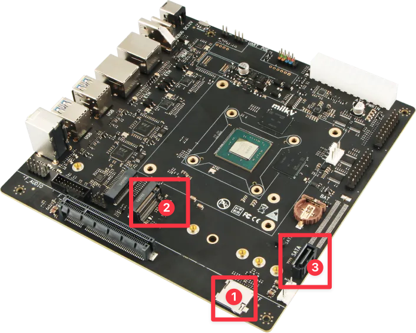
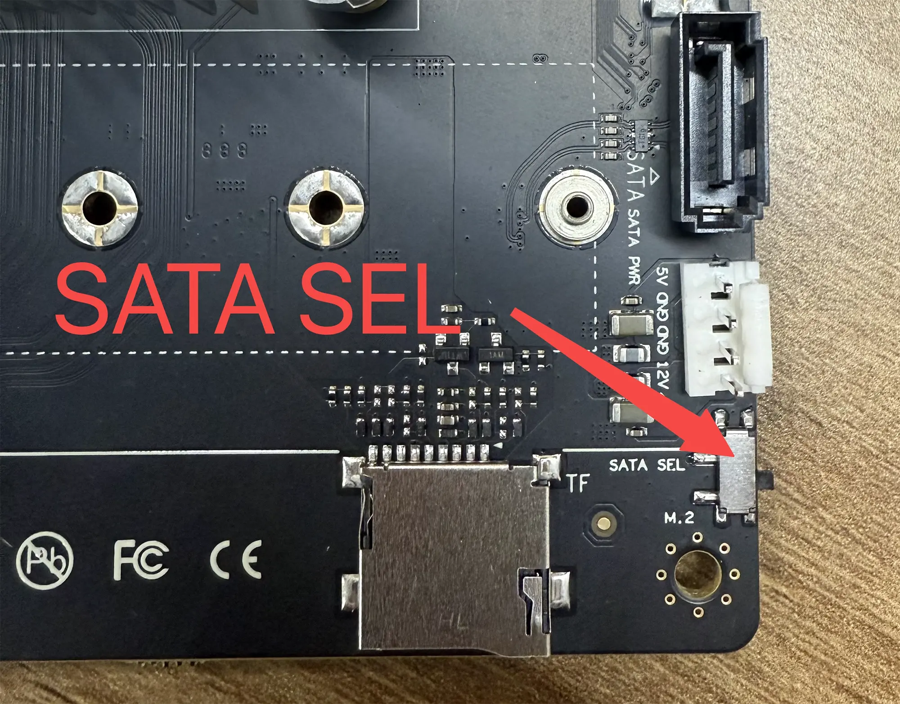
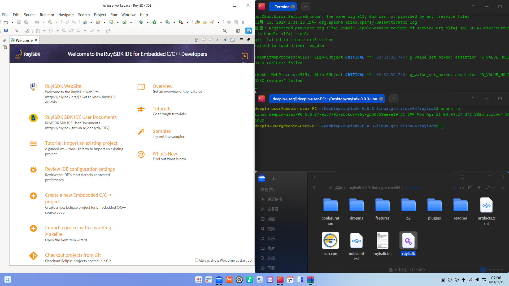

## Test Environment

### Operating System Information

- System Version: deepin 25-crimson-preview EIC7700 20250422
- Download Link: https://ci.deepin.com/repo/deepin/deepin-ports/cdimage/20250422/riscv64/deepin-25-crimson-preview-riscv64-eic7700-20250422-122731.tar.xz
- Reference Installation Document: https://milkv.io/zh/docs/megrez/getting-started/boot

### Hardware Information

- Development Board: Milk-V Megrez
- USB A to C / USB C to C Cable
- One of the following storage device:
  - MicroSD Card
  - SATA M.2 SSD
  - SATA3 hard drive + 7-pin SATA connector + 15-pin SATA power connector

## Installation Steps

Figure 1: Position of each interface



Figure 2: SATA SEL Switch



### Flashing Image to the SD Card

First, partition your SD Card into `boot` and `root`. Then flash the corresponding image into the partition:

``` shell
sudo dd if=deepin-eic7700-riscv64-25-desktop-installer.boot.ext4 of=/dev/sdX1 status=progress
sudo dd if=deepin-eic7700-riscv64-25-desktop-installer.root.ext4 of=/dev/sdX2 status=progress
```

Finally, Insert the SD card into the card slot shown with No.1 of figure 1.

### Flashing Image to the SATA M.2 SSD

Follow the same procedure with Flashing Image to the SD Card to flash the image into your SATA M.2 SSD. Insert the SATA M.2 SSD into the SATA M.2 interface shown with No.2 of figure 1. Finally, switch the SATA SEL to the downside shown in figure 2.

### Flasing Image to the SATA3 Hard Drive

Follow the same procedure with Flashing Image to the SD Card to flash the image into your SATA3 hard drive. Connect the 7-pin SATA interface with the SATA3 interface shown with No.3 of figure 1. Connect the 15-pin SATA power connector individually. Finally, switch the SATA SEL to the upside shown in figure 2.

### Initialize the System

Power on the machine. If you've connected a display, you can complete the deepin Installation guide

If you don't have a GUI interface, you can login via UART:

Default username: `root`
Password: `deepin`

## Expected Results

The system should boot successfully, allowing login via the GUI. RuyiSDK IDE Running successful.

## Actual Results

The system boots up successfully, and login via the GUI is successful. RuyiSDK IDE Running successful.



## Test Criteria

Successful: The actual result matches the expected result.

Failed: The actual result does not match the expected result.

## Test Conclusion

Successful
