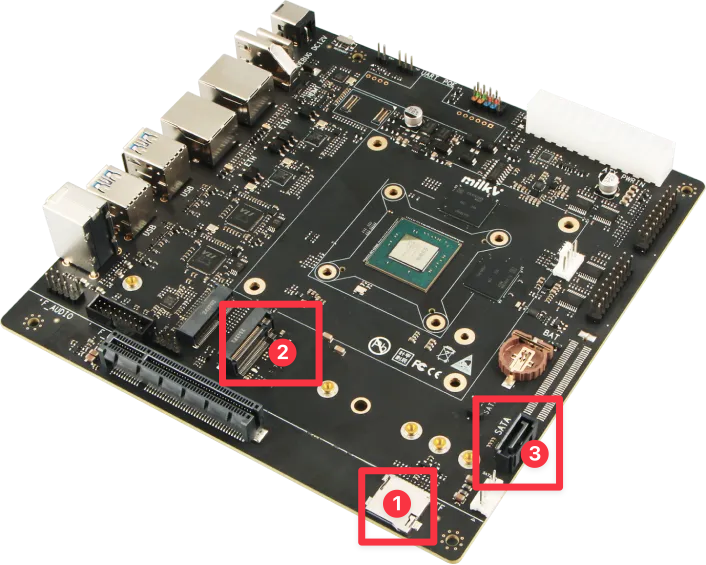

## 测试环境

### 操作系统信息

- 系统版本：deepin 25-crimson-preview EIC7700 20250422
- 下载链接：https://ci.deepin.com/repo/deepin/deepin-ports/cdimage/20250422/riscv64/deepin-25-crimson-preview-riscv64-eic7700-20250422-122731.tar.xz
- 参考安装文档：https://milkv.io/zh/docs/megrez/getting-started/boot

### 硬件信息

- 开发板：Milk-V Megrez
- USB A to C / USB C to C 线缆
- 以下存储设备之一：
  - MicroSD 卡
  - SATA M.2 SSD 硬盘
  - SATA3 硬盘 + SATA 连接线 + SATA 供电线

## 安装步骤

图一：各接口位置



图二：SATA 接口切换器


### 烧写镜像至 SD 卡

首先将SD卡分为`boot`和`root`两个分区，随后刷入对应镜像：

``` shell
sudo dd if=deepin-eic7700-riscv64-25-desktop-installer.boot.ext4 of=/dev/sdX1 status=progress
sudo dd if=deepin-eic7700-riscv64-25-desktop-installer.root.ext4 of=/dev/sdX2 status=progress
```

最后，将 SD 卡插入如图一标号 1 所示的 SD 卡槽中。

### 烧写镜像至 SATA M.2 SSD 硬盘

步骤同上。成功后，将 SATA M.2 SSD 硬盘插入设备的 SATA M.2 接口，如图一标号 2 所示，再将如图二所示所示的 SATA SEL 开关拨至图中的下方。

### 刷写操作系统至 SATA3 硬盘

步骤同上。成功后，将 SATA3 硬盘的 7-pin SATA 端子插入如图一标号 3 所示的 SATA接口，并单独连接 15 pin 供电线。最后，再将如图二所示的 SATA SEL 开关拨至图中的上方。

### 初始化系统

接通电源。如果连接了显示器，则可以通过deepin安装引导完成初始化；

同时也可以通过UART进行登录：

用户名: `root`
密码: `deepin`

## 预期结果

系统正常启动，能够通过图形界面登录，能够运行RuyiSDK IDE。

## 实际结果

系统正常启动，成功通过图形界面登录，成功运行RuyiSDK IDE。


## 测试判定标准

测试成功：实际结果与预期结果相符。

测试失败：实际结果与预期结果不符。

## 测试结论

测试成功。
