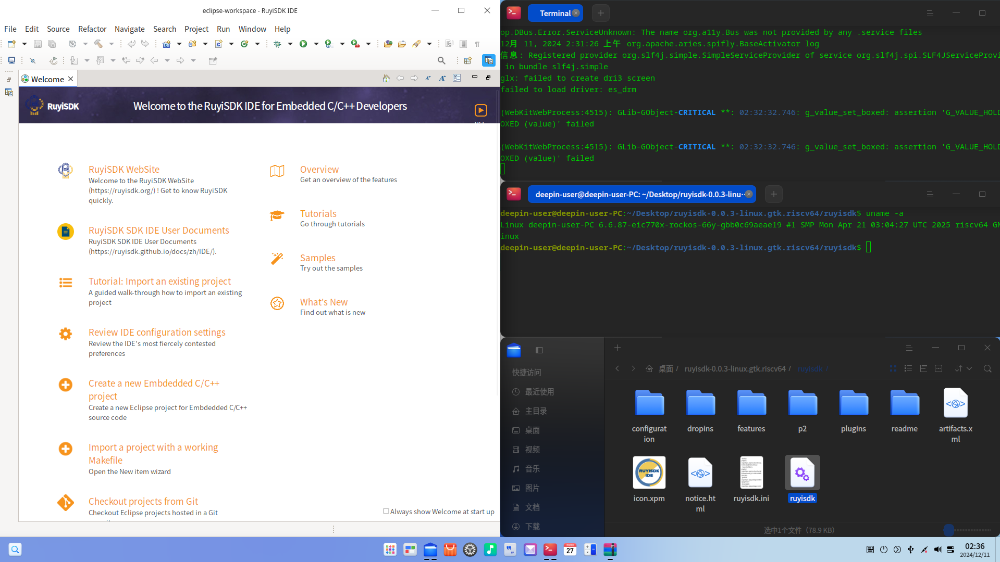

## 测试环境

### 操作系统信息

- 系统版本：Deepin 25-crimson-preview EIC7700 20250422
- 下载链接：https://deepin-community.github.io/sig-deepin-ports/images/riscv/download
- 参考安装文档：https://milkv.io/zh/docs/megrez/getting-started/boot

### 硬件信息

- 开发板：Milk-V Megrez
- USB A to C / USB C to C 线缆
- SD 卡

## 安装步骤

### 烧写镜像

首先将SD卡分为`boot`和`root`两个分区，随后刷入对应镜像：

``` shell
sudo dd if=deepin-eic7700-riscv64-25-desktop-installer.boot.ext4 of=/dev/sdd1 status=progress
sudo dd if=deepin-eic7700-riscv64-25-desktop-installer.root.ext4 of=/dev/sdd2 status=progress
```

### 初始化系统

### 初始化系统

如果连接了显示器，则可以通过Deepin安装引导完成初始化；

同时也可以通过UART进行登录：

用户名: `root`
密码: `deepin`

## 预期结果

系统正常启动，能够通过图形界面登录，能够运行RuyiSDK IDE。

## 实际结果

系统正常启动，成功通过图形界面登录，成功运行RuyiSDK IDE。



## 测试判定标准

测试成功：实际结果与预期结果相符。

测试失败：实际结果与预期结果不符。

## 测试结论

测试成功。
