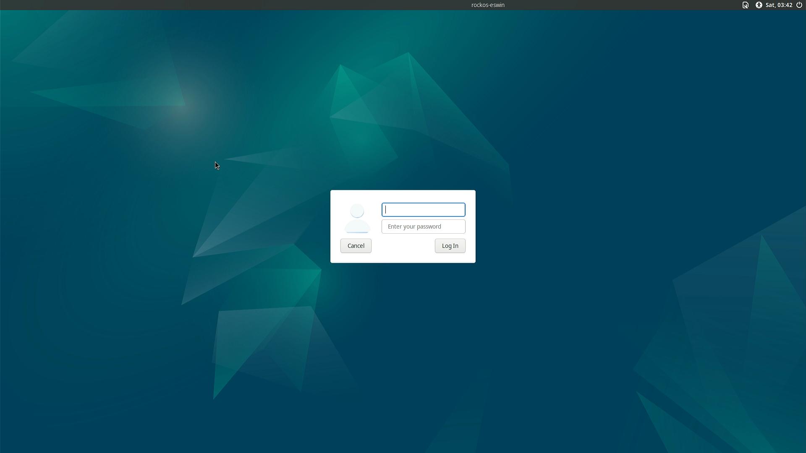
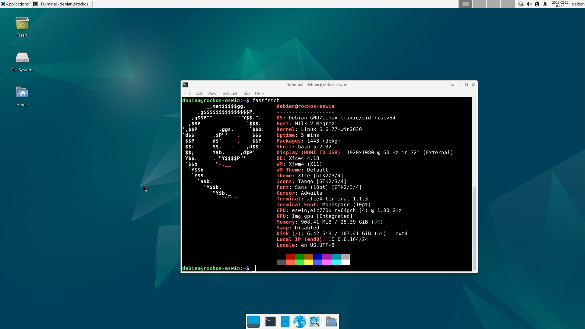

# Milk-V Megrez RockOS Test Report

## Test Environment

### Operating System Information

- Download Link: https://fast-mirror.isrc.ac.cn/rockos/images/generic/latest/
- Reference Installation Document
    - https://milkv.io/zh/docs/megrez/getting-started/boot
    - https://rockos-riscv.github.io/rockos-docs/docs/installation

### Hardware Information

- Board: Milk-V Megrez 16G/32G
- USB A to C / USB C to C Cable
- DC 12V / ATX PSU
- eMMC module / M.2 SATA SSD / PCI-E SSD (adapter card required for M.2 NVMe SSD) / microSD
- (Optional) Keyboard, mouse, monitor
- (Optional) M.2 SDIO Wi-Fi Module
- (Optional) A USB drive formatted in FAT32 or EXT4 to upgrade firmware
    - Or you may use `dhcp` or `tftpboot` instead, which requires ethernet connection and a TFTP server setup on your computer
- (Optional) A M.2 SATA or M.2 NVMe / PCI-E SSD to USB enclosure
    - For flashing the image to into SSD
- (Optional) microSD card reader

## Installation Steps

### Download and decompress the files

```shell
wget https://fast-mirror.isrc.ac.cn/rockos/images/generic/latest/boot-rockos-20250219-091803.ext4.zst \
     https://fast-mirror.isrc.ac.cn/rockos/images/generic/latest/root-rockos-20250219-091803.ext4.zst \
     https://fast-mirror.isrc.ac.cn/rockos/images/generic/latest/bootloader_secboot_ddr5_milkv-megrez.bin
# Assume you have zstd installed
zstd -d *.zst
```

If you want to flash the firmware to an SSD or microSD card, download these files instead:

```shell
wget https://fast-mirror.isrc.ac.cn/rockos/images/generic/latest/bootloader_secboot_ddr5_milkv-megrez.bin \
     https://fast-mirror.isrc.ac.cn/rockos/images/generic/latest/sdcard-rockos-20250219-091803.img.zst
zstd -d *.zst
```

If you want to upgrade bootchain via a USB drive, copy the `bootloader_secboot_ddr5_milkv-megrez.bin` file into the drive's first FAT32/EXT4 partition.

You can rename it to a shorter file name for convenience.

### Flashing Image

#### Upgrading bootchain firmware (recommended)

First of all we should upgrade the firmware, a.k.a. bootchain for EIC7700X boards.

In short, you need to load the firmware into RAM, then run `es_burn` to write the firmware to onboard SPI Flash.

To load the bootchain file, you have a few options:

- From an internal or external storage device
    - `ext4load`
    - `fatload`
- From network / LAN
    - `tftpboot`
    - `dhcp`

1. Connect the onboard USB Type-C "Debug" port to your computer.

You will see a `CH340` USB to UART serial device showing up.

2. Use tools like `tio`, `minicom` or the classic `PuTTY` to open the UART serial terminal.

The default baud rate is `115200`.

3. Now plug in the power. Megrez should automatically power on.

Make sure your boot device is properly installed before powering on.

If you want to upgrade via a USB drive, plug it in before powering on. Make sure you plugged into the two ports near the 3.5mm ports, otherwise it might not be picked up in U-Boot.

4. While the console prompts `Autoboot in 5 seconds`, press `s` to stop the autoboot.

##### Upgrade via USB drive

1. Check if the USB Drive is detected: `usb info`

If you plugged the USB drive after boot, you need `usb reset` to rescan USB devices.

2.1. If your drive is FAT32: `fatload usb 0 0x90000000 bootloader_secboot_ddr5_milkv-megrez.bin`

2.2. If your drive is EXT4: `ext4load usb 0 0x9000000 0bootloader_secboot_ddr5_milkv-megrez.bin`

3. Flash the firmware and reboot: `es_burn write 0x90000000 flash; reset`

4. After rebooting, it is recommended to reset U-Boot env vars to default and save:

```shell
env default -a -f; env save; reset
```

Other wise you might see your MAC address is regenerated on every boot.

##### Upgrade via TFTP

Set up a TFTP Server.

For Windows you may use TFTPd64, for Linux you may use `tftp-hpa`, `atftp`, or even `dnsmasq` has a TFTP server built in.

Please check your distros' documations for usage.

Or you may want to check out Arch Wiki [here](https://wiki.archlinux.org/title/TFTP#Server).

Make sure the TFTP server is serving the `bootloader_secboot_ddr5_milkv-megrez.bin` file at the root directory.

Then check your computer's LAN IP.

Make sure the board is plugged in to ethernet.

After interrupting the autoboot, type:

```shell
dhcp 0x90000000 $hostIPaddr:bootloader_secboot_ddr5_milkv-megrez.bin
es_burn write 0x90000000 flash; reset
```

As said above, it is recommended to reset U-Boot env vars to default and save after upgrading:

```shell
env default -a -f; env save; reset
```

Other wise you might see your MAC address is regenerated on every boot.

#### Flash to eMMC via `fastboot`

After upgrading the bootchain, power on the board, type `s` to interrupt autoboot, then following these steps:

1. In U-Boot console: `fastboot usb 0`

2. Find the `RECOVERY` switch beside the DC barrel jack. Flip it to `RECOVERY` mode. Your computer should pick up a `USB download gadget` / `Android Bootloader Interface`.

3. Use `fastboot` to flash the firmware.

(On Linux, you'll need `sudo`, or add VID:PID 3452:7700 to your udev rules.)

```shell
fastboot flash boot boot-rockos-20250219-091803.ext4
fastboot flash root root-rockos-20250219-091803.ext4
```

4. Wait for the flashing process to complete. After that, press Ctrl+C in U-Boot console, then type `reset` to reboot.

5. You're good to go.

#### Flash to SSD or microSD

Just use `etcher` or `dd` to write the sdcard image into SSD or microSD.

```shell
sudo dd if=sdcard-rockos-20250219-091803.img of=/dev/sdX bs=1M status=progress; sync
```

### Other Notes

Do a system upgrade after booting into the system.

The preinstalled kernel version is okay for use but it will keep dumping logs into dmesg, which might be quite annoying for debugging purposes.

The latest kernel inside the repo has already fixed this, and the system image is expected to update to fix this issue soon.

For now:

```shell
sudo apt update; sudo apt upgrade -y; sudo reboot
```

### Logging into the System

Logging into the system via serial port.

Default username: `debian`
Default password: `debian`

## Expected Results

The system boots up normally, and information can be viewed through the onboard serial port.

GUI available through the onboard HDMI port.

## Actual Results

Same as expected.

### Boot Log

[](https://asciinema.org/a/NrY2moN5tJAYMaGpr6g4Bl8tl)

（Screenshots are from an HDMI capture card）





## Test Criteria

Successful: The actual result matches the expected result.

Failed: The actual result does not match the expected result.

## Test Conclusion

Test successful.