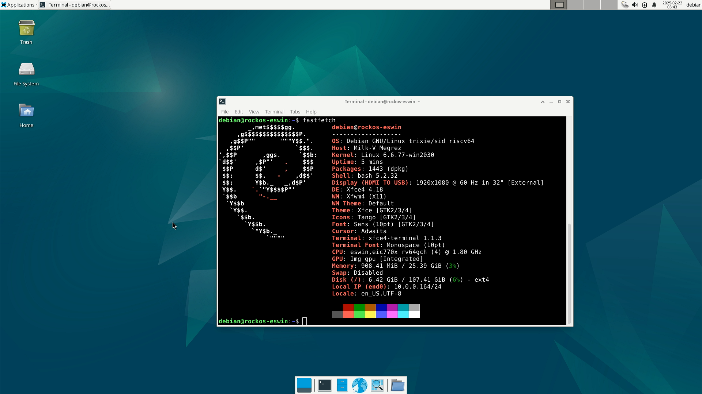

# Milk-V Megrez RockOS 测试报告

## 测试环境

### 操作系统信息

- 下载链接：https://fast-mirror.isrc.ac.cn/rockos/images/generic/latest/
- 参考安装文档
    - https://milkv.io/zh/docs/megrez/getting-started/boot
    - https://rockos-riscv.github.io/rockos-docs/docs/installation

### 硬件信息

- 开发板：Milk-V Megrez
- USB A to C / USB C to C 线缆
- DC 12V 或 ATX 电源
- eMMC 模块/M.2 SATA SSD / PCI-E SSD（M.2 NVMe SSD 需要转接卡）/ microSD 存储卡
- （可选）键盘、鼠标、显示器
- （可选）M.2 SDIO Wi-Fi 模块
- （可选）以 FAT32 或 EXT4 格式化的 U 盘一个，用于升级 bootchain 固件
    - 如果使用 `dhcp` 或 `tftpboot`，则需要以太网连接，且计算机上已安装并配置好 TFTP 服务器
- （可选）M.2 SATA / PCI-E 转 USB 硬盘盒
    - 用于刷写镜像至 SSD
- （可选）microSD 读卡器

## 安装步骤

### 下载并解压镜像

```shell
wget https://fast-mirror.isrc.ac.cn/rockos/images/generic/latest/boot-rockos-20250423-145338.ext4.zst \
     https://fast-mirror.isrc.ac.cn/rockos/images/generic/latest/root-rockos-20250423-145338.ext4.zst \
     https://fast-mirror.isrc.ac.cn/rockos/images/generic/latest/bootloader_secboot_ddr5_milkv-megrez.bin
# 假设您已安装了 zstd
zstd -d *.zst
```

如果您想刷写镜像到 SSD 或 microSD 卡，则请下载如下文件：

```shell
wget https://fast-mirror.isrc.ac.cn/rockos/images/generic/latest/bootloader_secboot_ddr5_milkv-megrez.bin \
     https://fast-mirror.isrc.ac.cn/rockos/images/generic/latest/sdcard-rockos-20250423-145338.img.zst
zstd -d *.zst
```

如果您想通过 U 盘更新 bootchain 固件，则请将 `bootloader_secboot_ddr5_milkv-megrez.bin` 复制到 U 盘的第一个 FAT32 或 EXT4 分区。

您可将其重命名成较短的文件名，以便稍后操作。

### 刷写镜像

#### 更新 bootchain 固件（推荐）

首先我们应该更新固件，即 EIC7700X 开发板上的 bootchain 固件。

简单来说，您需要将固件加载进内存，然后运行 `es_burn` 来将固件烧录至板载 SPI Flash 中。

有如下几种方式加载 bootchain 文件：

- 从内部或外部存储设备
    - `ext4load`
    - `fatload`
- 通过网络/局域网
    - `tftpboot`
    - `dhcp`

1. 将开发板 Type-C debug 接口连接至计算机。

你将看到一个 `CH340` USB 转 UART 设备出现。

2. 使用 `tio`, `minicom` 或经典的 `PuTTY` 等工具打开串口控制台。

默认波特率为 115200。

3. 现在接入电源，Megrez 应当会自动上电开机。

确保引导设备在上电前已正确安装。

如果您想从 U 盘更新 bootchain，请在上电前就将其插入。务必插到靠近 3.5mm 一侧的两个 USB 口中，否则可能会无法识别。

4. 控制台提示 `Autoboot in 5 seconds` 时，按 `s` 打断自动启动。

##### 通过 U 盘更新

1. 检查 U 盘是否已被识别：`usb info`

如果您是在上电之后才插入的，需要运行 `usb reset` 来重新扫描 USB 设备。

2.1. 如果是 FAT32 格式：`fatload usb 0 0x90000000 bootloader_secboot_ddr5_milkv-megrez.bin`

2.2 如果是 EXT4 格式：`ext4load usb 0 0x9000000 0bootloader_secboot_ddr5_milkv-megrez.bin`

3. 刷写固件并重启：`es_burn write 0x90000000 flash; reset`

4. 重启后，建议重置 U-Boot 环境变量至默认值并保存：

```shell
env default -a -f; env save; reset
```

否则可能会出现每次重启时 MAC 地址都会重新生成的问题。

##### 通过 TFTP 更新

设置一个 TFTP 服务器。

对于 Windows 用户，可使用 TFTPd64；对于 Linux 用户，可使用 `tftp-hpa`，`atftp`，甚至 `dnsmasq` 也有一个内置的 TFTP 服务器可用。

可以看看 [Arch Wiki](https://wiki.archlinux.org/title/TFTP#Server) 提供的相关文档。

确保 TFTP 服务器在根目录提供了 `bootloader_secboot_ddr5_milkv-megrez.bin` 文件。

检查您计算机的 LAN IP 地址。

确保开发板连接到了以太网。

打断自动启动后，运行：

```shell
dhcp 0x90000000 $hostIPaddr:bootloader_secboot_ddr5_milkv-megrez.bin
es_burn write 0x90000000 flash; reset
```

和上面通过 U 盘更新相同，建议重置 U-Boot 环境变量至默认值并保存：

```shell
env default -a -f; env save; reset
```

否则可能会出现每次重启时 MAC 地址都会重新生成的问题。

#### 通过 `fastboot` 烧录镜像至 eMMC

更新好 bootchain 后，给开发板上电，按 `s` 打断启动，然后执行如下步骤：

1. 在 U-Boot 控制台：`fastboot usb 0`

2. 找到 DC 电源接口附近的 `RECOVERY` 开关，将其切换到 `RECOVERY` 模式。您的计算机应该会识别到一个`USB download gadget` 或 `Android Bootloader Interface` 设备。

3. 使用 `fastboot` 刷写固件。

（在 Linux 上你将需要 `sudo`，或者将 VID:PID 3452:7700 添加进你的 udev 规则。）

```shell
fastboot flash boot boot-rockos-20250423-145338.ext4
fastboot flash root root-rockos-20250423-145338.ext4
```

4. 等待刷写过程结束。结束后，在 U-Boot 控制台按 Ctrl+C，然后输入 `reset` 重启。

5. 至此，一切就绪。

#### 烧录至 SSD 或 microSD

使用 `etcher` 或 `dd` 来将 sdcard 镜像写入 SSD 或 microSD 即可。

```shell
sudo dd if=sdcard-rockos-20250423-145338.img of=/dev/sdX bs=1M status=progress; sync
```

### 其它说明

开机进入系统后请进行一次系统更新。

预装的内核版本虽然能够正常使用，但会不断向内核中打印日志，不便于调试。

软件仓库中的最新版内核已经修复了这一问题，下一版本的系统镜像将很快修复这一问题。

请执行：

```shell
sudo apt update; sudo apt upgrade -y; sudo reboot
```

### 登录系统

通过串口登录系统。

默认用户名： `debian`
默认密码： `debian`

## 预期结果

开发板正常输出启动信息。

能通过板载 HDMI 接口使用 GUI。

## 实际结果

与预期相符。

### 启动信息

<details>
<summary>已过期（20250219）</summary>

[](https://asciinema.org/a/NrY2moN5tJAYMaGpr6g4Bl8tl)

（屏幕截图来自 HDMI 采集卡）




</details>

## 测试判定标准

测试成功：实际结果与预期结果相符。

测试失败：实际结果与预期结果不符。

## 测试结论

测试成功。