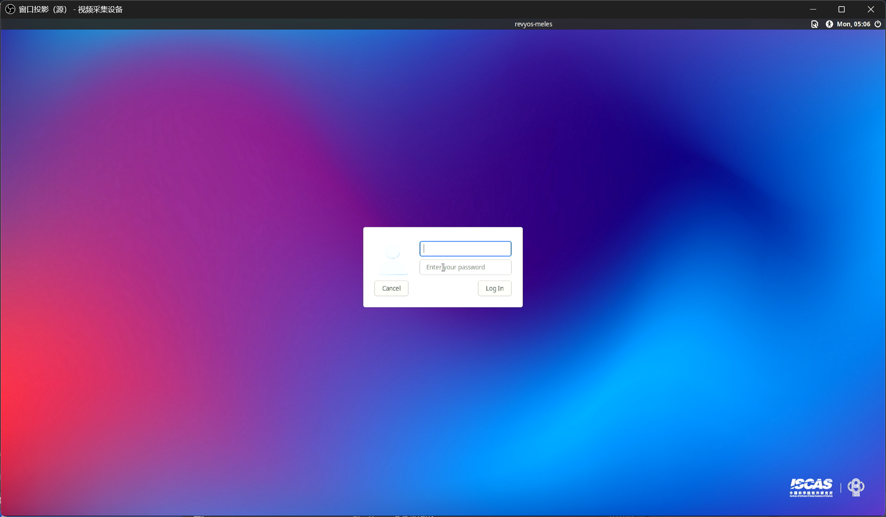
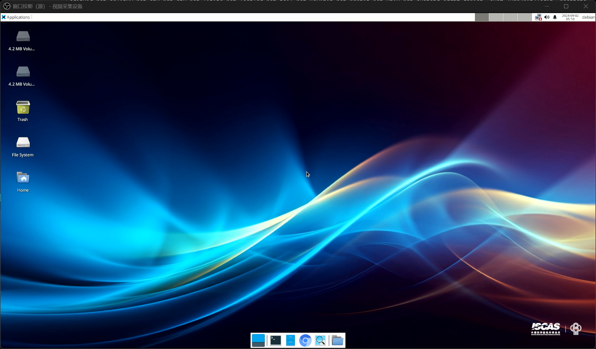

# RevyOS Meles 版本测试报告

## 测试环境

### 操作系统信息

- 系统版本：RevyOS Meles 20241229
- 下载链接：https://mirror.iscas.ac.cn/revyos/extra/images/meles/20241229/
    - iw-single-line 烧录工具：https://mirror.iscas.ac.cn/revyos/extra/images/meles/20240720/iw-single-line.bin
- 参考安装文档：https://milkv.io/zh/docs/meles/getting-started/boot

### 硬件信息

- Milk-V Meles 4GB/8GB/16GB
- eMMC 模组 > 16GB
- USB A to C 线缆一条
- USB-TTL 调试器一个（用于烧录 U-Boot with SPL 至 SPI NOR Flash）
- 可选：键盘、显示器、鼠标（测试图形界面）

## 安装步骤

与同为 TH1520 SoC 的 Lichee Pi 4A 稍有不同，Milk-V Meles 的 Bootloader 存储在板载 SPI NOR Flash 中，需要使用 `yotcools` 中的 `cct` 工具烧录。

这一过程需要使用 UART 串口连接。

> Note: 请勿按照刷写 LPi4A 的方式使用 `fastboot flash uboot` 来更新 U-Boot 固件。
> 这一操作并不会将 U-Boot 刷写至开机默认加载的 SPI NOR Flash 中。使用 `cct` 刷写固件是必须的。

已知问题：部分 AMD 主板可能会无法识别处于 fastboot 模式下的 Meles。

规避方法：尝试将 Meles 连接至外接的 USB Hub，而非主板/桥片直接引出的 USB 端口。

### 使用 `cct` 将 Bootloader 写入 SPI NOR Flash

`cct` 是 `yoctools` 提供的镜像刷写工具，`yoctools` 目前依赖 Python 3.6~3.11 和 Linux 系统。

若您所使用的发行版已经升级到 Python 3.12+，则需要手动安装 Python 3.11 并创建对应版本的 Python 虚拟环境 / venv。

Python 3.12 后受 [PEP 668](https://peps.python.org/pep-0668/) 影响，不能直接全局使用 `pip` 安装；此外由于 `yoctools` 仍依赖部分 Python 3.12+ 中已被替换的包，创建虚拟环境的步骤是必须的。

以 Arch Linux 为例，截止 2025.01，软件源内提供的 Python 版本为 3.13，在这一版本下安装 `yoctools` 后无法正常使用。需要从 [AUR](https://aur.archlinux.org/packages/python311/) 获取 Python 3.11，然后创建虚拟环境进行刷写操作。

准备 Python 3.11 虚拟环境：

```shell
paru python311
sudo pacman -S python-virtualenv
virtualenv -p 3.11 meles
source meles/bin/activate
pip install yoctools
cd meles/bin
```

对于 Python 版本为 3.6~3.11 的发行版，可直接通过 `pip` 安装 `yoctools`，创建虚拟环境不是必须的。

获取所需固件：

```shell
wget https://mirror.iscas.ac.cn/revyos/extra/images/meles/20240720/iw-single-line.bin
wget https://mirror.iscas.ac.cn/revyos/extra/images/meles/20241229/u-boot-with-spl-meles.bin
```

注意根据开发板内存大小选择正确的 `u-boot-with-spl` 固件：

- 4GB 版本 -> u-boot-with-spl-meles-4g.bin
- 8GB 版本 -> u-boot-with-spl-meles.bin
- 16GB 版本 -> u-boot-with-spl-meles-16g.bin

`iw-single-line.bin` 是通用的，不区分内存大小。

通过 UART 调试器连接开发板和计算机。烧录 U-Boot SPL 时**不要**运行 `minicom` 或 `tio` 等程序占用串口。

按住下载按钮，**然后**给开发板上电。

> 下载按钮位于 GPIO 插针附近，PCB 边缘，其内侧为 eMMC 启动按钮，注意区分。
> 详情请参照：https://milkv.io/zh/docs/meles/hardware/meles-main-board

```shell
sudo ./cct list -u /dev/ttyUSB0
#取决于您的调试器型号，如 CH343P 则此处为 ttyACM0，请根据实际情况更改
sudo ./cct download -d ram0 -f iw-single-line.bin -v checksum -r
sudo ./cct download -u /dev/ttyUSB0 -d qspi0 -f ./u-boot-with-spl-meles.bin -v checksum -r -t 1200
```

等待烧写完成后，给开发板断电，然后按住下载按钮，将开发板重新连接至计算机。

### 使用 `fastboot` 刷写镜像

检查连接状态：

```shell
$ lsusb | grep T-HEAD
Bus 001 Device 045: ID 2345:7654 T-HEAD USB download gadget
```

执行如下命令，下载，解压并刷写镜像至 eMMC。

> 如果出现 `fastboot` 不识别设备、无法刷写等情况，请检查设备连接，并尝试以特权用户身份（`sudo`）执行 `fastboot`。
> 通常在 Linux 下是需要使用 `sudo` 的，原因是 USB VID/PID 不在默认的 udev 规则内。

```shell
wget https://mirror.iscas.ac.cn/revyos/extra/images/meles/20241229/boot-meles-20241229_032258.ext4.zst
wget https://mirror.iscas.ac.cn/revyos/extra/images/meles/20241229/root-meles-20241229_032258.ext4.zst
zstd -T0 -dv *.ext4.zst
sudo fastboot flash ram u-boot-with-spl-meles.bin
sudo fastboot reboot
sudo fastboot flash boot boot-meles-20241229_032258.ext4
sudo fastboot flash root root-meles-20241229_032258.ext4
```

刷写完成后，重启开发板即可。

进入系统后，建议执行一次系统升级（`sudo apt update; sudo apt upgrade`）。更新的内核修复了一些已知问题（如无线网卡可能不工作）。

### 登录系统

通过串口或图形界面登录系统。

默认用户名：`debian`
默认密码：`debian`

## 预期结果

系统正常启动，能够通过串口登录，HDMI 正常输出，能够登录进桌面。

## 实际结果

与预期结果一致。

### 启动信息

[](https://asciinema.org/a/GowOSUJ7oFYVH4igmtqB0s4ub)





（截图来自 HDMI 采集卡）

## 测试判定标准

测试成功：实际结果与预期结果相符。

测试失败：实际结果与预期结果不符。

## 测试结论

测试成功。