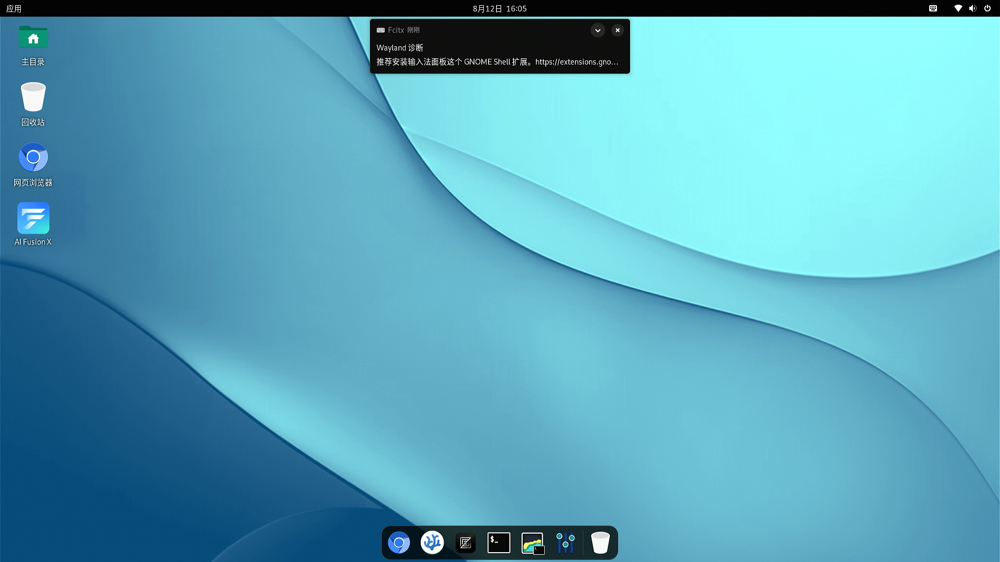

# SpacemiT MUSE Pi Pro, Bianbu-Compupter UEFI v1.3 Test Report

## Test Environment

### System Information

- Download Link: https://archive.spacemit.com/image/k1/version/bianbu-computer-uefi/v1.3/
- Reference Install Document: https://developer.spacemit.com/documentation?token=QSfGwmkhqiHwqQkHmCicH2Qnnyg

> This version is based on Bianbu Star v2.1.

### Hardware Information

- SpacemiT MUSE Pi Pro Board
- USB Charger
- USB Type-C cables
- UART to USB Debugger
- microSD Card (if flash to microSD card)

## Installation Steps

### Flashing the Image (SD Card)

**Please make sure to choose the file ending with `.img.zip`**

**Note: Please pay attention to use the uefi image, instead uboot image used by other k1/m1 devices.**

After downloading and extracting the image, use `dd` to flash the image to the microSD card.

```bash
unzip	bianbu-computer-s1-uefi-release-for-pipro-v1.3-release-20250529141832.img.zip
sudo dd if=bianbu-computer-s1-uefi-release-for-pipro-v1.2-release-20250421182705.img of=/dev/your-device bs=1M status=progress
```

Please replace `/dev/your-device` with the actual device name of your microSD card. Make sure to double-check the device name to avoid overwriting your own disk.

### Flashing the Image (eMMC)

**Please make sure to choose the file ending without `.img`**

**Note: Please pay attention to use the UEFI image, instead u-boot image used by other K1/M1 devices.**

After downloading and extracting the image, use `fastboot` to flash the image to the eMMC.

```bash
unzip bianbu-computer-s1-uefi-release-for-pipro-v1.3-release-20250529141832.zip
```

Under the USB Type-A port, you can see three buttons. Let the ethernet port facing up, from top to bottom, the buttons are **PWR**, **RST**, and **FDL** . You shall hold the **FDL** button while power on/RST, to enter the fastboot mode. You shall see the dfu-device in your system:

```log
$ fastboot devices
dfu-device       DFU download
```

> Note: for the steps below, `sudo` might be needed.
> Otherwise `fastboot` might not pick up the board since it's default USB VID/PID is not in the default udev rules.

```bash
fastboot stage factory/FSBL.bin
fastboot continue
sleep 1 # Wait for 1 sec
fastboot stage u-boot.itb
fastboot continue
sleep 1 # Wait for 1 sec
fastboot flash gpt partition_universal.json
fastboot flash bootinfo factory/bootinfo_sd.bin
fastboot flash fsbl factory/FSBL.bin
fastboot flash env env.bin
fastboot flash opensbi fw_dynamic.itb
fastboot flash uboot u-boot.itb
fastboot flash ESP efi.img
fastboot flash bootfs_linux bootfs_linux.img
fastboot flash rootfs_linux rootfs_linux.ext4
fastboot flash bootfs bootfs.ext4
fastboot flash rootfs rootfs.ext4
```


### Logging into the System

Logging into the system via the serial port.

> Note: If you boot into the desktop, you can see a install wizard. Follow the wizard to setup the account and password.

Default Username: `root`
Default Password: `bianbu`

## Expected Results

The system should boot normally and allow login via the onboard serial port. Can also login via the desktop.

## Actual Results

The system booted successfully and login via the onboard serial port was also successful. Can also login via the desktop.

### Boot Log

Screen recording (from flashing image to login):

[](https://asciinema.org/a/TpzxQ4x8CCxDm4RS3ym04D8hk)

```log
Welcome to Bianbu 2.1 (GNU/Linux 6.6.63 riscv64)                                                                        
                                                                                                                        
 * Documentation:  https://bianbu.spacemit.com                                                                          
 * Support:        https://ticket.spacemit.com                                                                          
                                                                                                                        
The programs included with the Bianbu system are free software;                                                         
the exact distribution terms for each program are described in the                                                      
individual files in /usr/share/doc/*/copyright.                                                                         
                                                                                                                        
Bianbu comes with ABSOLUTELY NO WARRANTY, to the extent permitted by                                                    
applicable law.                                                                                                         
                                                                                                                        
root@k1:~# uname -a                                                                                                     
Linux k1 6.6.63 #2.2~rc3.2 SMP PREEMPT Thu Apr  3 06:53:27 UTC 2025 riscv64 riscv64 riscv64 GNU/Linux                   
root@k1:~# cat /etc/os-release                                                                                          
PRETTY_NAME="Bianbu Star 2.1"                                                                                           
NAME="Bianbu"                                                                                                           
VERSION_ID="2.1"                                                                                                        
VERSION="2.1 (Noble Numbat)"                                                                                            
VERSION_CODENAME=noble                                                                                                  
ID=bianbu                                                                                                               
ID_LIKE=debian                                                                                                          
HOME_URL="https://bianbu.spacemit.com"                                                                                  
SUPPORT_URL="https://bianbu.spacemit.com"                                                                               
BUG_REPORT_URL="https://ticket.spacemit.com"                                                                            
PRIVACY_POLICY_URL="https://www.spacemit.com/privacy-policy"                                                            
UBUNTU_CODENAME=noble                                                                                                   
LOGO=ubuntu-logo                                                                                                        
root@k1:~#
```





## Test Criteria

Successful: The actual result matches the expected result.

Failed: The actual result does not match the expected result.

## Test Conclusion

Test successful.