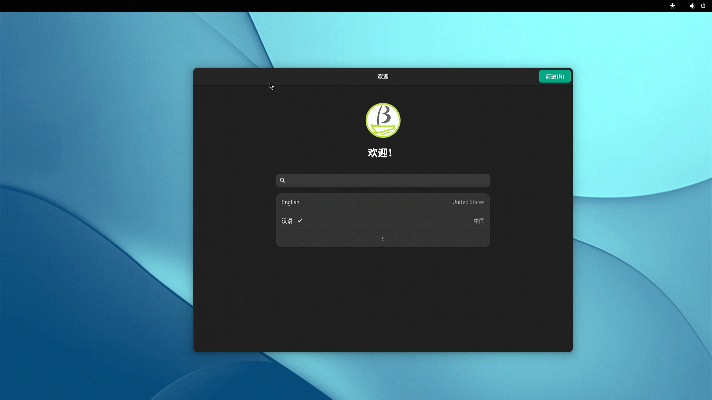
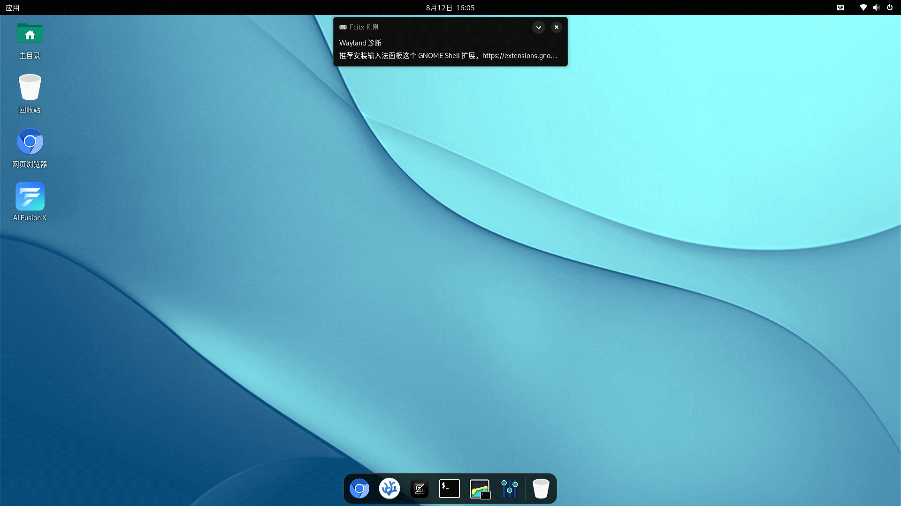
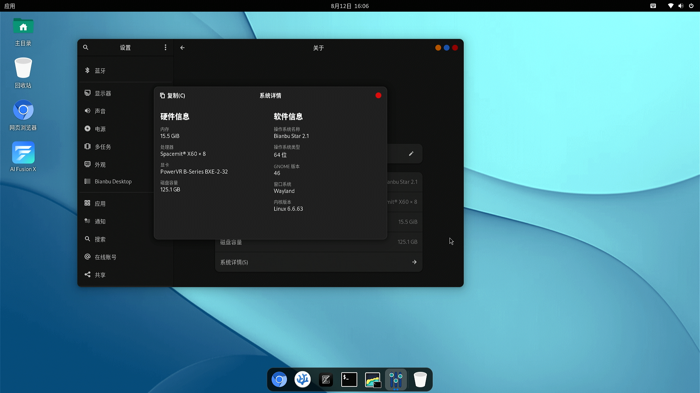

# SpacemiT MUSE Pi Pro, Bianbu-Computer UEFI v1.3 测试报告

## 系统信息

- 下载链接：https://archive.spacemit.com/image/k1/version/bianbu-computer-uefi/v1.3/
- 安装文档参考：https://developer.spacemit.com/documentation?token=EIk1wVY9NinD95kMsw0cFM89npd

> 此版本基于 Bianbu Star v2.1。

### 硬件信息

- SpacemiT MUSE Pi Pro 开发板
- USB 充电器
- USB Type-C 数据线
- UART to USB 调试线
- microSD 卡（如果刷写到 SD 卡）

## 安装步骤

### 刷写镜像（microSD 卡）

**请务必选择以 `.img.zip` 结尾的压缩包**

**注意：请注意使用 UEFI 镜像，而不是其他 K1/M1 设备使用的 uboot 镜像。**

下载并解压镜像后，使用 `dd` 将镜像写入 microSD 卡。

```bash
unzip bianbu-computer-s1-uefi-release-for-pipro-v1.2-release-20250421182705.img.zip
sudo dd if=bianbu-computer-s1-uefi-release-for-pipro-v1.2-release-20250421182705.img of=/dev/your-device bs=1M status=progress
```

请将 `/dev/your-device` 替换为实际的 microSD 卡设备名称。请务必仔细检查设备名称，以免覆盖自己的磁盘。

### 刷写镜像（eMMC）

**请务必选择不带 `.img` 的 zip 压缩包**

**注意：请注意使用 UEFI 镜像，而不是其他 k1/m1 设备使用的 uboot 镜像。**

下载并解压镜像后，使用 `fastboot` 将镜像烧录到 eMMC。

```bash
unzip bianbu-computer-s1-uefi-release-for-pipro-v1.3-release-20250529141832.zip
```

在 USB Type-A 端口下方，可以看到三个按键。让以网口朝上，从上到下，分别是 **PWR**、**RST** 和 **FDL**。你需要在上电/复位时按住 **FDL** 按键，进入 fastboot 模式。你应该能在系统中看到 dfu-device。

> 注意：下面的步骤可能需要使用 `sudo`。
> 否则 `fastboot` 可能不会正确识别设备，因为默认的 USB VID/PID 不在 udev 规则内。 

```log
$ fastboot devices
dfu-device       DFU download
```

```bash
fastboot stage factory/FSBL.bin
fastboot continue
sleep 1 # Wait for 1 sec
fastboot stage u-boot.itb
fastboot continue
sleep 1 # Wait for 1 sec
fastboot flash gpt partition_universal.json
fastboot flash bootinfo factory/bootinfo_sd.bin
fastboot flash fsbl factory/FSBL.bin
fastboot flash env env.bin
fastboot flash opensbi fw_dynamic.itb
fastboot flash uboot u-boot.itb
fastboot flash ESP efi.img
fastboot flash bootfs_linux bootfs_linux.img
fastboot flash rootfs_linux rootfs_linux.ext4
fastboot flash bootfs bootfs.ext4
fastboot flash rootfs rootfs.ext4
```

### 启动系统

通过串口登录系统。

> 提示：若初次从桌面登录系统，会进入安装向导，跟随提示完成设置即可。

默认用户名： `root`
默认密码： `bianbu`

## 预期结果

系统正常启动，能够通过板载串口登录。能使用桌面登录系统。

## 实际结果

系统正常启动，成功通过板载串口登录。能使用桌面登录系统。

### 启动信息

串口录制（从刷写镜像到启动）：
[](https://asciinema.org/a/TpzxQ4x8CCxDm4RS3ym04D8hk)


```log
Welcome to Bianbu 2.1 (GNU/Linux 6.6.63 riscv64)                                                                        
                                                                                                                        
 * Documentation:  https://bianbu.spacemit.com                                                                          
 * Support:        https://ticket.spacemit.com                                                                          
                                                                                                                        
The programs included with the Bianbu system are free software;                                                         
the exact distribution terms for each program are described in the                                                      
individual files in /usr/share/doc/*/copyright.                                                                         
                                                                                                                        
Bianbu comes with ABSOLUTELY NO WARRANTY, to the extent permitted by                                                    
applicable law.                                                                                                         
                                                                                                                        
root@k1:~# uname -a                                                                                                     
Linux k1 6.6.63 #2.2~rc3.2 SMP PREEMPT Thu Apr  3 06:53:27 UTC 2025 riscv64 riscv64 riscv64 GNU/Linux                   
root@k1:~# cat /etc/os-release                                                                                          
PRETTY_NAME="Bianbu Star 2.1"                                                                                           
NAME="Bianbu"                                                                                                           
VERSION_ID="2.1"                                                                                                        
VERSION="2.1 (Noble Numbat)"                                                                                            
VERSION_CODENAME=noble                                                                                                  
ID=bianbu                                                                                                               
ID_LIKE=debian                                                                                                          
HOME_URL="https://bianbu.spacemit.com"                                                                                  
SUPPORT_URL="https://bianbu.spacemit.com"                                                                               
BUG_REPORT_URL="https://ticket.spacemit.com"                                                                            
PRIVACY_POLICY_URL="https://www.spacemit.com/privacy-policy"                                                            
UBUNTU_CODENAME=noble                                                                                                   
LOGO=ubuntu-logo                                                                                                        
root@k1:~#
```





## 测试判定标准

测试成功：实际结果与预期结果相符。

测试失败：实际结果与预期结果不符。

## 测试结论

测试成功。