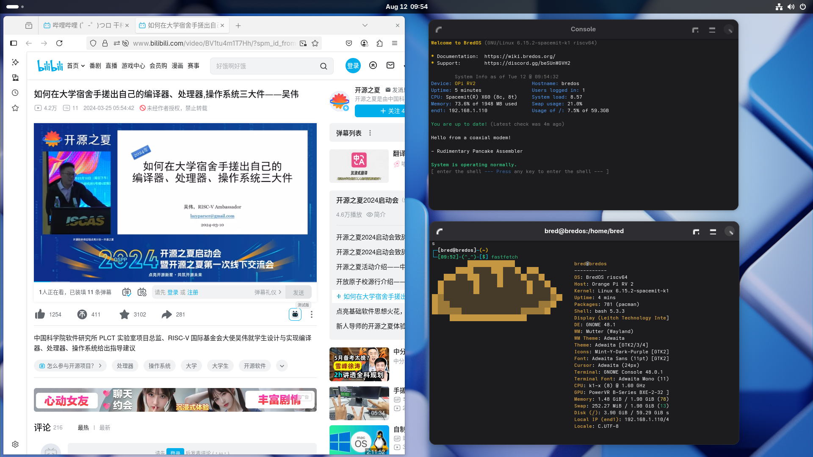

# BredOS OrangePi RV2 Test Report

## Test Environment

### Operating System Information
- OS Version: [BredOS](https://bredos.org/) (riscv64-OPI-RV2-2025-07-16)
- Download URL: <https://bredos.org/download.html>
- Installation Reference: <https://wiki.bredos.org/en/installation>

### Hardware Information
- OrangePi RV2
- USB to UART debugger
- Three DuPont wires
- microSD card

## Installation Steps

### Download and Extract Image
Download the desired image from the [official download page](https://bredos.org/download.html).
**Extract files:**
```bash
xz -dk BredOS-riscv64-OPI-RV2-2025-07-16.img.xz
```

### Writing System Image to microSD Card
You can used the `dd` command:
```bash
sudo dd if=BredOS-riscv64-OPI-RV2-2025-07-16.img of=/dev/mmcblkX bs=1M
```

Log:
```log
输入了 5148+1 块记录
输出了 5148+1 块记录
5398896640 字节 (5.4 GB, 5.0 GiB) 已复制，209.019 s，25.8 MB/s
```

## Logging into the System
Insert the microSD card into OrangePi RV2 and reboot.
Use a serial connection to log in; e.g. `minicom`.
```bash
minicom -D /dev/ttyACM0 -c on
```

The default username and password are both `Bred`.

## Expected Results
System boots normally and allows login via onboard serial port.
If network is connected, SSH login should also work.

## Actual Results
System booted successfully and allowed login via serial.

```log
┌─[bred@bredos]─(~)
└─[10:03]-(^_^)-[$] uname -a
Linux bredos 6.15.2-spacemit-k1 #6 SMP PREEMPT Sun Jul  6 01:25:47 EEST 2025 riscv64 GNU/Linux

┌─[bred@bredos]─(~)
└─[10:03]-(^_^)-[$] cat /etc/os-release
NAME="BredOS"
PRETTY_NAME="BredOS"
ID=bredos
ID_LIKE=arch
BUILD_ID=rolling
ANSI_COLOR="38;2;23;147;209"
HOME_URL="https://discord.gg/jwhxuyKXaa"
LOGO=bred
IMAGE_ID=BredOS
IMAGE_VERSION=2022.02.02
# 
```

## Desktop Environment
This image comes pre-installed with the **GNOME** desktop environment, which starts automatically as a desktop session when a monitor is connected.

Screenshots of GNOME desktop:



## Test Criteria
Successful: The actual result matches the expected result.

Failed: The actual result does not match the expected result.

## Test Conclusion
Test successful.
