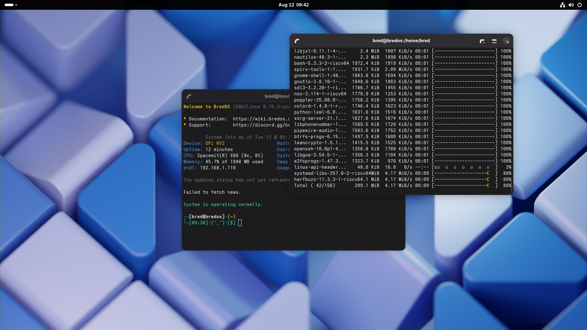
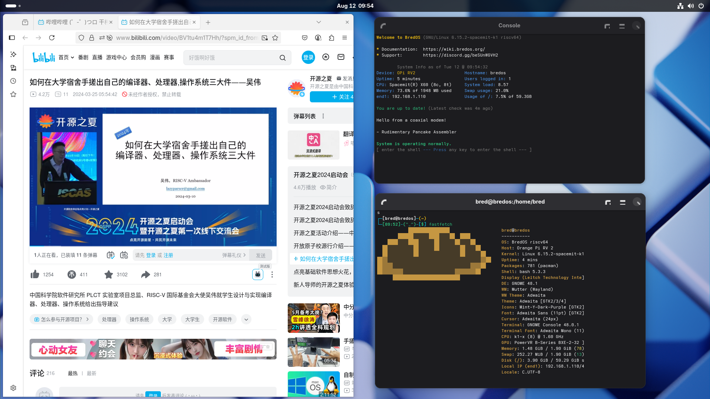

# BredOS OrangePi RV2 测试报告

## 测试环境

### 系统信息
- 系统版本：[BredOS](https://bredos.org/) (riscv64-OPI-RV2-2025-07-16)
- 下载网址：https://bredos.org/download.html
- 参考安装文档：<https://wiki.bredos.org/en/installation>

### 硬件信息
- OrangePi RV2
- USB to UART 调试器一个
- 杜邦线三根
- microSD 卡一张

## 安装步骤

### 下载并解压镜像
从[官方下载页面](https://bredos.org/download.html)下载你所需镜像。
**解压相关文件**
```bash
xz -dk BredOS-riscv64-OPI-RV2-2025-07-16.img.xz
```

### 向 microSD 卡烧录系统镜像
可使用 `dd` 命令
```bash
sudo dd if=BredOS-riscv64-OPI-RV2-2025-07-16.img of=/dev/mmcblk0 bs=1M
```

Log:
```log
输入了 5148+1 块记录
输出了 5148+1 块记录
5398896640 字节 (5.4 GB, 5.0 GiB) 已复制，209.019 s，25.8 MB/s
```

### 登录系统
将 microSD 卡插入 OrangePi RV2，重启。
通过串口登录系统，例如 `minicom` 工具。
```bash
minicom -D /dev/ttyACM0 -c on
```

默认用户名与密码均为 `Bred`。

## 预期结果
系统正常启动，能够通过板载串口登录。
若接入网络，可通过 SSH 登录。

## 实际结果
系统正常启动，成功通过板载串口登录。

```log
┌─[bred@bredos]─(~)
└─[10:03]-(^_^)-[$] uname -a
Linux bredos 6.15.2-spacemit-k1 #6 SMP PREEMPT Sun Jul  6 01:25:47 EEST 2025 riscv64 GNU/Linux

┌─[bred@bredos]─(~)
└─[10:03]-(^_^)-[$] cat /etc/os-release
NAME="BredOS"
PRETTY_NAME="BredOS"
ID=bredos
ID_LIKE=arch
BUILD_ID=rolling
ANSI_COLOR="38;2;23;147;209"
HOME_URL="https://discord.gg/jwhxuyKXaa"
LOGO=bred
IMAGE_ID=BredOS
IMAGE_VERSION=2022.02.02
# 
```
## 桌面环境
该镜像已预装 **GNOME** 桌面环境，连接显示器会以桌面会话自动启动。

桌面环境截图：



## 测试判定标准
测试成功：实际结果与预期结果相符。

测试失败：实际结果与预期结果不符。

## 测试结论
测试成功。