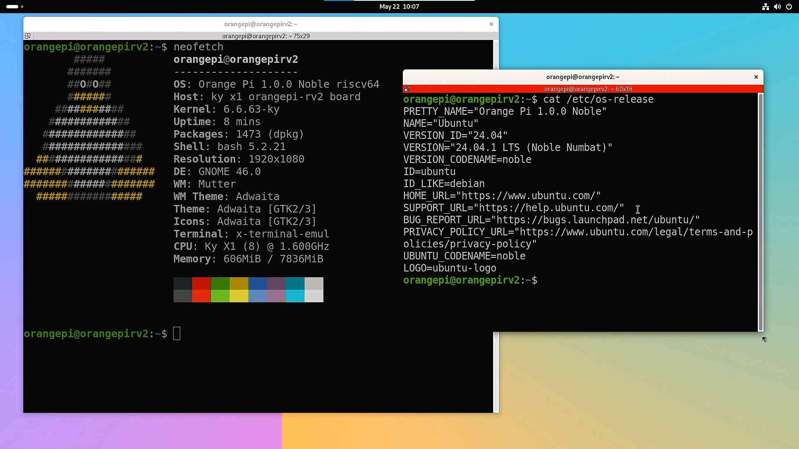

# Ubuntu 24.04.01 LTS OrangePi RV2 测试报告

## 测试环境

### 硬件信息

- 开发板：OrangePi RV2 (8GB RAM)
- 其他硬件：
  - USB 电源适配器和USB-A to C 或 C to C 线缆一条
  - microSD 卡一张
  - USB to UART 调试器一个（如：CH340, CH341, FT2232 等）
  - HDMI线缆、USB鼠标、USB键盘

### 操作系统信息

- 系统版本：Ubuntu 24.04.01 LTS
- 下载链接：<http://www.orangepi.cn/html/hardWare/computerAndMicrocontrollers/service-and-support/Orange-Pi-RV2.html>
- 参考安装文档：<http://www.orangepi.cn/html/hardWare/computerAndMicrocontrollers/service-and-support/Orange-Pi-RV2.html>

## 安装步骤

### 刷写镜像

使用 `7z` 解压镜像。然后使用 `dd`命令或者使用 `balenaEther` 软件将镜像写入 microSD 卡 (假设 `/dev/sdc` 为 microSD卡设备)

```bash
7z x Orangepirv2_1.0.0_ubuntu_noble_desktop_gnome_linux6.6.63.7z

sudo dd if=Orangepirv2_1.0.0_ubuntu_noble_desktop_gnome_linux6.6.63.img of=/dev/sdX bs=1M status=progress

sync
```

### 登录系统

通过串口登录系统。

默认用户名： `orangepi` (自动登录)

默认密码：`orangepi`

或

用户名：`root`

密码：`orangepi`

## 预期结果

系统正常启动，能够通过串口登录，连接HDMI至显示屏能够正常显示登录图像，并支持USB鼠标和USB键盘。

## 实际结果

系统正常启动，成功通过串口查看输出，连接HDMI至显示屏能够正常显示登录图像，并支持USB鼠标和USB键盘。

### 启动信息

```log
Starting kernel ...

[    0.000000] Linux version 6.6.63-ky (root@test) (riscv64-unknown-linux-gnu-gcc (g09b62c20e09) 13.2.1 20240423, GNU ld (GNU Binutils) 2.42) #1.0.0 SMP PREEMPT Wed Mar 12 09:04:00 CST 2025
[    0.000000] Machine model: ky x1 orangepi-rv2 board
[    0.000000] SBI specification v1.0 detected
[    0.000000] SBI implementation ID=0x1 Version=0x10003
[    0.000000] SBI IPI extension detected
[    0.000000] SBI RFENCE extension detected
[    0.000000] earlycon: sbi0 at I/O port 0x0 (options '')
[    0.000000] printk: bootconsole [sbi0] enabled

orangepirv2 login: orangepi (automatic login)

  ___  ____  _   ______     ______
 / _ \|  _ \(_) |  _ \ \   / /___ \
| | | | |_) | | | |_) \ \ / /  __) |
| |_| |  __/| | |  _ < \ V /  / __/
 \___/|_|   |_| |_| \_\ \_/  |_____|

Welcome to Orange Pi 1.0.0 Noble with Linux 6.6.63-ky

System load:   62%              Up time:       0 min
Memory usage:  4% of 7.65G      IP:            172.17.0.1 192.168.137.75
CPU temp:      48°C             Usage of /:    16% of 29G

orangepi@orangepirv2:~$ uname -a
Linux orangepirv2 6.6.63-ky #1.0.0 SMP PREEMPT Wed Mar 12 09:04:00 CST 2025 riscv64 riscv64 riscv64 GNU/Linux

orangepi@orangepirv2:~$ cat /etc/os-release
PRETTY_NAME="Orange Pi 1.0.0 Noble"
NAME="Ubuntu"
VERSION_ID="24.04"
VERSION="24.04.1 LTS (Noble Numbat)"
VERSION_CODENAME=noble
ID=ubuntu
ID_LIKE=debian
HOME_URL="https://www.ubuntu.com/"
SUPPORT_URL="https://help.ubuntu.com/"
BUG_REPORT_URL="https://bugs.launchpad.net/ubuntu/"
PRIVACY_POLICY_URL="https://www.ubuntu.com/legal/terms-and-policies/privacy-policy"
UBUNTU_CODENAME=noble
LOGO=ubuntu-logo

orangepi@orangepirv2:~$ cat /proc/cpuinfo
processor       : 0
hart            : 0
model name      : Ky(R) X1
isa             : rv64imafdcv_zicbom_zicboz_zicntr_zicond_zicsr_zifencei_zihintpause_zihpm_zfh_zfhmin_zca_zcd_zba_zbb_zbc_zbs_zkt_zve32f_zve32x_zve64d_zve64f_zve64x_zvfh_zvfhmin_zvkt_sscofpmf_sstc_svinval_svnapot_svpbmt
mmu             : sv39
uarch           : ky,x60
mvendorid       : 0x710
marchid         : 0x8000000058000001
mimpid          : 0x1000000049772200

processor       : 1
hart            : 1
model name      : Ky(R) X1
isa             : rv64imafdcv_zicbom_zicboz_zicntr_zicond_zicsr_zifencei_zihintpause_zihpm_zfh_zfhmin_zca_zcd_zba_zbb_zbc_zbs_zkt_zve32f_zve32x_zve64d_zve64f_zve64x_zvfh_zvfhmin_zvkt_sscofpmf_sstc_svinval_svnapot_svpbmt
mmu             : sv39
uarch           : ky,x60
mvendorid       : 0x710
marchid         : 0x8000000058000001
mimpid          : 0x1000000049772200

processor       : 2
hart            : 2
model name      : Ky(R) X1
isa             : rv64imafdcv_zicbom_zicboz_zicntr_zicond_zicsr_zifencei_zihintpause_zihpm_zfh_zfhmin_zca_zcd_zba_zbb_zbc_zbs_zkt_zve32f_zve32x_zve64d_zve64f_zve64x_zvfh_zvfhmin_zvkt_sscofpmf_sstc_svinval_svnapot_svpbmt
mmu             : sv39
uarch           : ky,x60
mvendorid       : 0x710
marchid         : 0x8000000058000001
mimpid          : 0x1000000049772200

processor       : 3
hart            : 3
model name      : Ky(R) X1
isa             : rv64imafdcv_zicbom_zicboz_zicntr_zicond_zicsr_zifencei_zihintpause_zihpm_zfh_zfhmin_zca_zcd_zba_zbb_zbc_zbs_zkt_zve32f_zve32x_zve64d_zve64f_zve64x_zvfh_zvfhmin_zvkt_sscofpmf_sstc_svinval_svnapot_svpbmt
mmu             : sv39
uarch           : ky,x60
mvendorid       : 0x710
marchid         : 0x8000000058000001
mimpid          : 0x1000000049772200

processor       : 4
hart            : 4
model name      : Ky(R) X1
isa             : rv64imafdcv_zicbom_zicboz_zicntr_zicond_zicsr_zifencei_zihintpause_zihpm_zfh_zfhmin_zca_zcd_zba_zbb_zbc_zbs_zkt_zve32f_zve32x_zve64d_zve64f_zve64x_zvfh_zvfhmin_zvkt_sscofpmf_sstc_svinval_svnapot_svpbmt
mmu             : sv39
uarch           : ky,x60
mvendorid       : 0x710
marchid         : 0x8000000058000001
mimpid          : 0x1000000049772200

processor       : 5
hart            : 5
model name      : Ky(R) X1
isa             : rv64imafdcv_zicbom_zicboz_zicntr_zicond_zicsr_zifencei_zihintpause_zihpm_zfh_zfhmin_zca_zcd_zba_zbb_zbc_zbs_zkt_zve32f_zve32x_zve64d_zve64f_zve64x_zvfh_zvfhmin_zvkt_sscofpmf_sstc_svinval_svnapot_svpbmt
mmu             : sv39
uarch           : ky,x60
mvendorid       : 0x710
marchid         : 0x8000000058000001
mimpid          : 0x1000000049772200

processor       : 6
hart            : 6
model name      : Ky(R) X1
isa             : rv64imafdcv_zicbom_zicboz_zicntr_zicond_zicsr_zifencei_zihintpause_zihpm_zfh_zfhmin_zca_zcd_zba_zbb_zbc_zbs_zkt_zve32f_zve32x_zve64d_zve64f_zve64x_zvfh_zvfhmin_zvkt_sscofpmf_sstc_svinval_svnapot_svpbmt
mmu             : sv39
uarch           : ky,x60
mvendorid       : 0x710
marchid         : 0x8000000058000001
mimpid          : 0x1000000049772200

processor       : 7
hart            : 7
model name      : Ky(R) X1
isa             : rv64imafdcv_zicbom_zicboz_zicntr_zicond_zicsr_zifencei_zihintpause_zihpm_zfh_zfhmin_zca_zcd_zba_zbb_zbc_zbs_zkt_zve32f_zve32x_zve64d_zve64f_zve64x_zvfh_zvfhmin_zvkt_sscofpmf_sstc_svinval_svnapot_svpbmt
mmu             : sv39
uarch           : ky,x60
mvendorid       : 0x710
marchid         : 0x8000000058000001
mimpid          : 0x1000000049772200

orangepi@orangepirv2:~$ sensors
cluster0_thermal-virtual-0
Adapter: Virtual device
temp1:        +58.0°C

cluster1_thermal-virtual-0
Adapter: Virtual device
temp1:        +58.0°C

orangepi@orangepirv2:~$
```

桌面的图形界面：



## 测试判定标准

测试成功：实际结果与预期结果相符。

测试失败：实际结果与预期结果不符。

## 测试结论

测试成功
