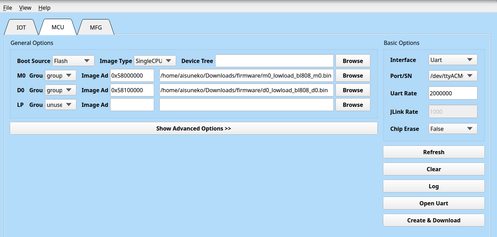

# BuildRoot Pine64 Ox64 Test Report

## Test Environment

### Operating System Information

- BuildRoot
  - Download Link: https://github.com/openbouffalo/buildroot_bouffalo/releases/download/v1.0.1/bl808-linux-pine64_ox64_full_defconfig.tar.gz
    - SDK: https://github.com/bouffalolab/bl_mcu_sdk
    - Flashing Tool: https://openbouffalo.org/static-assets/bldevcube/BouffaloLabDevCube-v1.8.3.zip
  - Reference Installation Document: https://www.hackster.io/lupyuen/8-risc-v-sbc-on-a-real-time-operating-system-ox64-nuttx-474358

### Hardware Information

- Pine64 Ox64
- A Type-C or microUSB cable
- A UART debugger (CH340G preferred, *avoid* CP2102)
- A microSD card
- A microSD card reader

## Installation Steps

### Get the Image

Download and extract the precompiled image and firmware:
```bash
wget https://github.com/openbouffalo/buildroot_bouffalo/releases/download/v1.0.1/bl808-linux-pine64_ox64_full_defconfig.tar.gz
tar -xvf bl808-linux-pine64_ox64_full_defconfig.tar.gz
cd bl808-linux-pine64_ox64_full_defconfig/firmware
xz -d sdcard-pine64_ox64_full_defconfig.img.xz
```

### Flashing the Firmware via UART

Power on the board through either the microUSB or Type-C port while holding down the BOOT button. Connect GPIO ports 14 and 15 to your debugger's RX and TX, respectively - This is the "Flashing UART".

Download the flashing tool and use the appropriate version for your system to flash the firmware. Make sure your BLDevCube binary is of version 1.8.3 **or lower**.

Enter the MCU tab and set the parameters as shown below:

M0: Group: group0, Image Addr: `0x58000000`, and choose `m0_lowload_bl808_m0.bin` from the above archive

D0: Group: group0, Image Addr: `0x58100000`, and choose `d0_lowload_bl808_d0.bin` from the above archive

Choose your UART port correspondingly and set the "Uart Rate" to 2000000.

Click "Create & Download" and wait for it to complete.



Next, Enter the IOT tab and set the parameters as shown below:

Enable "Single Download", set address to `0x800000` and choose `bl808-firmware.bin` from the above archive.

Click "Create & Download" and wait for it to complete.


### Flash the image to SD card

```shell
dd if=sdcard-pine64_ox64_full_defconfig.img of=/dev/your/device status=progress
```

### Boot

Insert the SD card, and connect GPIO ports 32 and 31 to your debugger's RX and TX, respectively - This is the "Serial Console UART". Remember to set the baud rate to 2000000.

## Expected Results

The system should start normally with serial output.

## Actual Results

The system started successfully, with serial output.

### Boot Information

```log
swapon: /dev/mmcblkXp1: read swap header failed
Resizing Rootfs
CHANGED: partition=3 start=2506786 old: size=1048576 end=3555361 new: size=59827133 end=62333918
Partition Resized
resize2fs 1.46.5 (30-Dec-2021)
Filesystem at /dev/mmcblkXp3 is mounted on /; on-line resizing required
old_desc_blocks = 1, new_desc_blocks = 2
[    3.120120] EXT4-fs (mmcblk0p3): resizing filesystem from 131072 to 7478391 blocks
[    3.805460] EXT4-fs (mmcblk0p3): resized filesystem to 7478391
The filesystem on /dev/mmcblkXp3 is now 7478391 (4k) blocks long.

Rootfs Resized
Running mkswap
Setting up swapspace version 1, size = 1024 MiB (1073737728 bytes)
no label, UUID=d4bded1e-1d6b-44f1-a861-45c71d817090
[    4.139249] Adding 1048572k swap on /dev/mmcblkXp1.  Priority:-2 extents:1 across:1048572k SS
Swap Partition Formatted
Starting syslogd: OK
Starting klogd: OK
Running sysctl: OK
Starting mdev... OK
Saving random seed: OK
Starting rpcbind: OK
Starting iptables: OK
Starting network: OK
Starting dhcpcd...
dhcpcd-9.4.1 starting
dhcp_vendor: Invalid argument
forked to background, child pid 131
Starting sntp: sntp 4.2.8p15@1.3728-o Mon Mar  6 10:45:15 UTC 2023 (1)
pool.ntp.org lookup error Temporary failure in name resolution
FAIL
Starting ntpd: OK
Starting dropbear sshd: OK

Welcome to Buildroot
ox64 login: root
Last login: Thu Jan  1 00:00:35 on console
# uname -a
Linux ox64 6.2.0 #1 Mon Mar  6 11:17:27 UTC 2023 riscv64 GNU/Linux
# cat /etc/os-release
NAME=Buildroot
VERSION=2022.11.1
ID=buildroot
VERSION_ID=2022.11.1
PRETTY_NAME="Buildroot 2022.11.1"
#

```

## Test Criteria

Successful: The actual result matches the expected result.

Failed: The actual result does not match the expected result.

## Test Conclusion

Test successful.

