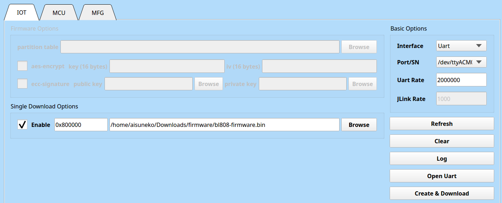

# NuttX Pine64 Ox64 测试报告

## 测试环境

### 操作系统信息

- 下载链接：https://github.com/lupyuen2/wip-nuttx/releases/download/gpio2-1/Image
  - SDK：https://github.com/bouffalolab/bl_mcu_sdk
  - 烧录工具：https://openbouffalo.org/static-assets/bldevcube/BouffaloLabDevCube-v1.8.3.zip
- 参考安装文档：https://www.hackster.io/lupyuen/8-risc-v-sbc-on-a-real-time-operating-system-ox64-nuttx-474358

### 硬件信息

- Pine64 Ox64
- Type-C 或者 microUSB 线一根
- 一个 UART 调试器 （推荐 CH340G，不建议使用 CP2102）
- 一张 microSD 卡
- 一个 microSD 读卡器

## 安装步骤

### 获取镜像

下载并解压预编译镜像和固件：
```bash
wget https://github.com/openbouffalo/buildroot_bouffalo/releases/download/v1.0.1/bl808-linux-pine64_ox64_full_defconfig.tar.gz
tar -xvf bl808-linux-pine64_ox64_full_defconfig.tar.gz
cd bl808-linux-pine64_ox64_full_defconfig/firmware
xz -d sdcard-pine64_ox64_full_defconfig.img.xz
```

### 串口方式刷写程序

按住 BOOT 按钮的同时通过 microUSB 或 Type-C 接口上电。将烧录用 UART (pin 14 & 15) 分别连接到调试器的 RX 和 TX。

下载烧录工具后使用对应系统的工具烧录。请确保所使用的 BLDevCube 版本为 1.8.3 **或更早**。

进入 MCU 页面，按如下所示设置参数：

M0: Group: group0, Image Addr: `0x58000000`, 选择 `m0_lowload_bl808_m0.bin`

M0: Group: group0, Image Addr: `0x58100000`, 选择 `d0_lowload_bl808_d0.bin`

选择对应的 UART 接口，波特率 2000000。点击 "Create & Download" 进行刷写。


然后进入 IOT 页面，按如下所示设置参数：

选中 "Single Download", 地址 `0x800000`， 选择 `bl808-firmware.bin`。点击 "Create & Download" 进行刷写。



### 替换镜像文件

下载 NuttX 内核：
```shell
wget https://github.com/lupyuen2/wip-nuttx/releases/download/gpio2-1/Image
```
挂载上述镜像，并用 NuttX 内核替换 `boot/Image`。例如：

```shell
sudo losetup /dev/loop14 sdcard-pine64_ox64_full_defconfig.img
sudo kpartx -av /dev/loop14
sudo mount /dev/mapper/loop14p2 /mnt
sudo mv Image /mnt/root/
sudo umount /mnt
sudo kpartx -d /dev/loop14
sudo losetup -d /dev/loop14
```

### 将镜像烧写至 SD 卡

```shell
dd if=sdcard-pine64_ox64_full_defconfig.img of=/dev/your/device status=progress
```

### 启动系统

插入 SD 卡，将串口 UART (pin 32 & 31) 分别连接到调试器的 RX 和 TX。注意设置 波特率为 2000000。

## 预期结果

系统正常启动，能够看到串口输出。

## 实际结果

系统正常启动，能够看到串口输出。

### 启动信息

```log
Starting kernel ...

ABC
bl808_gpiowrite: regaddr=0x20000938, clear=0x1000000

bl808_gpiowrite: regaddr=0x20000938, set=0x1000000

bl808_gpiowrite: regaddr=0x20000938, clear=0x1000000

NuttShell (NSH) NuttX-12.4.0-RC0
nsh> ls
/:
 dev/
 proc/
 system/
nsh> help
help usage:  help [-v] [<cmd>]

    .           cp          exit        mkdir       rmdir       umount
    [           cmp         expr        mkrd        set         unset
    ?           dirname     false       mount       sleep       uptime
    alias       dd          fdinfo      mv          source      usleep
    unalias     df          free        pidof       test        xd
    basename    dmesg       help        printf      time
    break       echo        hexdump     ps          true
    cat         env         kill        pwd         truncate
    cd          exec        ls          rm          uname
nsh> uname
NuttX
nsh> uname -a
NuttX 12.4.0-RC0 904b955-dirty Feb 12 2024 14:32:26 risc-v ox64
nsh>

```

## 测试判定标准

测试成功：实际结果与预期结果相符。

测试失败：实际结果与预期结果不符。

## 测试结论

测试成功。