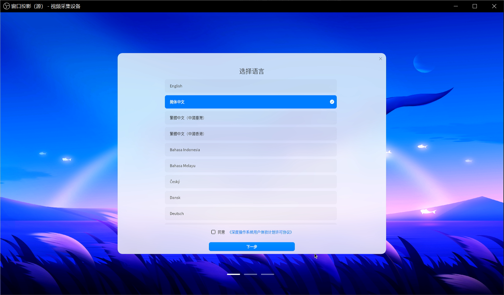
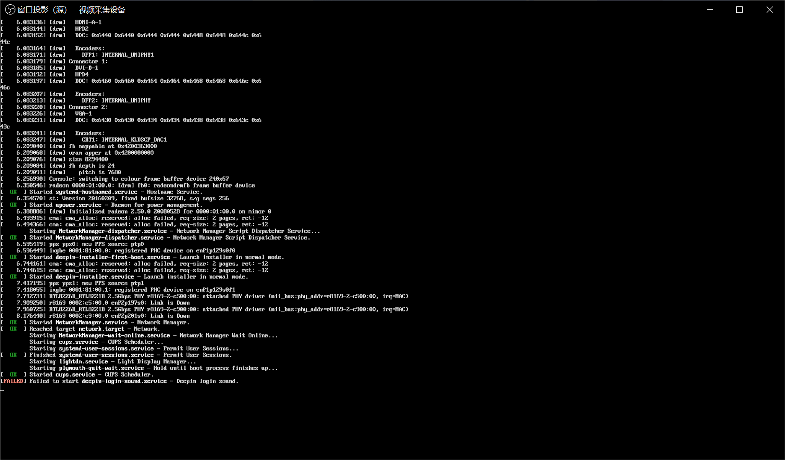
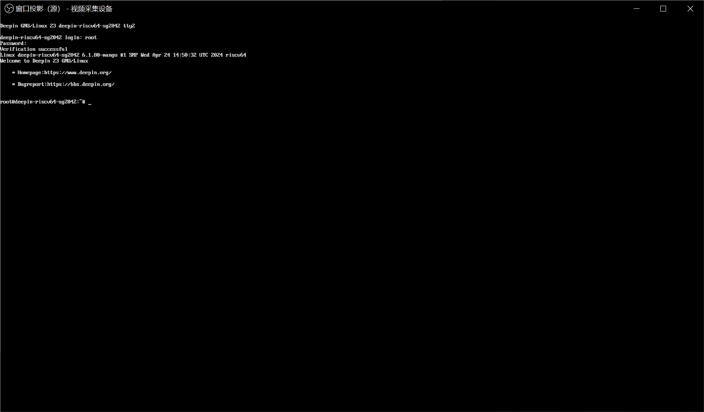

# Deepin RISC-V preview Pioneer test report

## Test environment

### OS information

- OS version: Deepin 23 preview-20240517
- Download Links:
    - OS image: https://cdimage.deepin.com/RISC-V/preview-20240517-riscv64/deepin-sg2042-riscv64-stable-desktop-installer.tar.xz
    - Firmware: https://cdimage.deepin.com/RISC-V/preview-20240517-riscv64/sophgo-bootloader-multi-sg2042-dev.zip
- Reference installation manual: https://cdimage.deepin.com/RISC-V/preview-20240517-riscv64/README.md

### Hardware info

- Milk-V Pioneer v1.3
- microSD Card (≥ 512MB)
- NVMe SSD (comes with this machine)
- microSD card reader
- NVMe-USB SSD enclosure
- USB-A to C / C to C cable
- VGA/HDMI monitor and cable (or a capture card as used in this test)
- USB keyboard & mouse

## Installation steps

### Extract and flash image

Use `tar` and `unzip` to extrace OS image and firmware.

Use `dd` to write these images.

Unzip `sophgo-bootloader-multi-sg2042-dev.zip`, write `firmware_multi_sg2042-dev.img` to microSD card.

Erase all partitions on the NVMe SSD, recreate a GPT partition table, create a new partition and write the ext4 system image to this partition.


`/dev/sdX`, `/dev/sdY` are microSD card and the NVMe SSD.

```bash
unzip sophgo-bootloader-multi-sg2042-dev.zip
sudo wipefs -af /dev/sdX
sudo dd if=firmware_multi_sg2042-dev.img of=/dev/sdX bs=1M status=progress
sudo wipefs -af /dev/sdY
sudo fdisk /dev/sdY
# Enter g, n, and Enter *3, then enter w to write the changes to disk
tar xvf deepin-23-beige-preview-riscv64-sg2042-20240613-124856.tar.xz
sudo dd if=./deepin-sg2042-riscv64-stable-desktop-installer.root.ext4 of=/dev/sdY1 bs=4M status=progress
echo ", +" | sudo sfdisk -N 1 /dev/sdX
sudo resize2fs /dev/sdX1
```

### Login

Login via GUI.

Choose the language and keyboard layout and complete the installation wizard.

Default username: `root`

Default password: `deepin`

## Expected Results

The system boots up normally and we can successfully login to the desktop.

## Actual Results

The system boots normally, the installation wizard loads up but cannot finish; cannot login to the desktop.

If we switch to another TTY (e.g. Ctrl + Alt + F2) then we can login to the shell.

> The following screenshots are from USB HDMI capture card directly from the machine.



The last step of the installation wizard will not complete:



TTY login:



### Boot log

N/A

Check the screenshots above.

## Test criteria

Successful: The actual result matches the expected result.

Failed: The actual result does not match the expected result.

## Conclusion

Test failed.