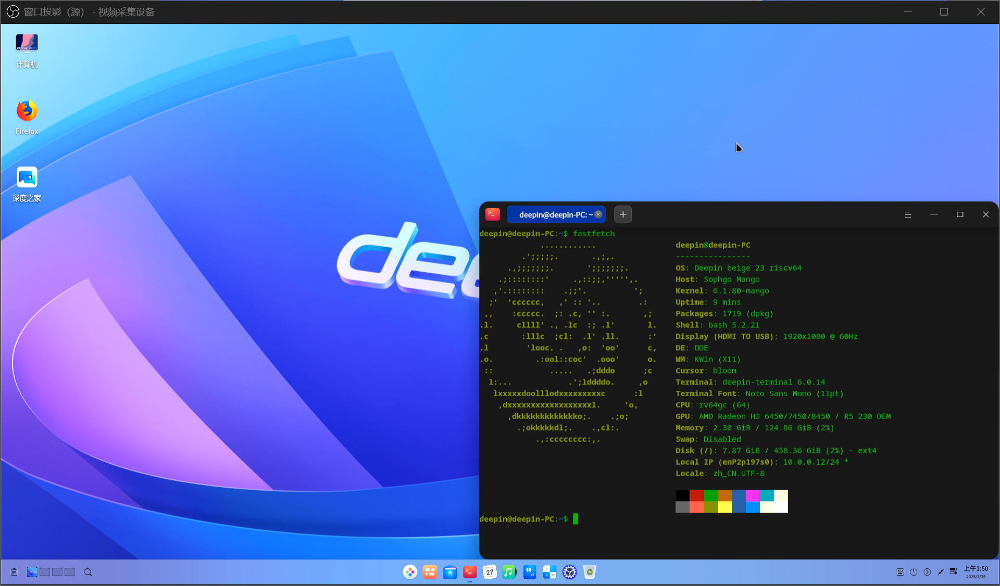
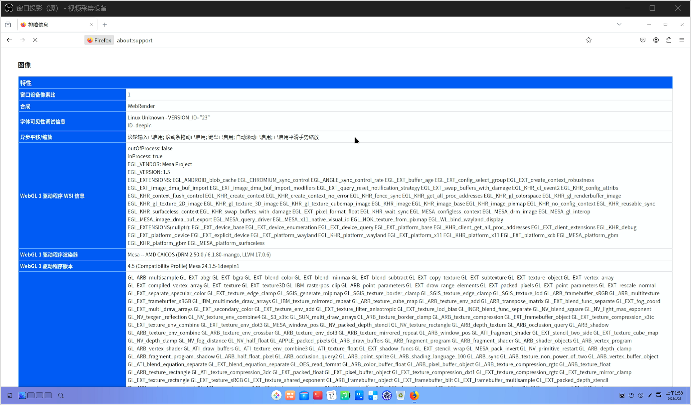
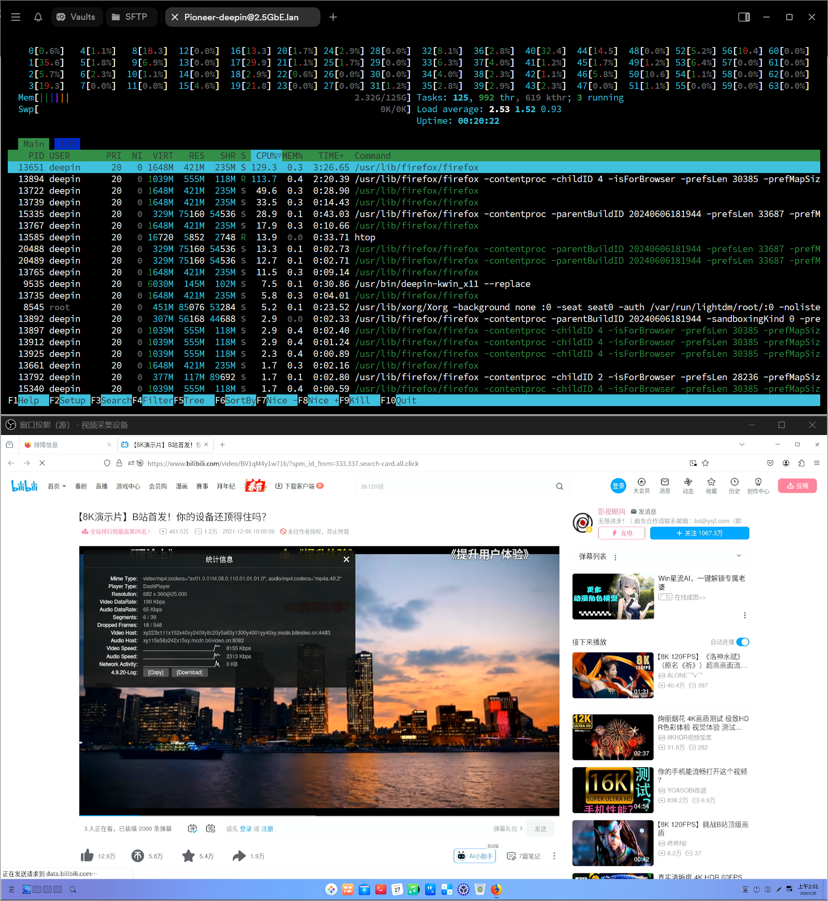
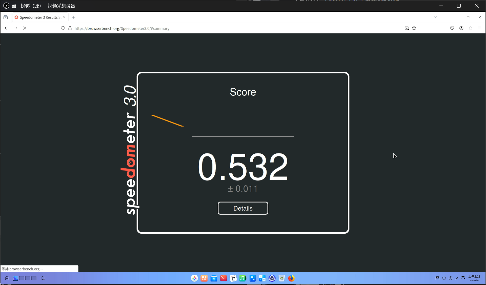
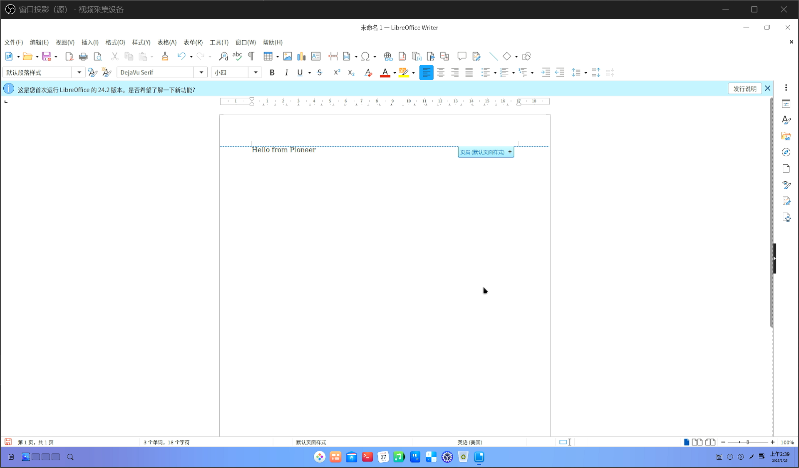

# Deepin RISC-V preview Pioneer test report

## Test environment

### OS information

- OS version: Deepin 23 preview-20240815
- Download Links:
    - OS image: https://cdimage.deepin.com/RISC-V/preview-20240815-riscv64/deepin-23-beige-preview-riscv64-sg2042-20240815-125146.tar.xz
    - Firmware: https://cdimage.deepin.com/RISC-V/preview-20240815-riscv64/sophgo-bootloader-single-sg2042-dev.zip
- Reference installation manual: https://cdimage.deepin.com/RISC-V/preview-20240517-riscv64/README.md

### Hardware info

- Milk-V Pioneer v1.3
- microSD Card (≥ 512MB)
- NVMe SSD (comes with this machine)
- microSD card reader
- NVMe-USB SSD enclosure
- USB-A to C / C to C cable
- VGA/HDMI monitor and cable (or a capture card as used in this test)
- USB keyboard & mouse

## Installation steps

### Extract and flash image

Use `tar` and `unzip` to extrace OS image and firmware.

Use `dd` to write these images.

Unzip `sophgo-bootloader-multi-sg2042-dev.zip`, write `firmware_multi_sg2042-dev.img` to microSD card.

Erase all partitions on the NVMe SSD, recreate a GPT partition table, create a new partition and write the ext4 system image to this partition.

`/dev/sdX`, `/dev/sdY` are microSD card and the NVMe SSD.

```bash
unzip sophgo-bootloader-multi-sg2042-dev.zip
sudo wipefs -af /dev/sdX
sudo dd if=firmware_multi_sg2042-dev.img of=/dev/sdX bs=1M status=progress
sudo wipefs -af /dev/sdY
sudo fdisk /dev/sdY
# Enter g, n, and Enter *3, then enter w to write the changes to disk
tar xvf deepin-23-beige-preview-riscv64-sg2042-20240815-125146.tar.xz
# Note that we are writing to the sdY1 partition instead of the entire sdY disk
sudo dd if=./deepin-sg2042-riscv64-stable-desktop-installer.root.ext4 of=/dev/sdY1 bs=4M status=progress
echo ", +" | sudo sfdisk -N 1 /dev/sdX
sudo resize2fs /dev/sdX1
```

### Login

Login via GUI.

Install the SSD before powering up and entering the setup wizard.

Before first login to desktop, the TTY console will be shown briefly upon completion of the setup wizard.

## Expected results

The system boots up normally and allows login through the graphical interface.

## Actual results

The system boots up normally and login through the setup wizard is successful.

> Below are screenshots taken from a USB HDMI video capture card.


### Desktop environment

The desktop experience is rather smooth.



### Package manager

Certain repositories are unusable due to lack of GPG signatures while the rest of the package manager works as intended.


### 视频播放

Playing "Big Buck Bunny" (1080P 60FPS H264) with the built-in media app results in significant audio and video desynchronization and frame dropping; presumably the hardware video decoder is not working.

Issue persists with `mpv --hwdec=auto`, though audio tracks are still playable.


### 浏览器

#### Firefox 127

The system comes with Firefox 127 preinstalled.

Inspection shows that this build of Firefox has WebRender hardware accelerated rendering disabled.



Hardware accleration for video playback is also disabled:


In the case of relatively heavy web pages such as BiliBili, software decoding (360P 25FPS AV1) comes with slight frame losses and stutters:



360P H264 yields better results but with slight frame losses too:


Speedometer 3.0 scored 0.532 ± 0.011:



（The results screen are not fully loaded due to network issues.）

BaseMark Web 3.0 triggered a GPU lockup，halting the test:

```log
[ 2765.323536] radeon 0000:01:00.0: GPU lockup (current fence id 0x00000000000186ac last fence id 0x00000000000186b0 on ring 0)
[ 2765.835510] radeon 0000:01:00.0: ring 0 stalled for more than 59904msec
[ 2765.835530] radeon 0000:01:00.0: GPU lockup (current fence id 0x00000000000186ac last fence id 0x00000000000186b0 on ring 0)
[ 2766.166855] radeon 0000:01:00.0: Saved 55 dwords of commands on ring 0.
[ 2766.166899] radeon 0000:01:00.0: GPU softreset: 0x00000019
[ 2766.166910] radeon 0000:01:00.0:   GRBM_STATUS               = 0xA2703CA0
[ 2766.166918] radeon 0000:01:00.0:   GRBM_STATUS_SE0           = 0x1C000007
[ 2766.166925] radeon 0000:01:00.0:   GRBM_STATUS_SE1           = 0x00000007
[ 2766.166933] radeon 0000:01:00.0:   SRBM_STATUS               = 0x20000AC0
[ 2766.166939] radeon 0000:01:00.0:   SRBM_STATUS2              = 0x00000000
[ 2766.166946] radeon 0000:01:00.0:   R_008674_CP_STALLED_STAT1 = 0x01000000
[ 2766.166953] radeon 0000:01:00.0:   R_008678_CP_STALLED_STAT2 = 0x00011000
[ 2766.166960] radeon 0000:01:00.0:   R_00867C_CP_BUSY_STAT     = 0x00068404
[ 2766.166966] radeon 0000:01:00.0:   R_008680_CP_STAT          = 0x80878647
[ 2766.166975] radeon 0000:01:00.0:   R_00D034_DMA_STATUS_REG   = 0x44C83D57
[ 2766.182077] radeon 0000:01:00.0: GRBM_SOFT_RESET=0x00007F6B
[ 2766.182147] radeon 0000:01:00.0: SRBM_SOFT_RESET=0x00000100
[ 2766.183309] radeon 0000:01:00.0:   GRBM_STATUS               = 0x00003828
[ 2766.183319] radeon 0000:01:00.0:   GRBM_STATUS_SE0           = 0x00000007
[ 2766.183327] radeon 0000:01:00.0:   GRBM_STATUS_SE1           = 0x00000007
[ 2766.183333] radeon 0000:01:00.0:   SRBM_STATUS               = 0x200000C0
[ 2766.183340] radeon 0000:01:00.0:   SRBM_STATUS2              = 0x00000000
[ 2766.183346] radeon 0000:01:00.0:   R_008674_CP_STALLED_STAT1 = 0x00000000
[ 2766.183353] radeon 0000:01:00.0:   R_008678_CP_STALLED_STAT2 = 0x00000000
[ 2766.183360] radeon 0000:01:00.0:   R_00867C_CP_BUSY_STAT     = 0x00000000
[ 2766.183366] radeon 0000:01:00.0:   R_008680_CP_STAT          = 0x00000000
[ 2766.183373] radeon 0000:01:00.0:   R_00D034_DMA_STATUS_REG   = 0x44C83D57
[ 2766.183397] radeon 0000:01:00.0: GPU reset succeeded, trying to resume
[ 2766.228998] [drm] PCIE GART of 1024M enabled (table at 0x0000000000162000).
[ 2766.229149] radeon 0000:01:00.0: WB enabled
[ 2766.229159] radeon 0000:01:00.0: fence driver on ring 0 use gpu addr 0x0000000080000c00
[ 2766.229168] radeon 0000:01:00.0: fence driver on ring 3 use gpu addr 0x0000000080000c0c
[ 2766.232217] radeon 0000:01:00.0: fence driver on ring 5 use gpu addr 0x0000000000072118
[ 2766.232446] debugfs: File 'radeon_ring_gfx' in directory '0' already present!
[ 2766.232474] debugfs: File 'radeon_ring_dma1' in directory '0' already present!
[ 2766.248765] [drm] ring test on 0 succeeded in 1 usecs
[ 2766.248790] [drm] ring test on 3 succeeded in 6 usecs
[ 2766.248803] debugfs: File 'radeon_ring_uvd' in directory '0' already present!
[ 2766.425951] [drm] ring test on 5 succeeded in 2 usecs
[ 2766.425977] [drm] UVD initialized successfully.
```

#### Chromium

Chromium is not available in either the system nor the software repositories.

```log
deepin@deepin-PC:~$ sudo apt update; sudo apt install chromium
命中:2 https://ci.deepin.com/repo/deepin/deepin-community/stable beige InRelease
获取:3 https://ci.deepin.com/repo/deepin/deepin-ports/v23-addons beige InRelease [13.5 kB]
命中:1 https://cdn-community-packages.deepin.com/driver-23 driver InRelease
忽略:3 https://ci.deepin.com/repo/deepin/deepin-ports/v23-addons beige InRelease
已下载 13.5 kB，耗时 2秒 (6,211 B/s)
正在读取软件包列表... 完成
正在分析软件包的依赖关系树... 完成
正在读取状态信息... 完成                 
有 573 个软件包可以升级。请执行 ‘apt list --upgradable’ 来查看它们。
W: GPG 错误：https://ci.deepin.com/repo/deepin/deepin-ports/v23-addons beige InRelease: 由于没有公钥，无法验证下列签名： NO_PUBKEY A26F40EFAE3821E2
正在读取软件包列表... 完成
正在分析软件包的依赖关系树... 完成
正在读取状态信息... 完成                 
没有可用的软件包 chromium，但是它被其它的软件包引用了。
这可能意味着这个缺失的软件包可能已被废弃，
或者只能在其他发布源中找到

E: 软件包 chromium 没有可安装候选
eepin@deepin-PC:~$ apt search chromium
正在排序... 完成
全文搜索... 完成  
chromium-l10n/未知 128.0.6613.84-1deepin1 all
  web browser - language packs

emacs-mozc/未知 2.28.4715.102+dfsg-2.3deepin1 riscv64
  Mozc for Emacs
...
```

### Office suites

The system comes with LibreOffice preinstalled.

First startup of LibreOffice Write takes approximately 30s.

Upon typing, the blue tip in the menu bar will keep blinking (which can be turned off manually).

Other functions work as intended.



### Boot log

N/A

Check the screenshots above.

## Test criteria

Successful: The actual result matches the expected result.

Failed: The actual result does not match the expected result.

## Conclusion

Test successful.