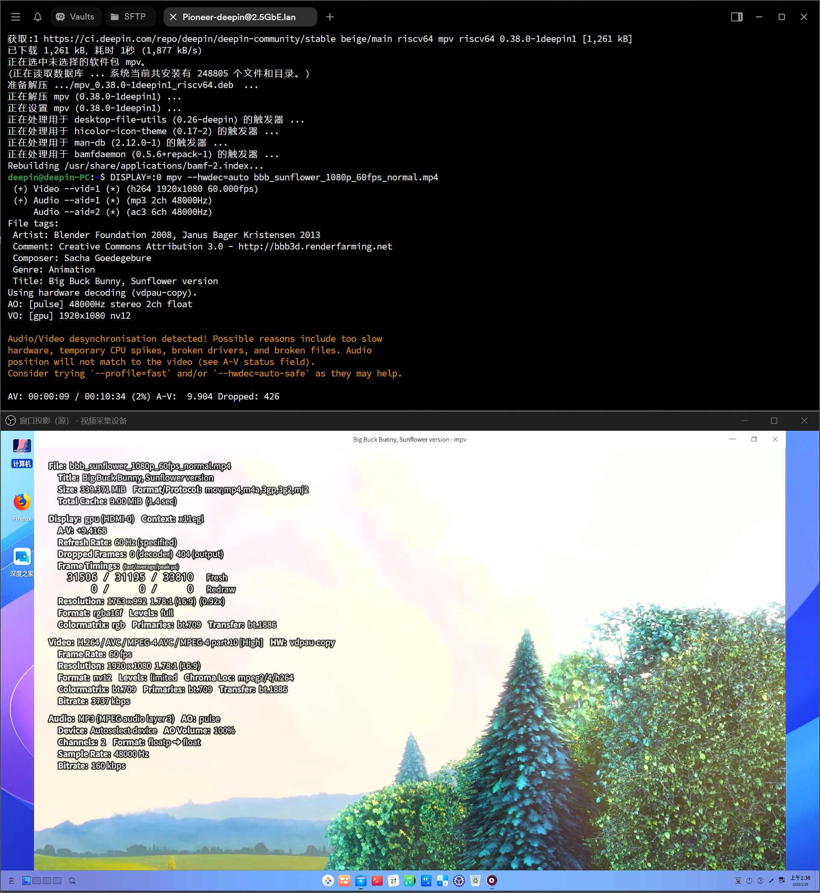

# Deepin RISC-V preview Pioneer 测试报告

## 测试环境

### 操作系统信息

- 系统版本：Deepin 23 preview-20240815
- 下载链接：
    - 系统镜像：https://cdimage.deepin.com/RISC-V/preview-20240815-riscv64/deepin-23-beige-preview-riscv64-sg2042-20240815-125146.tar.xz
    - 固件：https://cdimage.deepin.com/RISC-V/preview-20240815-riscv64/sophgo-bootloader-single-sg2042-dev.zip
- 参考安装文档：https://cdimage.deepin.com/RISC-V/preview-20240517-riscv64/README.md

### 硬件信息

- Milk-V Pioneer v1.3
- microSD 卡一张（≥ 512M 即可）
- NVMe SSD 一个（出厂预装）
- 读卡器一个
- NVMe-USB 硬盘盒一个
- USB-A to C 或 C to C 线缆一根
- VGA/HDMI 显示器及对应线缆（本次测试使用了 HDMI 采集卡）
- USB 键盘&鼠标

## 安装步骤

### 解压并刷写镜像到 microSD 卡

使用 `tar` 和 `unzip` 分别解压系统镜像和固件。
使用 `dd` 将固件写入 microSD 卡。

解压 `sophgo-bootloader-multi-sg2042-dev.zip`，将 `firmware_multi_sg2042-dev.img` 写入 microSD 卡。

抹除 NVMe SSD 上先前已存在的所有分区，重新创建一个 GPT 分区表，新建一个分区，将 ext4 格式的系统镜像写入到此分区。

下述 `/dev/sdX`、`/dev/sdY` 分别为 microSD 卡和 NVMe SSD，请自行变更。

```bash
unzip sophgo-bootloader-multi-sg2042-dev.zip
sudo wipefs -af /dev/sdX
sudo dd if=firmware_multi_sg2042-dev.img of=/dev/sdX bs=1M status=progress
sudo wipefs -af /dev/sdY
sudo fdisk /dev/sdY
# 依次输入 g，n，然后回车确认（三次），最后输入 w 将设置写入硬盘
tar xvf deepin-23-beige-preview-riscv64-sg2042-20240815-125146.tar.xz
# 注意是写入 sdY 的第一个分区 sdY1 而不是直接写入 sdY 全盘
sudo dd if=./deepin-sg2042-riscv64-stable-desktop-installer.root.ext4 of=/dev/sdY1 bs=4M status=progress
echo ", +" | sudo sfdisk -N 1 /dev/sdX
sudo resize2fs /dev/sdX1
```

### 登录系统

通过 GUI 登录系统。

安装好 SSD 后，开机进入首次启动向导。

设置向导最后完成后会回到 TTY，稍等片刻会自动进入桌面。

## 预期结果

系统正常启动，能够进入桌面。

## 实际结果

系统成功启动，能够进入设置向导。

切换到其他 TTY (Ctrl + Alt + F2) 可以登录 Shell。

> 截图为 USB HDMI 采集卡捕获到的画面。


### 桌面环境

桌面体验较为流畅。


### 软件包管理

注意到有部分源因缺少 GPG 签名而无法使用，但不影响整体体验，包管理正常工作。


### 视频播放

使用系统自带的影音应用播放 1080P 60FPS H264 的 Big Buck Bunny 样片，出现明显音画不同步和掉帧情况：

推测硬件视频解码未工作。

尝试手动安装 mpv，通过 `mpv --hwdec=auto` 方式调用，出现了同样的情况。声音正常播放，视频丢帧严重。



### 浏览器

#### Firefox 127

系统预装了 Firefox 127 版本。

经检查，Firefox 的 WebRender 硬件加速渲染已启用。


视频硬件加码默认未启用：


以 bilibili 这类相对较重的网页实测，360P 25FPS AV1 软解下，视频有轻微丢帧卡顿：


360P H264 软解下，依然有部分丢帧，卡顿情况稍有缓解：


Speedometer 3.0 得分：0.532 ± 0.011


（得分界面未完全加载是网络问题。）

BaseMark Web 3.0 运行过程中触发了 GPU lockup，测试无法继续运行：

```log
[ 2765.323536] radeon 0000:01:00.0: GPU lockup (current fence id 0x00000000000186ac last fence id 0x00000000000186b0 on ring 0)
[ 2765.835510] radeon 0000:01:00.0: ring 0 stalled for more than 59904msec
[ 2765.835530] radeon 0000:01:00.0: GPU lockup (current fence id 0x00000000000186ac last fence id 0x00000000000186b0 on ring 0)
[ 2766.166855] radeon 0000:01:00.0: Saved 55 dwords of commands on ring 0.
[ 2766.166899] radeon 0000:01:00.0: GPU softreset: 0x00000019
[ 2766.166910] radeon 0000:01:00.0:   GRBM_STATUS               = 0xA2703CA0
[ 2766.166918] radeon 0000:01:00.0:   GRBM_STATUS_SE0           = 0x1C000007
[ 2766.166925] radeon 0000:01:00.0:   GRBM_STATUS_SE1           = 0x00000007
[ 2766.166933] radeon 0000:01:00.0:   SRBM_STATUS               = 0x20000AC0
[ 2766.166939] radeon 0000:01:00.0:   SRBM_STATUS2              = 0x00000000
[ 2766.166946] radeon 0000:01:00.0:   R_008674_CP_STALLED_STAT1 = 0x01000000
[ 2766.166953] radeon 0000:01:00.0:   R_008678_CP_STALLED_STAT2 = 0x00011000
[ 2766.166960] radeon 0000:01:00.0:   R_00867C_CP_BUSY_STAT     = 0x00068404
[ 2766.166966] radeon 0000:01:00.0:   R_008680_CP_STAT          = 0x80878647
[ 2766.166975] radeon 0000:01:00.0:   R_00D034_DMA_STATUS_REG   = 0x44C83D57
[ 2766.182077] radeon 0000:01:00.0: GRBM_SOFT_RESET=0x00007F6B
[ 2766.182147] radeon 0000:01:00.0: SRBM_SOFT_RESET=0x00000100
[ 2766.183309] radeon 0000:01:00.0:   GRBM_STATUS               = 0x00003828
[ 2766.183319] radeon 0000:01:00.0:   GRBM_STATUS_SE0           = 0x00000007
[ 2766.183327] radeon 0000:01:00.0:   GRBM_STATUS_SE1           = 0x00000007
[ 2766.183333] radeon 0000:01:00.0:   SRBM_STATUS               = 0x200000C0
[ 2766.183340] radeon 0000:01:00.0:   SRBM_STATUS2              = 0x00000000
[ 2766.183346] radeon 0000:01:00.0:   R_008674_CP_STALLED_STAT1 = 0x00000000
[ 2766.183353] radeon 0000:01:00.0:   R_008678_CP_STALLED_STAT2 = 0x00000000
[ 2766.183360] radeon 0000:01:00.0:   R_00867C_CP_BUSY_STAT     = 0x00000000
[ 2766.183366] radeon 0000:01:00.0:   R_008680_CP_STAT          = 0x00000000
[ 2766.183373] radeon 0000:01:00.0:   R_00D034_DMA_STATUS_REG   = 0x44C83D57
[ 2766.183397] radeon 0000:01:00.0: GPU reset succeeded, trying to resume
[ 2766.228998] [drm] PCIE GART of 1024M enabled (table at 0x0000000000162000).
[ 2766.229149] radeon 0000:01:00.0: WB enabled
[ 2766.229159] radeon 0000:01:00.0: fence driver on ring 0 use gpu addr 0x0000000080000c00
[ 2766.229168] radeon 0000:01:00.0: fence driver on ring 3 use gpu addr 0x0000000080000c0c
[ 2766.232217] radeon 0000:01:00.0: fence driver on ring 5 use gpu addr 0x0000000000072118
[ 2766.232446] debugfs: File 'radeon_ring_gfx' in directory '0' already present!
[ 2766.232474] debugfs: File 'radeon_ring_dma1' in directory '0' already present!
[ 2766.248765] [drm] ring test on 0 succeeded in 1 usecs
[ 2766.248790] [drm] ring test on 3 succeeded in 6 usecs
[ 2766.248803] debugfs: File 'radeon_ring_uvd' in directory '0' already present!
[ 2766.425951] [drm] ring test on 5 succeeded in 2 usecs
[ 2766.425977] [drm] UVD initialized successfully.
```

#### Chromium

系统未预装 Chromium，且软件源中无 Chromium 可用。

```log
deepin@deepin-PC:~$ sudo apt update; sudo apt install chromium
命中:2 https://ci.deepin.com/repo/deepin/deepin-community/stable beige InRelease
获取:3 https://ci.deepin.com/repo/deepin/deepin-ports/v23-addons beige InRelease [13.5 kB]
命中:1 https://cdn-community-packages.deepin.com/driver-23 driver InRelease
忽略:3 https://ci.deepin.com/repo/deepin/deepin-ports/v23-addons beige InRelease
已下载 13.5 kB，耗时 2秒 (6,211 B/s)
正在读取软件包列表... 完成
正在分析软件包的依赖关系树... 完成
正在读取状态信息... 完成                 
有 573 个软件包可以升级。请执行 ‘apt list --upgradable’ 来查看它们。
W: GPG 错误：https://ci.deepin.com/repo/deepin/deepin-ports/v23-addons beige InRelease: 由于没有公钥，无法验证下列签名： NO_PUBKEY A26F40EFAE3821E2
正在读取软件包列表... 完成
正在分析软件包的依赖关系树... 完成
正在读取状态信息... 完成                 
没有可用的软件包 chromium，但是它被其它的软件包引用了。
这可能意味着这个缺失的软件包可能已被废弃，
或者只能在其他发布源中找到

E: 软件包 chromium 没有可安装候选
eepin@deepin-PC:~$ apt search chromium
正在排序... 完成
全文搜索... 完成  
chromium-l10n/未知 128.0.6613.84-1deepin1 all
  web browser - language packs

emacs-mozc/未知 2.28.4715.102+dfsg-2.3deepin1 riscv64
  Mozc for Emacs
...
```

### 办公套件

系统预装了 LibreOffice 办公套件。

以 LibreOffice Write 为例，初次启动耗时约 30s。

开始打字后，菜单栏的蓝色提示会不断闪烁（可以手动关闭）。

基本功能正常，LibreOffice 基本可用。


## 启动信息

屏幕截图见上方。

## 测试判定标准

测试成功：实际结果与预期结果相符。

测试失败：实际结果与预期结果不符。

## 测试结论

测试成功。