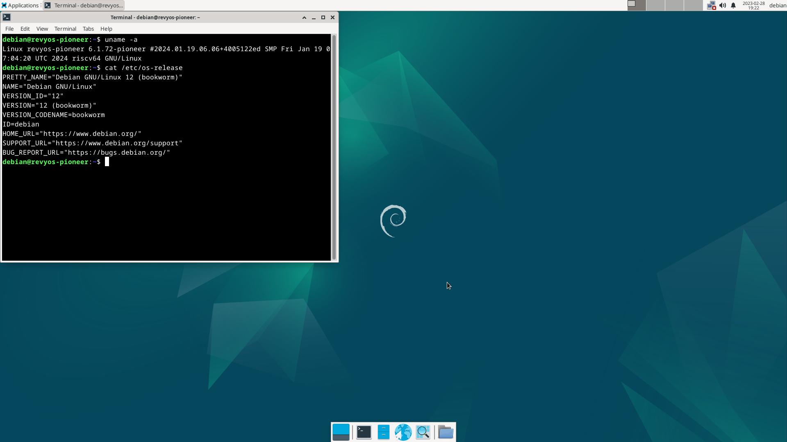

# RevyOS Pioneer Test Report

## Test Environment

### Operating System Information

- System Version: RevyOS 20240119
- Download Link: [https://mirror.iscas.ac.cn/revyos/extra/images/sg2042/20240119/](https://mirror.iscas.ac.cn/revyos/extra/images/sg2042/20240119/)
- Reference Installation Document: [https://revyos.github.io/docs/](https://revyos.github.io/docs/)

### Hardware Information

- Milk-V Pioneer Box v1.1
- One microSD card
- HDMI cable + monitor

## Installation Steps

### Flashing Image

Decompress the image using `zstd`.
Write the image to the microSD card using `dd`.

```bash
zstd -d /path/to/revyos.img.zstd
dd if=/path/to/revyos.img of=/dev/yout-device bs=4M status=progress
```

### Common Issues

- To boot from the SD card, manually add Fip.bin and ZSBL to it.

### Logging into the System

Logging into the system via the graphical interface.

Default username: `debian`
Default password: `debian`

## Expected Results

The system boots up normally and allows login through the graphical interface.

## Actual Results

The system boots up normally and login through the graphical interface is successful.

### Boot Log



Serial logs (from flashing the system to booting up):

[](https://asciinema.org/a/voe4Uou1CvIP7u21inc3tfjAT)

## Test Criteria

Successful: The actual result matches the expected result.

Failed: The actual result does not match the expected result.

## Test Conclusion

Test successful.
