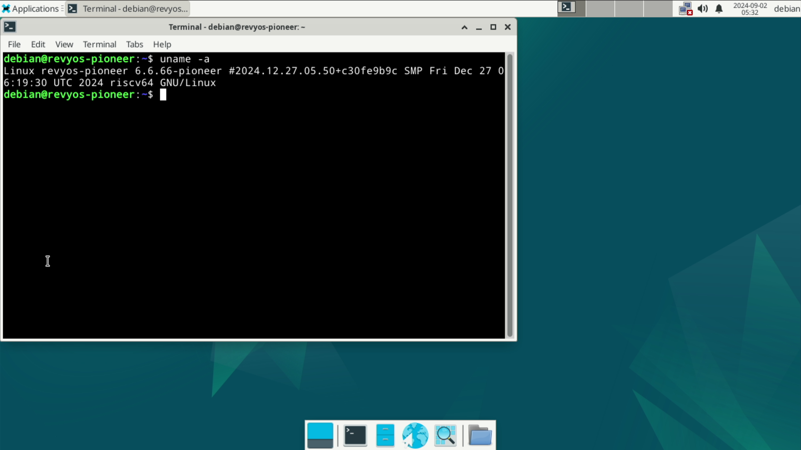

# RevyOS Pioneer Test Report

## Test Environment

### Operating System Information

- System Version: RevyOS 20241230
- Download Link: [https://mirror.iscas.ac.cn/revyos/extra/images/sg2042/20241230/](https://mirror.iscas.ac.cn/revyos/extra/images/sg2042/20241230/)
  - Firmware: [https://mirror.iscas.ac.cn/revyos/extra/images/sg2042/20241230/](https://mirror.iscas.ac.cn/revyos/extra/images/sg2042/20241230/)
- Reference Installation Document: [https://docs.revyos.dev/docs/Installation/milkv-pioneer/](https://docs.revyos.dev/docs/Installation/milkv-pioneer/)

### Hardware Information

- Milk-V Pioneer Box v1.3
- A microSD card
- NVME SSD and Reader
- HDMI cable + monitor

## Installation Steps

### Flashing Firmware

#### SD card (suggest for fist-time)

Get the firmware and flash to the SD card:
```bash
wget https://mirror.iscas.ac.cn/revyos/extra/images/sg2042/20241230/firmware_single_sg2042-v6.6-lts-v0p7.img
sudo dd if=firmware_single_sg2042-v6.6-lts-v0p7.img of=/dev/your/sd/card
sync
```

Insert the SD card into the Pioneer Box.

#### SPI Flash

To flash the SPI flash, you need to have a running system on Pioneer Box.

Install mtd relative software:
```bash
sudo apt install mtd-utils
sudo modprobe mtdblock
```

Download and flash into SPI Flash **Notice this time the firmware ends with `.bin`**
```bash
wget https://mirror.iscas.ac.cn/revyos/extra/images/sg2042/20240819/firmware_single_sg2042-v6.6-lts-v0p7.bin
sudo flashcp -v firmware_single_sg2042-v6.6-lts-v0p7.bin /dev/mtd1
```

### Flashing Image

Decompress the image using `zstd`.
Write the image to the microSD card using `dd`.

```bash
zstd -d /path/to/revyos-pioneer-20241230-212249.img.zst
dd if=/path/to/revyos-pioneer-20241230-212249.img.zst of=/dev/yout-device bs=4M status=progress
```

### Common Issues

- To boot from the SD card, manually add Fip.bin and ZSBL to it.
- If you see random mess from serial port, which means you probably needs to update your firmware.

### Logging into the System

Logging into the system via the graphical interface.

Default username: `debian`
Default password: `debian`

## Expected Results

The system boots up normally and allows login through the graphical interface.

## Actual Results

The system boots up normally and login through the graphical interface is successful.

### Boot Log

```log
revyos-pioneer login: debian
Password: 
Linux revyos-pioneer 6.6.66-pioneer #2024.12.27.05.50+c30fe9b9c SMP Fri Dec 27 06:19:30 UTC 2024 riscv64

The programs included with the Debian GNU/Linux system are free software;
the exact distribution terms for each program are described in the
individual files in /usr/share/doc/*/copyright.

Debian GNU/Linux comes with ABSOLUTELY NO WARRANTY, to the extent
permitted by applicable law.
debian@revyos-pioneer:~$ uname -a
Linux revyos-pioneer 6.6.66-pioneer #2024.12.27.05.50+c30fe9b9c SMP Fri Dec 27 06:19:30 UTC 2024 riscv64 GNU/Linux
debian@revyos-pioneer:~$ cat /etc/os-release 
PRETTY_NAME="Debian GNU/Linux trixie/sid"
NAME="Debian GNU/Linux"
VERSION_CODENAME=trixie
ID=debian
HOME_URL="https://www.debian.org/"
SUPPORT_URL="https://www.debian.org/support"
BUG_REPORT_URL="https://bugs.debian.org/"
debian@revyos-pioneer:~$ cat /etc/re
resolv.conf     revyos-release  
debian@revyos-pioneer:~$ cat /etc/revyos-release 
20241230-212249
```




Serial logs (from flashing the system to booting up):

[](https://asciinema.org/a/OFK3vNsNvS9zHLPXAI46ynBtd)

## Test Criteria

Successful: The actual result matches the expected result.

Failed: The actual result does not match the expected result.

## Test Conclusion

Test successful.
