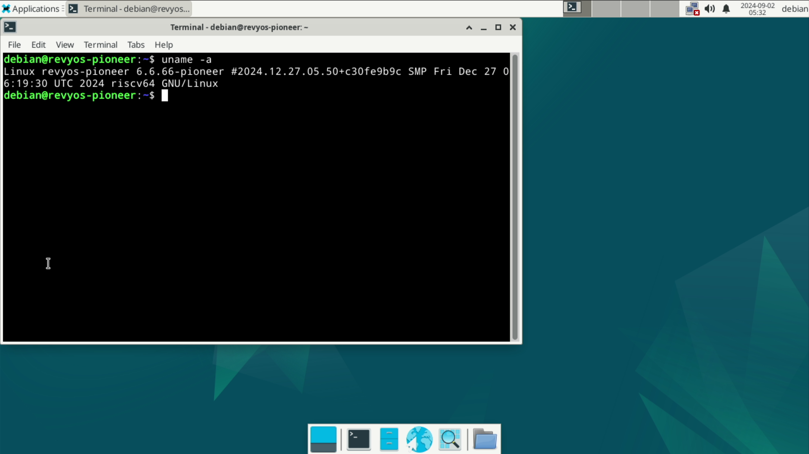

# RevyOS Pioneer 测试报告

## 测试环境

### 操作系统信息

- 系统版本：RevyOS 20241230
- 下载链接：[https://mirror.iscas.ac.cn/revyos/extra/images/sg2042/20241230/](https://mirror.iscas.ac.cn/revyos/extra/images/sg2042/20241230/)
  - 固件: [https://mirror.iscas.ac.cn/revyos/extra/images/sg2042/20241230/](https://mirror.iscas.ac.cn/revyos/extra/images/sg2042/20241230/)
- 参考安装文档：[https://docs.revyos.dev/docs/Installation/milkv-pioneer/](https://docs.revyos.dev/docs/Installation/milkv-pioneer/)

### 硬件信息

- Milk-V Pioneer Box v1.3
- microSD 卡一张
- NMVE SSD 及硬盘盒
- HDMI 线 + 显示器

## 安装步骤

### 刷写固件

#### SD 卡（推荐第一次使用）

下载固件并刷入 SD 卡中：
```bash
wget https://mirror.iscas.ac.cn/revyos/extra/images/sg2042/20241230/firmware_single_sg2042-v6.6-lts-v0p7.img
sudo dd if=firmware_single_sg2042-v6.6-lts-v0p7.img of=/dev/your/sd/card
sync
```

插入 SD 卡到 Pioneer Box。

#### SPI Flash

你需要在 Pioneer Box 上有一个正在运行的系统才能刷写 SPI Flash。

安装 mtd 相关软件：
```bash
sudo apt install mtd-utils
sudo modprobe mtdblock
```

下载固件并刷入 SPI Flash *注意此处固件以 `.bin` 结尾*
```bash
wget https://mirror.iscas.ac.cn/revyos/extra/images/sg2042/20240819/firmware_single_sg2042-v6.6-lts-v0p7.bin
sudo flashcp -v firmware_single_sg2042-v6.6-lts-v0p7.bin /dev/mtd1
```


### 刷写镜像

使用 `zstd` 解压镜像。
使用 `dd` 将镜像写入 microSD 卡。

```bash
zstd -d /path/to/revyos-pioneer-20241230-212249.img.zst
dd if=/path/to/revyos-pioneer-20241230-212249.img.zst of=/dev/yout-device bs=4M status=progress
```

### 常见问题

- 若需要从 SD 卡启动，需要手动向其中添加 Fip.bin 和 ZSBL。
- 若串口出现乱码，可能需要升级固件。

### 登录系统

通过图形界面登录系统。

默认用户名：`debian`
默认密码：`debian`

## 测试判定标准

测试成功：实际结果与预期结果相符。

测试失败：实际结果与预期结果不符。

## 预期结果

系统正常启动，能够通过图形界面登录。

## 实际结果

系统正常启动，成功通过图形界面登录。

### 启动信息



```log
revyos-pioneer login: debian
Password: 
Linux revyos-pioneer 6.6.66-pioneer #2024.12.27.05.50+c30fe9b9c SMP Fri Dec 27 06:19:30 UTC 2024 riscv64

The programs included with the Debian GNU/Linux system are free software;
the exact distribution terms for each program are described in the
individual files in /usr/share/doc/*/copyright.

Debian GNU/Linux comes with ABSOLUTELY NO WARRANTY, to the extent
permitted by applicable law.
debian@revyos-pioneer:~$ uname -a
Linux revyos-pioneer 6.6.66-pioneer #2024.12.27.05.50+c30fe9b9c SMP Fri Dec 27 06:19:30 UTC 2024 riscv64 GNU/Linux
debian@revyos-pioneer:~$ cat /etc/os-release 
PRETTY_NAME="Debian GNU/Linux trixie/sid"
NAME="Debian GNU/Linux"
VERSION_CODENAME=trixie
ID=debian
HOME_URL="https://www.debian.org/"
SUPPORT_URL="https://www.debian.org/support"
BUG_REPORT_URL="https://bugs.debian.org/"
debian@revyos-pioneer:~$ cat /etc/re
resolv.conf     revyos-release  
debian@revyos-pioneer:~$ cat /etc/revyos-release 
20241230-212249
```


串口日志（从刷写系统到启动系统）：

[](https://asciinema.org/a/OFK3vNsNvS9zHLPXAI46ynBtd)


## 测试结论

测试成功。