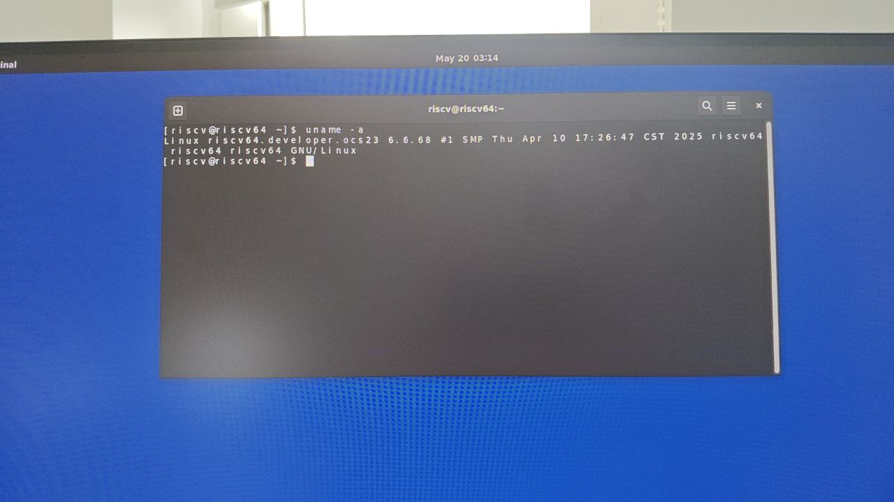

# openCloudOS-Stream 23 Pioneer Test Report

## Test Environment

### Operating System Information

- System Version: openCloudOS-Stream 23
- Download Link: [https://mirrors.opencloudos.tech/opencloudos-stream/releases/23/images/riscv64/sdcard/](https://mirrors.opencloudos.tech/opencloudos-stream/releases/23/images/riscv64/sdcard/)

### Hardware Information

- Milk-V Pioneer Box v1.3
- A microSD card
- A USB Type-C cable (used to connect the onboard serial port)

## Installation Steps

### Flashing Image

Download the uefi version: [ocs_developer_sdcard-uefi.img.xz](https://mirrors.opencloudos.tech/opencloudos-stream/releases/23/images/riscv64/sdcard/ocs_developer_sdcard-uefi.img.xz)

Decompress the image using `xz`.
Write the image to the microSD card using `dd`.

```bash
xz -d ocs_developer_sdcard-uefi.img.xz
dd if=ocs_developer_sdcard-uefi.img of=/dev/your-device bs=4M status=progress
```

### Install Desktop Environment

You meed to update the mesa driver before using the desktop environment.

```bash
sudo dnf update -y
```

```bash
sudo dnf install -y xorg-x11*
sudo dnf install -y gnome*
sudo dnf install -y gtk3 clutter-gtk xdg-user-dirs-gtk colord-gtk
```

We highly recommend install the following fonts for better experience:

```bash
sudo dnf install -y google-noto-fonts-common google-noto-cjk-fonts-common google-noto-sans-cjk-sc-fonts google-noto-serif-sc-fonts
```

*If you use other language, change the sc font to your language*

Apply following chages to boot into desktop environment:

```bash
sudo systemctl set-default graphical.target
```

### Logging into the System

Logging into the system via the serial port.

Default username: `root`
Default password: `riscv666!`

## Expected Results

The system boots up normally and allows login through the serial port.

## Actual Results

The system boots up normally and login through the serial port is successful.

### Boot Log

*Note: the grub in uefi could be slow, please wait patiently*

```log
Welcome to the OpenCloudOS-Stream/RISC-V disk image

Build date: Thu Apr 24 12:41:27 UTC 2025

Kernel 6.6.68 on an riscv64 (ttyS0)

The root password is 'riscv666!'.
root password logins are disabled in SSH.
User 'riscv' with password 'riscv666!' in 'wheel' and 'mock' groups 
is provided.

To install new packages use 'dnf install ...'

To upgrade disk image use 'dnf upgrade --best'

If DNS isn’t working, try editing ‘/etc/yum.repos.d/OpenCloudOS-Stream.repo’.

riscv64 login: root
Password: 
[root@riscv64 ~]# cat /etc/os-release 
NAME="OpenCloudOS Stream"
VERSION="23"
RELEASE="2410"
ID="opencloudos"
ID_LIKE="opencloudos"
VERSION_ID="23"
PLATFORM_ID="platform:ocs23"
PRETTY_NAME="OpenCloudOS Stream 23"
ANSI_COLOR="0;31"
CPE_NAME="cpe:/o:opencloudos:opencloudos:23"
HOME_URL="https://www.opencloudos.org/"
BUG_REPORT_URL="https://bugs.opencloudos.tech/"
[root@riscv64 ~]# lscpu
Architecture:          riscv64
  Byte Order:          Little Endian
CPU(s):                64
  On-line CPU(s) list: 0-63
NUMA:                  
  NUMA node(s):        4
  NUMA node0 CPU(s):   0-7,16-23
  NUMA node1 CPU(s):   8-15,24-31
  NUMA node2 CPU(s):   32-39,48-55
  NUMA node3 CPU(s):   40-47,56-63
[root@riscv64 ~]# uname -a
Linux riscv64.developer.ocs23 6.6.68 #1 SMP Thu Apr 10 17:26:47 CST 2025 riscv64 riscv64 riscv64 GNU/Linux
[root@riscv64 ~]# cat /etc/opencloudos-release 
OpenCloudOS Stream release 23
[root@riscv64 ~]# cat /etc/opencloudos-stream-release 
OpenCloudOS Stream release 23
          
```

Serial logs (from flashing the system to booting up):

[](https://asciinema.org/a/GcjWbifW4xMC2hLwPtn2BeobG)



## Test Criteria

Successful: The actual result matches the expected result.

Failed: The actual result does not match the expected result.

## Test Conclusion

Test successful.
