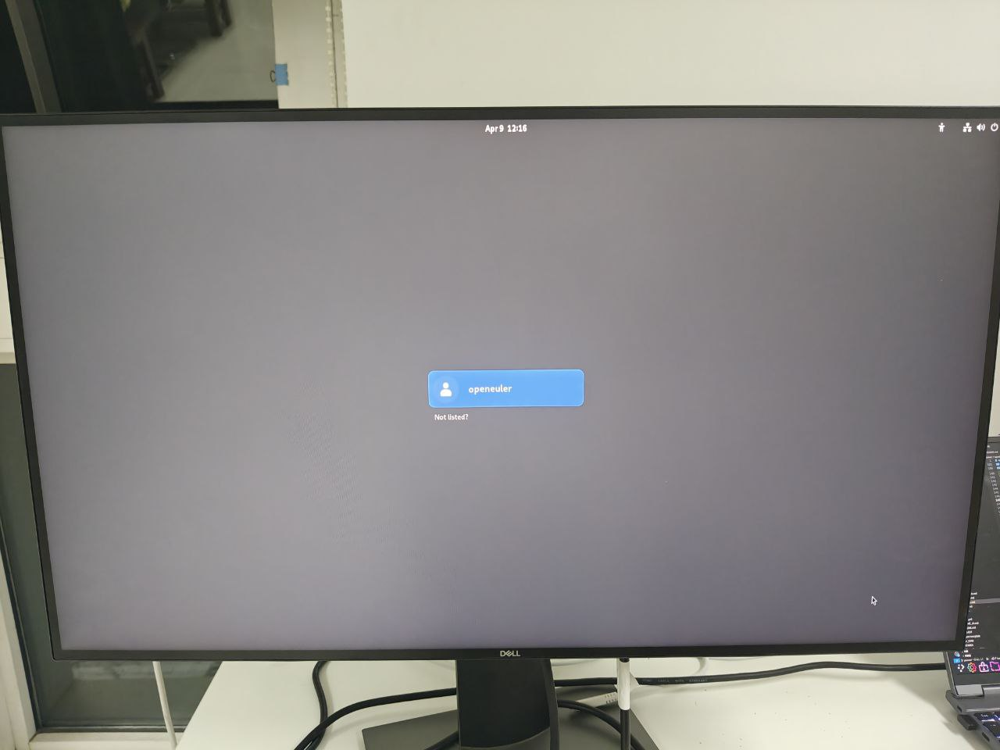

# openEuler RISC-V 25.03 Pioneer Test Report

## Test Environment

### Operating System Information

- System Version: openEuler RISC-V 25.03 (Image, Linux boot)
- Download Link: [openEuler website](https://www.openeuler.org/en/download/) Choose: riscv64 -> embedded -> SG2042 -> Choose Mirror Site
  - Firmware: sg2042_firmware_linuxboot.img.zip, on the same page
- Installation Guide: [Installing on Pioneer Box - openEuler Docs](https://docs.openeuler.org/en/docs/24.03_LTS/docs/Installation/RISC-V-Pioneer1.3.html)

### Hardware Information

- Milk-V Pioneer Box v1.3
- A microSD card (or NVMe SSD + NVMe SSD to USB hard drive enclosure)
- A USB Type-C cable (used to connect the onboard serial port)

## Installation Steps

### Flashing Image to microSD card or NVMe SSD using `dd`

Download, unzip and burn the **Firmware** to **microSD card**.

```shell
unzip sg2042_firmware_linuxboot.img.zip
sudo dd if=sg2042_firmware_linuxboot.img of=/dev/your/device bs=512K iflag=fullblock oflag=direct conv=fsync status=progress
```

Download, unzip and burn the **System Image** to **NVMe SSD**. For Windows users, try Rufus or balenaEtcher.

```shell
unzip openEuler-25.03-riscv64-sg2042.img.zip
sudo wipefs -af /dev/your/device
sudo dd if=openEuler-25.03-riscv64-sg2042.img of=/dev/your/device bs=1M status=progress
```

### Logging into the System

According to openEuler's docs:

> Due to the limitations of the current factory firmware, the RISC-V serial output is incomplete during device startup, and the serial output will be closed before the operating system is fully loaded. The graphics card needs to be inserted into the `PCIe` slot and connected to a monitor to observe the complete startup process.

We'll log into the system via SSH instead of serial here.

Check the device's IP on your router.

Or you can just connect a monitor, keyboard and mouse to Pioneer and login.

Default username: `openeuler` or `root`
Default password: `openEuler12#$`

### Install Desktop Environment

e.g. GNOME:
```shell
sudo dnf update
sudo dnf install dejavu-fonts liberation-fonts gnu-*-fonts google-*-fonts
sudo dnf install xorg-*
sudo dnf install adwaita-icon-theme atk atkmm at-spi2-atk at-spi2-core baobab \
 abattis-cantarell-fonts cheese clutter clutter-gst3 clutter-gtk cogl dconf \
 dconf-editor devhelp eog epiphany evince evolution-data-server file-roller folks \
 gcab gcr gdk-pixbuf2 gdm gedit geocode-glib gfbgraph gjs glib2 glibmm24 \
 glib-networking gmime30 gnome-autoar gnome-backgrounds gnome-bluetooth \
 gnome-boxes gnome-calculator gnome-calendar gnome-characters \
 gnome-clocks gnome-color-manager gnome-contacts gnome-control-center \
 gnome-desktop3 gnome-disk-utility gnome-font-viewer gnome-getting-started-docs \
 gnome-initial-setup gnome-keyring gnome-logs gnome-menus gnome-music \
 gnome-online-accounts gnome-online-miners gnome-photos gnome-remote-desktop \
 gnome-screenshot gnome-session gnome-settings-daemon gnome-shell \
 gnome-shell-extensions gnome-software gnome-system-monitor gnome-terminal \
 gnome-tour gnome-user-docs gnome-user-share gnome-video-effects \
 gnome-weather gobject-introspection gom grilo grilo-plugins \
 gsettings-desktop-schemas gsound gspell gssdp gtk3 gtk4 gtk-doc gtkmm30 \
 gtksourceview4 gtk-vnc2 gupnp gupnp-av gupnp-dlna gvfs json-glib libchamplain \
 libdazzle libgdata libgee libgnomekbd libgsf libgtop2 libgweather libgxps libhandy \
 libmediaart libnma libnotify libpeas librsvg2 libsecret libsigc++20 libsoup \
 mm-common mutter nautilus orca pango pangomm libphodav python3-pyatspi \
 python3-gobject rest rygel simple-scan sysprof tepl totem totem-pl-parser \
 tracker3 tracker3-miners vala vte291 yelp yelp-tools \
 yelp-xsl zenity
```

To boot to GUI by default:

```
sudo systemctl enable gdm
sudo systemctl set-default graphical.target
```

Xfce is not available at the moment.

## Expected Results

The system starts up properly and can be accessed via SSH and/or GUI.

## Actual Results

The system starts up correctly and SSH/GUI login is successful.

### Boot Log

```log
Welcome to 6.6.0-72.6.0.56.oe2503.riscv64

System information as of time:  Wed Apr  9 19:11:58 CST 2025

System load:    0.16
Memory used:    .6%
Swap used:      0.0%
Usage On:       15%
IP address:     192.168.36.39
Users online:   2
To run a command as administrator(user "root"),use "sudo <command>".
[openeuler@openeuler-riscv64 ~]$ uname -a
Linux openeuler-riscv64 6.6.0-72.6.0.56.oe2503.riscv64 #1 SMP PREEMPT Wed Mar 26 18:19:48 CST 2025 riscv64 riscv64 riscv64 GNU/Linux
[openeuler@openeuler-riscv64 ~]$ cat /etc/os-release 
NAME="openEuler"
VERSION="25.03"
ID="openEuler"
VERSION_ID="25.03"
PRETTY_NAME="openEuler 25.03"
ANSI_COLOR="0;31"

[openeuler@openeuler-riscv64 ~]$ lscpu
Architecture:          riscv64
  Byte Order:          Little Endian
CPU(s):                64
  On-line CPU(s) list: 0-63
NUMA:                  
  NUMA node(s):        4
  NUMA node0 CPU(s):   0-7,16-23
  NUMA node1 CPU(s):   8-15,24-31
  NUMA node2 CPU(s):   32-39,48-55
  NUMA node3 CPU(s):   40-47,56-63
```

Screen recording (from flash to bootup):

[](https://asciinema.org/a/POSVLZCg9sYagwild3U7RKGW0)



## Test Criteria

Successful: The actual result matches the expected result.

Failed: The actual result does not match the expected result.

## Test Conclusion

Test successful.

