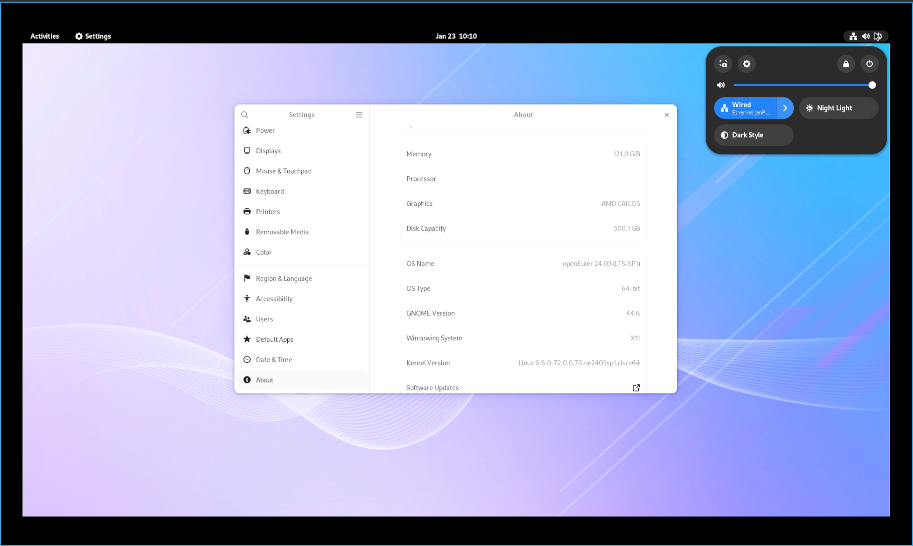

# openEuler RISC-V 24.03 LTS SP1 Pioneer 版本测试报告

## 测试环境

### 操作系统信息

- 系统版本：openEuler RISC-V 24.03 LTS SP1 (Image, Linux Boot 启动)
- 下载链接：[openEuler 官网](https://www.openeuler.org/zh/download/) (Choose: riscv64 -> 嵌入式 -> SG2042 -> 选择镜像仓)
  - 固件：sg2042_firmware_linuxboot.img.zip，在下载链接同一页面上
- 参考安装文档：[Installing on Pioneer Box - openEuler Docs](https://docs.openeuler.org/zh/docs/24.03_LTS/docs/Installation/RISC-V-Pioneer1.3.html)

### 硬件信息

- Milk-V Pioneer Box v1.3
- microSD 卡一张（或 NVMe SSD + NVMe SSD 转 USB 硬盘盒）
- USB Type-C 线缆一条（用来连接板载串口）

## 安装步骤

### 使用 `dd` 刷写镜像到 microSD 卡或 NVMe SSD

下载**固件**，解压，使用 `dd` 烧录至 **microSD 卡**。

将下面的 `/dev/mmcblkX` 替换成真实硬盘位置。

```shell
unzip sg2042_firmware_linuxboot.img.zip
sudo dd if=sg2042_firmware_linuxboot.img of=/dev/mmcblkX bs=512K iflag=fullblock oflag=direct conv=fsync status=progress
```

下载**系统镜像**，解压，使用 `dd` 烧录至 **NVMe SSD**。

如果您在使用 Windows，推荐使用 Rufus 或 Etcher 这类工具进行烧写。

将下面的 `/dev/sdX` 替换成真实硬盘位置。

```shell
unzip openEuler-24.03-LTS-riscv64-sg2042.img.zip
sudo wipefs -af /dev/sdX
sudo dd if=openEuler-24.03-LTS-riscv64-sg2042.img of=/dev/sdX bs=1M status=progress
sudo eject /dev/sdX
```

### 登录系统

在 openEuler Docs 中写到：

> `Image` 版本使用者：
>
> 由于当前出厂固件的局限性，设备启动时 `RISC-V` 串口回显并不完整，操作系统未加载完成时串口输出即会关闭。需将显卡插入 `PCIe` 槽位并连接显示器才能观察到完整的启动过程。

因此，我们将使用 SSH 而不是串口登录系统。可在路由器上检查机器 IP。

或者也可以连接显示器、键盘、鼠标，直接在机器上登录。

默认用户名：`openeuler` 或 `root`
默认密码：`openEuler12#$`

### 安装桌面环境

以 GNOME 为例：
```shell
sudo dnf update
sudo dnf install dejavu-fonts liberation-fonts gnu-*-fonts google-*-fonts
sudo dnf install xorg-*
sudo dnf install adwaita-icon-theme atk atkmm at-spi2-atk at-spi2-core baobab \
 abattis-cantarell-fonts cheese clutter clutter-gst3 clutter-gtk cogl dconf \
 dconf-editor devhelp eog epiphany evince evolution-data-server file-roller folks \
 gcab gcr gdk-pixbuf2 gdm gedit geocode-glib gfbgraph gjs glib2 glibmm24 \
 glib-networking gmime30 gnome-autoar gnome-backgrounds gnome-bluetooth \
 gnome-boxes gnome-builder gnome-calculator gnome-calendar gnome-characters \
 gnome-clocks gnome-color-manager gnome-contacts gnome-control-center \
 gnome-desktop3 gnome-disk-utility gnome-font-viewer gnome-getting-started-docs \
 gnome-initial-setup gnome-keyring gnome-logs gnome-menus gnome-music \
 gnome-online-accounts gnome-online-miners gnome-photos gnome-remote-desktop \
 gnome-screenshot gnome-session gnome-settings-daemon gnome-shell \
 gnome-shell-extensions gnome-software gnome-system-monitor gnome-terminal \
 gnome-tour gnome-user-docs gnome-user-share gnome-video-effects \
 gnome-weather gobject-introspection gom grilo grilo-plugins \
 gsettings-desktop-schemas gsound gspell gssdp gtk3 gtk4 gtk-doc gtkmm30 \
 gtksourceview4 gtk-vnc2 gupnp gupnp-av gupnp-dlna gvfs json-glib libchamplain \
 libdazzle libgdata libgee libgnomekbd libgsf libgtop2 libgweather libgxps libhandy \
 libmediaart libnma libnotify libpeas librsvg2 libsecret libsigc++20 libsoup \
 mm-common mutter nautilus orca pango pangomm libphodav python3-pyatspi \
 python3-gobject rest rygel simple-scan sushi sysprof tepl totem totem-pl-parser \
 tracker3 tracker3-miners vala vte291 yelp yelp-tools \
 yelp-xsl zenity
```

设置系统默认以 GUI 登录：

```
sudo systemctl enable gdm
sudo systemctl set-default graphical.target
```

Xfce 因缺少软件包暂不可用。

## 预期结果

系统正常启动，可通过 SSH 和/或 GUI 登录。

## 实际结果

系统正常启动，成功通过 SSH 和 GUI 登录。

### 启动信息

```log
Authorized users only. All activities may be monitored and reported.
openeuler@192.168.36.39's password:

Authorized users only. All activities may be monitored and reported.
Last login: Mon Mar  3 17:13:14 2025


Welcome to 6.6.0-72.0.0.76.oe2403sp1.riscv64

System information as of time:  Mon Mar  3 17:14:07 CST 2025

System load:    0.07
Memory used:    .6%
Swap used:      0.0%
Usage On:       14%
IP address:     192.168.36.39
Users online:   2
To run a command as administrator(user "root"),use "sudo <command>".
[openeuler@openeuler-riscv64 ~]$ uname -a
Linux openeuler-riscv64 6.6.0-72.0.0.76.oe2403sp1.riscv64 #1 SMP PREEMPT Sun Dec 29 15:11:05 UTC 2024 riscv64 riscv64 riscv64 GNU/Linux
[openeuler@openeuler-riscv64 ~]$ lscpu
Architecture:          riscv64
  Byte Order:          Little Endian
CPU(s):                64
  On-line CPU(s) list: 0-63
NUMA:
  NUMA node(s):        4
  NUMA node0 CPU(s):   0-7,16-23
  NUMA node1 CPU(s):   8-15,24-31
  NUMA node2 CPU(s):   32-39,48-55
  NUMA node3 CPU(s):   40-47,56-63
[openeuler@openeuler-riscv64 ~]$ cat /etc/os-release
NAME="openEuler"
VERSION="24.03 (LTS-SP1)"
ID="openEuler"
VERSION_ID="24.03"
PRETTY_NAME="openEuler 24.03 (LTS-SP1)"
ANSI_COLOR="0;31"

[openeuler@openeuler-riscv64 ~]$
```

asciinema 录屏（从启动时串口输出到 SSH 登录）：

[](https://asciinema.org/a/Wzbli8yUqqYEF2D4A4X2M5fUu)



桌面体验测试报告参见 https://github.com/QA-Team-lo/oscompare/blob/main/openEuler/Pioneer/README.md.

## 测试判定标准

测试成功：实际结果与预期结果相符。

测试失败：实际结果与预期结果不符。

## 测试结论

测试成功。
