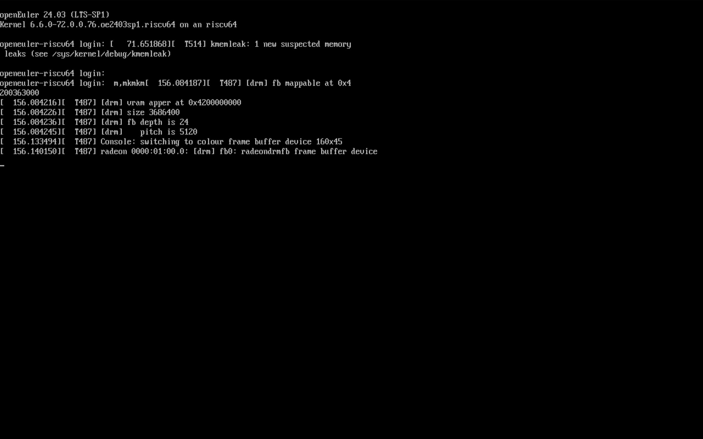

# openEuler RISC-V 24.03 LTS SP1 Pioneer 版本测试报告

## 测试环境

### 操作系统信息

- 系统版本：openEuler RISC-V 24.03 LTS (Image, Legacy 启动)
- 下载链接：[openEuler 镜像源](https://mirrors.nju.edu.cn/openeuler/openEuler-24.03-LTS-SP1/embedded_img/riscv64/SG2042/) (或在 [openEuler 官网](https://www.openeuler.org/en/download/#openEuler%2024.03%20LTS%20SP1) riscv64 -> 嵌入式 -> SG2042 -> 选择镜像仓)
- 参考安装文档：[Installing on Pioneer Box - openEuler Docs](https://docs.openeuler.org/zh/docs/24.03_LTS_SP1/docs/Installation/RISC-V-Pioneer1.3.html)

### 硬件信息

- Milk-V Pioneer Box v1.3
- microSD 卡一张（或 NVMe SSD + NVMe SSD 转 USB 硬盘盒）
- USB Type-C 线缆一条（用来连接板载串口）

## 安装步骤

### 使用 `dd` 刷写镜像到 microSD 卡或 NVMe SSD

下载系统镜像，解压，使用 `dd` 烧录至 microSD 卡或者 NVMe SSD。

如果您在使用 Windows，推荐使用 Rufus 或 Etcher 这类工具进行烧写。

将下面的 `/dev/sda` 替换成真实硬盘位置。

```shell
unzip openEuler-24.03-LTS-SP1-riscv64-sg2042.img.zip
sudo dd if=openEuler-24.03-LTS-SP1-riscv64-sg2042.img of=/dev/sda bs=4M status=progress
sync
sudo eject /dev/sda
```

### 登录系统

在 openEuler Docs 中写到：

> `Image` 版本使用者：
> 
> 由于当前出厂固件的局限性，设备启动时 `RISC-V` 串口回显并不完整，操作系统未加载完成时串口输出即会关闭。需将显卡插入 `PCIe` 槽位并连接显示器才能观察到完整的启动过程。

因此，我们将使用 SSH 而不是串口登录系统。

可在路由器上检查机器 IP。

或者也可以连接显示器、键盘、鼠标，直接在机器上登录。

默认用户名：`openeuler` 或 `root`
默认密码：`openEuler12#$`

## 预期结果

系统正常启动，可通过 SSH 登录。

## 实际结果

系统正常启动，成功通过 SSH 登录。

### 启动信息



```log
Authorized users only. All activities may be monitored and reported.
openeuler@192.168.36.39's password: 

Authorized users only. All activities may be monitored and reported.
Last login: Mon Mar  3 17:13:14 2025


Welcome to 6.6.0-72.0.0.76.oe2403sp1.riscv64

System information as of time:  Mon Mar  3 17:14:07 CST 2025

System load:    0.07
Memory used:    .6%
Swap used:      0.0%
Usage On:       14%
IP address:     192.168.36.39
Users online:   2
To run a command as administrator(user "root"),use "sudo <command>".
[openeuler@openeuler-riscv64 ~]$ uname -a
Linux openeuler-riscv64 6.6.0-72.0.0.76.oe2403sp1.riscv64 #1 SMP PREEMPT Sun Dec 29 15:11:05 UTC 2024 riscv64 riscv64 riscv64 GNU/Linux
[openeuler@openeuler-riscv64 ~]$ lscpu
Architecture:          riscv64
  Byte Order:          Little Endian
CPU(s):                64
  On-line CPU(s) list: 0-63
NUMA:                  
  NUMA node(s):        4
  NUMA node0 CPU(s):   0-7,16-23
  NUMA node1 CPU(s):   8-15,24-31
  NUMA node2 CPU(s):   32-39,48-55
  NUMA node3 CPU(s):   40-47,56-63
[openeuler@openeuler-riscv64 ~]$ cat /etc/os-release 
NAME="openEuler"
VERSION="24.03 (LTS-SP1)"
ID="openEuler"
VERSION_ID="24.03"
PRETTY_NAME="openEuler 24.03 (LTS-SP1)"
ANSI_COLOR="0;31"

[openeuler@openeuler-riscv64 ~]$ 
```

asciinema 录屏（从启动时串口输出到 SSH 登录）：

[](https://asciinema.org/a/Wzbli8yUqqYEF2D4A4X2M5fUu)

## 测试判定标准

测试成功：实际结果与预期结果相符。

测试失败：实际结果与预期结果不符。

## 测试结论

测试成功。