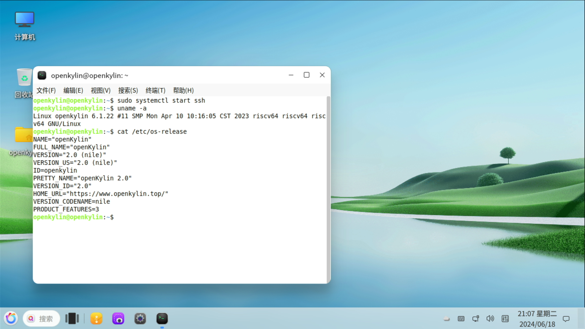

# openKylin 2.0-SP1 RISC-V 测试报告

## 测试环境

- 系统版本：openKylin 2.0-SP1 RISC-V
- 下载链接：[https://mirror.iscas.ac.cn/openkylin-cdimage/2.0-SP1/openKylin-Embedded-V2.0-SP1-milk-v-pioneer-riscv64.img.xz](https://mirror.iscas.ac.cn/openkylin-cdimage/2.0-SP1/openKylin-Embedded-V2.0-SP1-milk-v-pioneer-riscv64.img.xz)
- 参考安装文档：[https://docs.openkylin.top/zh/01_%E5%AE%89%E8%A3%85%E5%8D%87%E7%BA%A7%E6%8C%87%E5%8D%97/%E5%9C%A8riscv%E4%B8%8A%E5%AE%89%E8%A3%85/%E5%9C%A8Sophgo_sg2042%E4%B8%8A%E5%AE%89%E8%A3%85openKylin](https://docs.openkylin.top/zh/01_%E5%AE%89%E8%A3%85%E5%8D%87%E7%BA%A7%E6%8C%87%E5%8D%97/%E5%9C%A8riscv%E4%B8%8A%E5%AE%89%E8%A3%85/%E5%9C%A8Sophgo_sg2042%E4%B8%8A%E5%AE%89%E8%A3%85openKylin)

### 硬件信息

- Milk-V Pioneer Box v1.3
- microSD 卡一张
- HDMI 线 + 显示器

## 安装步骤

### 刷写镜像

使用 `unxz` 解压镜像。
使用 `dd` 将镜像写入 microSD 卡。

```bash
wget https://mirror.iscas.ac.cn/openkylin-cdimage/2.0-SP1/openKylin-Embedded-V2.0-SP1-milk-v-pioneer-riscv64.img.xz
unxz /path/to/openKylin-Embedded-V2.0-SP1-milk-v-pioneer-riscv64.img.xz
sudo dd if=/path/to/openKylin-Embedded-V2.0-SP1-milk-v-pioneer-riscv64.img.xz of=/dev/your_device bs=4M status=progress
```

### 登录系统

通过图形界面登录系统。

默认用户名： `openKylin`
默认密码： `openkylin`

## 预期结果

系统正常启动，能够通过图形界面登录。

## 实际结果

系统正常启动，成功通过图形界面登录。

### 启动信息



```log
openkylin@192.168.36.39's password: 
Welcome to openKylin 2.0 (GNU/Linux 6.1.22 riscv64)

 * Support:        https://openkylin.top

The programs included with the openKylin system are free software;
the exact distribution terms for each program are described in the
individual files in /usr/share/doc/*/copyright.

openKylin comes with ABSOLUTELY NO WARRANTY, to the extent permitted by
applicable law.

You do not have any new mail.
openkylin@openkylin:~$ uname -a
Linux openkylin 6.1.22 #11 SMP Mon Apr 10 10:16:05 CST 2023 riscv64 riscv64 riscv64 GNU/Linux
openkylin@openkylin:~$ cat /etc/os-release 
NAME="openKylin"
FULL_NAME="openKylin"
VERSION="2.0 (nile)"
VERSION_US="2.0 (nile)"
ID=openkylin
PRETTY_NAME="openKylin 2.0"
VERSION_ID="2.0"
HOME_URL="https://www.openkylin.top/"
VERSION_CODENAME=nile
PRODUCT_FEATURES=3
openkylin@openkylin:~$ 
```

串口日志（从刷写镜像到启动系统）：
[](https://asciinema.org/a/Cgn1K3yizCBB40x4rVbYeZMj3)


## 测试判定标准

测试成功：实际结果与预期结果相符。

测试失败：实际结果与预期结果不符。

## 测试结论

测试成功。