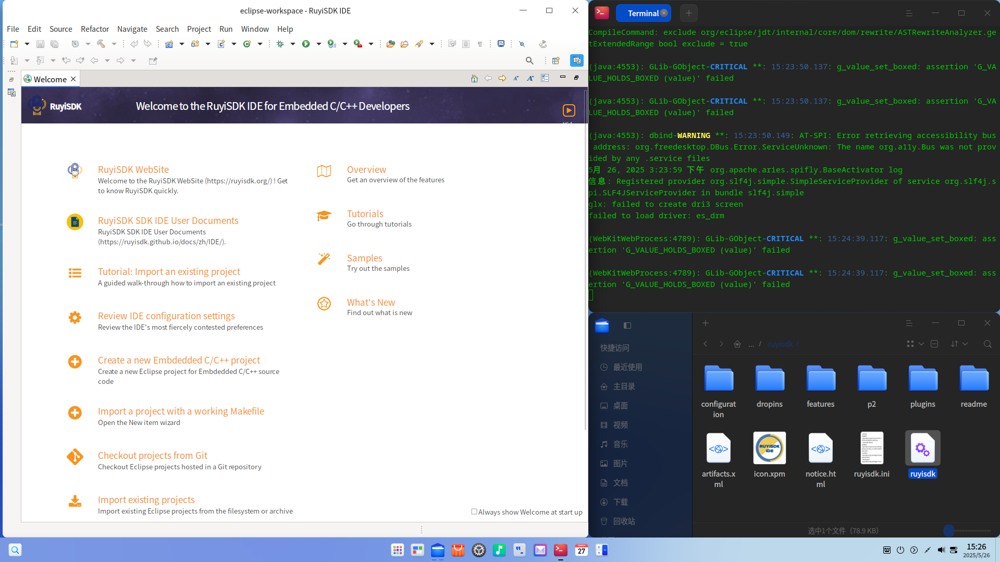

## Test Environment

### System Information

- System Version: deepin 25-crimson-preview EIC7700 20250422
- Download Link: https://ci.deepin.com/repo/deepin/deepin-ports/cdimage/20250422/riscv64/deepin-25-crimson-preview-riscv64-eic7700-20250422-122731.tar.xz

### Hardware Information

- SiFive HiFive Premier P550
- Power Adapter
- USB-C Cable * 1
- USB-A Cable * 1

## Installation Steps

### Getting System Image

### Flashing the System and Run

First, connect your computer with the USB-C UART serial port. There'll be 4 UART ports, which the second biggest one is what we need for debugging, naming `/dev/tty.usbserial-102` (macOS) / `/dev/ttyUSB2`(Linux) in this report. Run following command after cables connected:

macOS: `sudo screen -L /dev/tty.usbserial-102 115200`
Linux: `sudo screen -L /dev/ttyUSB2 115200`

Then, turn on the system with booting from Boot-SPI (default). Press Ctrl-C after entering u-boot menu, and execute `fastboot usb 0` after command prompt appear. The board side has prepared now.

Ensure you system has `fastboot` installed. In another shell, execute following commands:

``` shell
# fastboot flash boot deepin-eic7700-riscv64-25-desktop-installer.boot.ext4
# fastboot flash root deepin-eic7700-riscv64-25-desktop-installer.root.ext4
```

Example output:

``` text
april@Aprils-MacBook-Air deepin-eic7700 % fastboot flash boot deepin-eic7700-riscv64-25-desktop-installer.boot.ext4
Sending sparse 'boot' 1/1 (107313 KB)              OKAY [  3.390s]
Writing 'boot'                                     OKAY [  5.965s]
Finished. Total time: 9.583s

april@Aprils-MacBook-Air deepin-eic7700 % fastboot flash root deepin-eic7700-riscv64-25-desktop-installer.root.ext4
Sending sparse 'root' 1/38 (260442 KB)             OKAY [  8.067s]
Writing 'root'                                     OKAY [  2.739s]
Sending sparse 'root' 2/38 (234405 KB)             OKAY [  7.272s]
Writing 'root'                                     OKAY [  2.213s]
Sending sparse 'root' 3/38 (262141 KB)             OKAY [  8.129s]
Writing 'root'                                     OKAY [  2.435s]
Sending sparse 'root' 4/38 (261589 KB)             OKAY [  8.110s]
Writing 'root'                                     OKAY [  2.338s]
```

After running complete, `Ctrl-C` to exit fastboot, and type `boot` to enter boot menu again. The new system will appear. Select the new system, it shall be boot correctly.

### Initialize the System

If you've connected a display, you can complete the deepin Installation guide

If you don't have a GUI interface, you can login via UART:

Default username: `root`
Password: `deepin`

## Expected Results

The system should boot successfully, allowing login via the GUI. RuyiSDK IDE Running successful.

## Actual Results

The system boots up successfully, and login via the GUI is successful. RuyiSDK IDE Running successful.



## Test Criteria

Successful: The actual result matches the expected result.

Failed: The actual result does not match the expected result.

## Test Conclusion

Test successful.
