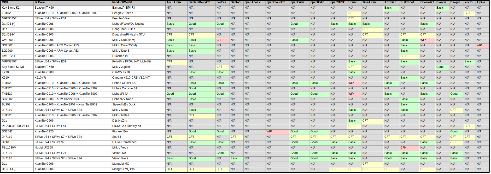
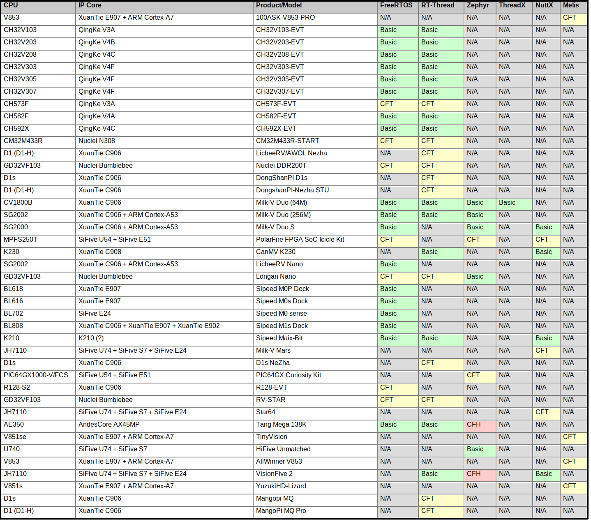

# RISC-V Board and OS Support Matrix

[English](./README.md) / [中文](./README_zh.md)

## Linux Distributions

---

## *BSD

---

## RTOS / Real-Time Operating Systems

---

## Others

---

## Notes

* Good: Supports GUI
* Basic: Can boot up and run
* CFH (Call for help): Official documentations/community forums show this OS is supported on this board, but failed to boot up
* CFT (Call for testing): An OS image is avaliable, need further verification on real hardware
* CFI (Call for more information):  Official documentations claims there is support for this OS, but no OS image avaliable yet
* WIP: Official announcements say there will be/is support for this OS/board, but no image or other resources (e.g. source code) avaliable yet
* -: No support for this OS/board combo, either from official or other sources

[Pioneer]: ./Pioneer/README.md
[Duo]: ./Duo/README.md
[Duo256m]: ./Duo256m/README.md
[LPi4A]: ./LicheePi4A/README.md
[VF1]: ./VisionFive/README.md
[VF2]: ./VisionFive2/README.md
[K230]: ./K230/README.md
[C906]: ./D1_LicheeRV/README.md
[Unmatched]: ./Unmatched/README.md
[DuoS]: ./Duo_S/README.md
[Mars]: ./Mars/README.md
[Vega]: ./Vega/README.md
[Meles]: ./Meles/README.md
[MaixBit]: ./Maix-I_K210/README.md
[Cluster4A]: ./LicheeCluster4A/README.md
[Console4A]: ./LicheeConsole4A/README.md
[LicheeRVNano]: ./LicheeRV_Nano/README.md
[TangMega138K]: ./Tang_Mega_138K/README.md
[K510]: ./K510/README.md
[SipeedM1s]: ./M1s/README.md
[M0sense]: ./M0sense/README.md
[M0P]: ./M0P_Dock/README.md
[M0s]: ./M0s/README.md
[CH32V103]: ./CH32V103/README.md
[CH32V203]: ./CH32V203/README.md
[CH32V208]: ./CH32V208/README.md
[CH32V303]: ./CH32V303/README.md
[CH32V305]: ./CH32V305/README.md
[CH32V307]: ./CH32V307/README.md
[CH582F]: ./CH582F/README.md
[CH592X]: ./CH592X/README.md
[Longan_Nano]: ./Longan_Nano/README.md
[RV_STAR]: ./RV_STAR/README.md
[DDR200T]: ./DDR200T/README.md
[V853]: ./V853/README.md
[100ASK]: ./100ASK/README.md
[YouMuPI]: ./YouMuPI/README.md
[TinyVision]: ./TinyVision/README.md
[CH573F]: ./CH573F/README.md
[DongshanPI-STU]: ./DongshanPI-STU/README.md
[mangopi_mq_pro]: ./mangopi_mq_pro/README.md
[DongShanPI-D1s]: ./DongShanPI-D1s/README.md
[mangopi_mq]: ./mangopi_mq/README.md
[NeZha-D1s]: ./NeZha-D1s/README.md
[BPI-F3]: ./BPI-F3/README.md
[Jupiter]: ./Jupiter/README.md
[BeagleV-Ahead]: ./BeagleV-Ahead/README.md
[BeagleV-Fire]: ./BeagleV-Fire/README.md
[STAR64]: ./STAR64/README.md
[Icicle]: ./Icicle/README.md
[PIC64GX]: ./PIC64GX/README.md
[CM32M433R]: ./CM32M433R/README_zh.md
[R128-EVT]: ./R128-EVT/README_zh.md
[Huashan_Pi]: ./Huashan_Pi/README.md
