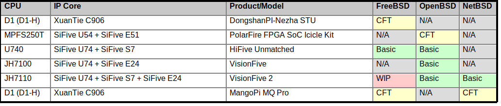
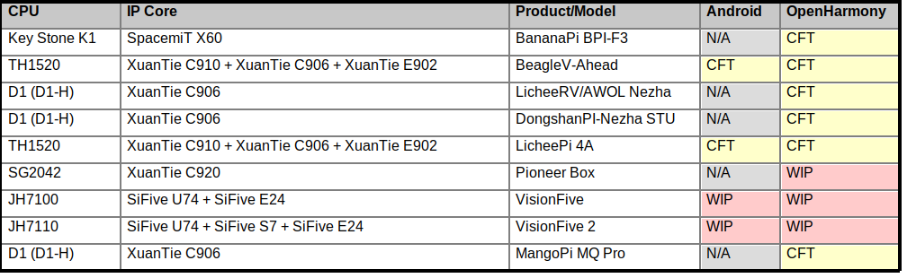

# RISC-V 开发板与操作系统支持矩阵

[English](./README_zh.md) | [中文](./README_zh.md)

## Linux 发行版

---

## *BSD

---

## RTOS / 实时操作系统

---

## 其它

---

#### 说明

* Good：支持图形界面
* Basic：能启动运行
* CFH (Call for help)：官方/论坛资料表示支持，但是未跑通
* CFT (Call for testing)：镜像链接有，但是缺乏硬件设备验证
* CFI (Call for more information)：官方资料宣称有，但是找不到镜像文件等实际可用的资料
* WIP：官方宣发操作系统即将/正在对开发板进行支持，但暂未获取到可用的镜像
* -：暂未从官方或者其它渠道获取到开发板的支持信息

[Pioneer]: ./Pioneer/README_zh.md
[Duo]: ./Duo/README_zh.md
[Duo256m]: ./Duo256m/README_zh.md
[LPi4A]: ./LicheePi4A/README_zh.md
[VF1]: ./VisionFive/README_zh.md
[VF2]: ./VisionFive2/README_zh.md
[K230]: ./K230/README_zh.md
[C906]: ./D1_LicheeRV/README_zh.md
[Unmatched]: ./Unmatched/README_zh.md
[DuoS]: ./Duo_S/README_zh.md
[Mars]: ./Mars/README_zh.md
[Vega]: ./Vega/README_zh.md
[Meles]: ./Meles/README_zh.md
[MaixBit]: ./Maix-I_K210/README_zh.md
[Cluster4A]: ./LicheeCluster4A/README_zh.md
[Console4A]: ./LicheeConsole4A/README_zh.md
[LicheeRVNano]: ./LicheeRV_Nano/README_zh.md
[TangMega138K]: ./Tang_Mega_138K/README_zh.md
[K510]: ./K510/README_zh.md
[SipeedM1s]: ./M1s/README_zh.md
[M0sense]: ./M0sense/README_zh.md
[M0P]: ./M0P_Dock/README_zh.md
[M0s]: ./M0s/README_zh.md
[CH32V103]: ./CH32V103/README_zh.md
[CH32V203]: ./CH32V203/README_zh.md
[CH32V208]: ./CH32V208/README_zh.md
[CH32V303]: ./CH32V303/README_zh.md
[CH32V305]: ./CH32V305/README_zh.md
[CH32V307]: ./CH32V307/README_zh.md
[CH582F]: ./CH582F/README_zh.md
[CH592X]: ./CH592X/README_zh.md
[Longan_Nano]: ./Longan_Nano/README_zh.md
[RV_STAR]: ./RV_STAR/README_zh.md
[DDR200T]: ./DDR200T/README_zh.md
[V853]: ./V853/README_zh.md
[100ASK]: ./100ASK/README_zh.md
[YouMuPI]: ./YouMuPI/README_zh.md
[TinyVision]: ./TinyVision/README_zh.md
[CH573F]: ./CH573F/README_zh.md
[DongshanPI-STU]: ./DongshanPI-STU/README_zh.md
[mangopi_mq_pro]: ./mangopi_mq_pro/README_zh.md
[DongShanPI-D1s]: ./DongShanPI-D1s/README_zh.md
[mangopi_mq]: ./mangopi_mq/README_zh.md
[NeZha-D1s]: ./NeZha-D1s/README_zh.md
[BPI-F3]: ./BPI-F3/README_zh.md
[Jupiter]: ./Jupiter/README_zh.md
[BeagleV-Ahead]: ./BeagleV-Ahead/README_zh.md
[BeagleV-Fire]: ./BeagleV-Fire/README_zh.md
[STAR64]: ./STAR64/README_zh.md
[Icicle]: ./Icicle/README_zh.md
[PIC64GX]: ./PIC64GX/README_zh.md
[CM32M433R]: ./CM32M433R/README_zh.md
[R128-EVT]: ./R128-EVT/README_zh.md
[Huashan_Pi]: ./Huashan_Pi/README_zh.md
