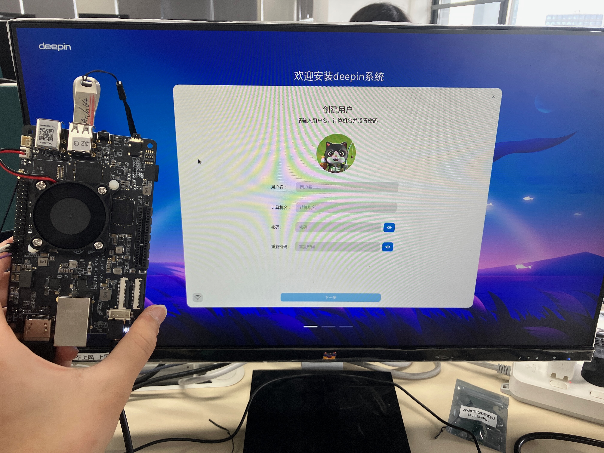

## 测试环境

### 系统信息

- 系统版本: deepin 25-crimson-preview EIC7700 20250422
- 下载链接: https://deepin-community.github.io/sig-deepin-ports/images/riscv/download
  - 或下载测试版最新镜像：https://ci.deepin.com/repo/deepin/deepin-ports/cdimage/20250603/riscv64/deepin-25-crimson-preview-riscv64-eic7700-20250603-105747.tar.xz

### 硬件信息

- PINE64 StarPro64
- 电源适配器
- USB 转 TTL 调试线
- U盘
- MicroSD卡

## 安装步骤

### 连接UART调试

将USB转TTL调试线的针脚以如下方式连接至板子的GPIO针脚：

| StarPro64   | USB UART |
|-------------|----------|
| GND (Pin 6) | GND      |
| TX (Pin 8)  | RX       |
| RX (Pin 10) | TX       |

详见[例子](https://lupyuen.org/articles/starpro64.html#boot-without-microsd)。

插好后，将计算机通过UART与板子相连接，例如使用如下类似命令：

``` shell
sudo screen /dev/ttyUSB0 115200
```

### 更新bootloader

为确保板子能成功探测并启动操作系统，首先我们需要将bootloader更新至最新版本。

#### 获取bootloader

从[该网站](https://github.com/deepin-community/deepin-riscv-kernel/actions)的最新“build all” action中下载名为`uboot-eic770x-rockos`的文件。我们在此使用[此版本](https://github.com/deepin-community/deepin-riscv-kernel/actions/runs/15407166179/artifacts/3246357043)。

下载完成后，解压并找到`./uboot-eic770x-rockos/pine64-starpro64/bootloader_secboot_ddr5.bin`。将U盘格式化为单个FAT分区，随后将该文件复制到U盘的根目录下。

#### 刷写bootloader

将U盘插入板子的USB-2.0插槽中，随后将板子通电。终端将通过UART串口被接通。输入字符打断autoboot流程，随后使用如下命令将新的bootloader载入板子的内存中：

``` shell
fatload usb 0 0x90000000 bootloader_secboot_ddr5.bin
```

> 如果你在设备通电后才插入U盘，可以执行 `usb reset` 以重新定位USB设备。

执行如下命令以将新bootloader烧录至板子中：

``` shell
es_burn write 0x90000000 flash
```

重启以生效。

### 刷写SD卡

首先将SD卡分为`boot`和`root`两个分区，1GB的boot分区即足够。随后刷入对应镜像： 

``` shell
sudo dd if=deepin-eic7700-riscv64-25-desktop-installer.boot.ext4 of=/dev/sdd1 status=progress
sudo dd if=deepin-eic7700-riscv64-25-desktop-installer.root.ext4 of=/dev/sdd2 status=progress
```

将SD卡插入板子，随后将板子通电。

### 初始化系统

如果连接了显示器，则可以通过deepin安装引导完成初始化；

同时也可以通过UART进行登录：

用户名: `root`
密码: `deepin`

## 预期结果

系统正常启动，能够通过图形界面登录

## 实际结果

系统正常启动，成功通过图形界面登录



## 测试判定标准

测试成功：实际结果与预期结果相符。

测试失败：实际结果与预期结果不符。

## 测试结论

测试成功。
