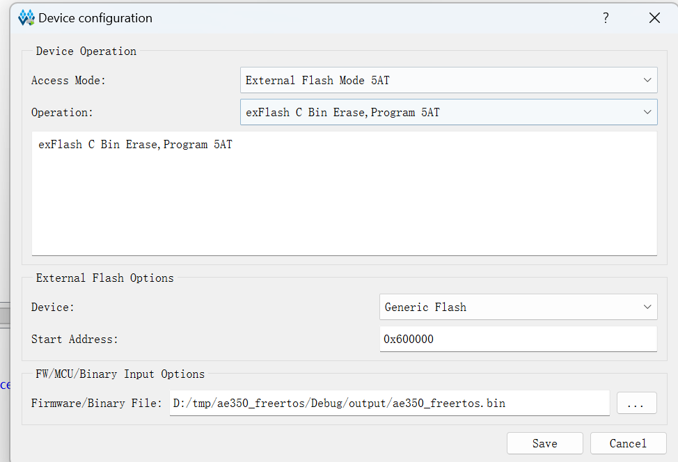

# FreeRTOS Tang Mega 138K Pro Test Report

## Test Environment

### Operating System Information

- Build System: Linux
- FreeRTOS
- Source Code Download Link: https://cdn.gowinsemi.com.cn/RiscV_AE350_SOC_V1.1.zip
    - Bitstream: https://github.com/sipeed/TangMega-138KPro-example
- Reference Installation Document: https://cdn.gowinsemi.com.cn/MUG1029-1.1_Gowin_RiscV_AE350_SOC%E8%BD%AF%E4%BB%B6%E7%BC%96%E7%A8%8B%E7%94%A8%E6%88%B7%E6%89%8B%E5%86%8C.pdf
- Reference Design Document: https://cdn.gowinsemi.com.cn/MUG1031-1.1_Gowin_RiscV_AE350_SOC%E7%A1%AC%E4%BB%B6%E8%AE%BE%E8%AE%A1%E7%94%A8%E6%88%B7%E6%89%8B%E5%86%8C.pdf

### Hardware Information

- Tang Mega 138K Pro Dock
- A Type A to C cable
- A UART serial cable
- Power supply come with the board

## Installation Steps

**The following steps are for building in a Linux environment. For Windows, please install AE350 SOC RDS and use the included Cygwin environment. Unless stated otherwise, the operations are the same.**

*If IDE functionality is not required, RDS License is not necessary for building in Windows.*

### Copy and Patch Code

FreeRTOS code can be found in the source code archive at ref_design/MCU_RefDesign/ae350_freertos. Extract it to your working directory.

For Linux: patch the Debug/makefile:
Replace the following content:
```diff
diff --git a/Debug/makefile b/Debug/makefile
index eb97e6d..232a162 100644
--- a/Debug/makefile
+++ b/Debug/makefile
@@ -117,7 +117,7 @@ $(SECONDARY_OUTPUT_PATH)/.PHONY.size: $(LINKER_OUTPUTS)
 
 $(SECONDARY_OUTPUT_PATH)/ae350-ddr.ld: $(SAG_SRCS)
 	@echo 'Invoking: LdSaG Tool'
-	nds_ldsag --version=v5 -t "$(ANDESIGHT_ROOT)/utils/nds32_template_v5.txt" "$(SAG_FILE)" -o $(LDSAG_OUT)
+	cp ../src/bsp/sag/ae350-ddr.ld $(LDSAG_OUT)
 	@echo 'Finished building: $@'
 	@echo ' '
 

```
If it fails, ensure the line endings are CRLF.

Replace the working path:
```bash
find -name "*.mk" -exec sed -i "s|/cygdrive/E/RDS5/workspace/ae350_freertos|$(pwd)|g" {} \;
```

### Compile Code

#### Linux
Unpack the cross-compilation toolchain, preferably nds32le-elf-mculib-v5. Refer to its location as `$(nds32_path)`.

Compile the target file:
```bash
cd Debug
make CROSS_COMPILE=$(nds32_path)/bin/riscv32-elf-
```

#### Windows
Open the Cygwin environment included with RDS:
Run Cygwin.bat in the RDS installation directory.

Navigate to the source code folder (disks are located under `/cygdrive/$(drive_letter)`)

Compile the target file, with RDS_ROOT being replaced by your RDS installation path:
```bash
cd Debug
make ANDESIGHT_ROOT=<RDS_ROOT> CROSS_COMPILE=<RDS_ROOT>/toolchains/nds32le-elf-mculib-v5/bin/riscv32-elf-
```

### Get FPGA Bitstream

**Tang Mega 138K support is available only in the commercial version**

The FPGA project can use the demo provided by Sipeed, found in the ae350_customized_demo from the [TangMega-138KPro-example](https://github.com/sipeed/TangMega-138KPro-example). The bitstream is pre-compiled and does not need to be regenerated.

### Download Bitstream

Connect the FPGA and use the Gowin's cloud software to download the bitstream.

### Flash the Program

Use programmer.exe located in the flash directory of the RDS. Set up as follows:
- External Flash Mode 5AT
- exFlash C Bin Erase, Program 5AT
- Start address: 0x600000



If there's no output after flashing, try re-downloading the bitstream.

### Connect Serial Port

The default UART2 is bound to:
```
IO_LOC "UART2_TXD" U16;     //1
IO_LOC "UART2_RXD" V16;     //2
```

### View Output

Check the FreeRTOS output through the serial port.

## Expected Results

The system should boot normally and allow you to view FreeRTOS output via the onboard serial port.

## Actual Results

The system booted successfully and the FreeRTOS output was visible through the onboard serial port.

### Boot Log

```log

****************************************************************************

Name:     FreeRTOS-AE350_SOC

Edition:  V10.3.1

Compiled: Apr 16 2024, 16:25:50

Author:   GowinSemiconductor

****************************************************************************

****************************************************************************

                     ◆

           ◆◆◆◆◆◆◆◆◆◆◆            ◆◆◆◆◆◆◆

               ◆◆◆◆◆◆◆

               ◆          ◆

               ◆◆◆◆◆◆◆            ◆◆◆◆◆◆◆◆◆◆◆

                                                   ◆

           ◆◆◆◆◆◆◆◆◆◆◆                ◆

           ◆                  ◆              ◆      ◆

           ◆    ◆◆◆◆◆    ◆            ◆          ◆

           ◆    ◆      ◆    ◆          ◆◆◆◆◆◆◆◆◆

           ◆    ◆◆◆◆◆  ◆◆                          ◆

****************************************************************************

1.task1 

0.task0 

0.task0 

0.task0 

0.task0 

```

## Test Criteria

Successful: The actual result matches the expected result.

Failed: The actual result does not match the expected result.

## Test Conclusion

Test successful.