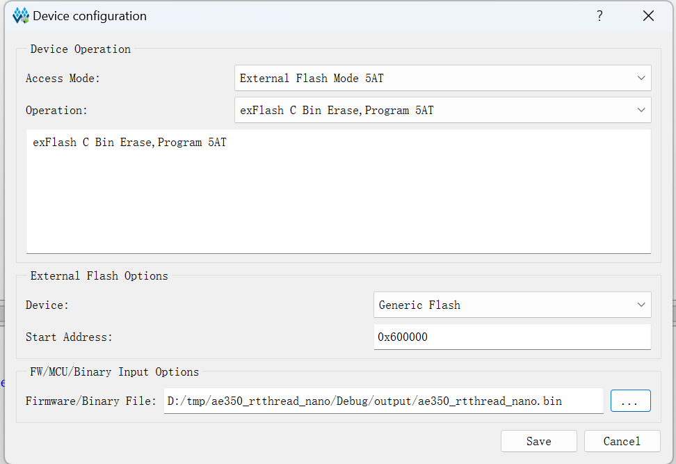

# RT-Thread Tang Mega 138K Pro Test Report

## Test Environment

### Operating System Information

- Build system: Linux
- RT-Thread
- Source code download link: https://cdn.gowinsemi.com.cn/RiscV_AE350_SOC_V1.1.zip
	- Bitstream: https://github.com/sipeed/TangMega-138KPro-example
- Reference installation documentation: https://cdn.gowinsemi.com.cn/MUG1029-1.1_Gowin_RiscV_AE350_SOC软件编程用户手册.pdf
- Reference design documentation: https://cdn.gowinsemi.com.cn/MUG1031-1.1_Gowin_RiscV_AE350_SOC硬件设计用户手册.pdf

### Hardware Information

- Tang Mega 138K Pro Dock
- A type A to C cable
- A UART serial cable
- Power supply come with the board

## Installation Steps

**The following instructions are based on building in a Linux system. For Windows, please install AE350 SOC RDS and perform the same operations in the included Cygwin environment unless otherwise specified**

*If IDE functionality is not needed, you don't need an RDS License for building on Windows*

### Copy and Patch Code

RT-Thread code is located within the source code package at `ref_design/MCU_RefDesign/ae350_rtthread_nano`. Extract it to your workspace.

If using Linux, patch `Debug/makefile`:
Replace the following contents:
```diff
diff --git a/Debug/makefile b/Debug/makefile
index eb97e6d..232a162 100644
--- a/Debug/makefile
+++ b/Debug/makefile
@@ -119,7 +119,7 @@ $(SECONDARY_OUTPUT_PATH)/.PHONY.size: $(LINKER_OUTPUTS)
 
 $(SECONDARY_OUTPUT_PATH)/ae350-ddr.ld: $(SAG_SRCS)
 	@echo 'Invoking: LdSaG Tool'
-	nds_ldsag --version=v5 -t "$(ANDESIGHT_ROOT)/utils/nds32_template_v5.txt" "$(SAG_FILE)" -o $(LDSAG_OUT)
+	cp ../src/bsp/sag/ae350-ddr.ld $(LDSAG_OUT)
 	@echo 'Finished building: $@'
 	@echo ' '
 

```
If an error occurs, ensure the line endings should be CRLF.

Replace the working directory:
```bash
find -name "*.mk" -exec sed -i "s|/cygdrive/E/RDS5/workspace/ae350_rtthread_nano|$(pwd)|g" {} \;
```

### Compile Code

#### Linux
Unpack the cross-compilation toolchain; it's recommended to use `nds32le-elf-mculib-v5`. Assume its path is `$(nds32_path)`.

Compile the target file:
```bash
cd Debug
make CROSS_COMPILE=$(nds32_path)/bin/riscv32-elf-
```

#### Windows
Open the Cygwin environment included with RDS:
Run `Cygwin.bat` located in the Cygwin directory of the RDS installation path.

`cd` to the source folder (disk is located at `/cygdrive/$(Drive letter)`).

Compile the target file; replace `$(RDS_ROOT)` with your RDS installation path:
```bash
cd Debug
make ANDESIGHT_ROOT=<RDS_ROOT> CROSS_COMPILE=<RDS_ROOT>/toolchains/nds32le-elf-mculib-v5/bin/riscv32-elf-
```

### Get FPGA Bitstream

**Tang Mega 138K is supported only in the commercial version**

The FPGA project can use the demo provided by Sipeed, located in the `ae350_customized_demo` inside [TangMega-138KPro-example](https://github.com/sipeed/TangMega-138KPro-example). The bitstream is already compiled and does not need to be regenerated.

### Download Bitstream

Connect to the FPGA and use the Gowin Download Tool to download the bitstream.

### Program Flash

Use `programmer.exe` located in the `flash` directory of the RDS installation. Configure as follows:
- External Flash Mode: 5AT
- exFlash C: Bin Erase, Program 5AT
- Start address: 0x600000



If there is no output after programming, you may need to re-download the bitstream.

### Connect to Serial Port

By default, UART2 is bound to:
```
IO_LOC "UART2_TXD" U16;     //1
IO_LOC "UART2_RXD" V16;     //2
```

### View Output

View the RT-Thread output via the serial port.

## Expected Results

The system boots normally and the output from RT-Thread can be viewed via the onboard serial port.

## Actual Results

The system boots normally and the output from RT-Thread can be viewed via the onboard serial port.

### Boot Log

```log

It's a RT-Thread Nano version demo.

Initializes RT hw board...

 \ | /

- RT -     Thread Operating System

 / | \     3.1.5 build Apr 16 2024

 2006 - 2020 Copyright by rt-thread team

RT demo...

```

## Test Criteria

Successful: The actual result matches the expected result.

Failed: The actual result does not match the expected result.

## Test Conclusion

Test successful.
