# Deepin HiFive Unmatched Report

## Test Environment

### System Information

- System Version: Deepin (2022.11.11, EOL)
- Download Link: https://cdimage.deepin.com/RISC-V/Unmatched-image/deepin-sifive.7z
- Reference Installation Document: https://cdimage.deepin.com/RISC-V/Unmatched-image/README.txt

> [!Warning]
> Deepin has **ended** support for HiFive Unmatched. The image under test dates back from 2022.11.11 and is **not ready** for production as security threats might arise. 

### Hardware Information

- HiFive Unmatched Rev A
- A microUSB cable (included with HiFive Unmatched)
- An ATX power supply
- NVMe SSD

## Installation Steps

### Flashing Image

**The image is NOT for SD card, a NVMe SSD is needed!**

Use `7z` to decompress the image.
Use `dd` to write the image to the microSD card.

```bash
7z e deepin-sifive.7z
sudo dd if=deepin-sifive.img of=/dev/your/device bs=1M status=progress
```

### Logging into the System

Logging into the system via the serial port or via GUI.

Default Username: `root`
Default Password: `Riscv2022#`

Default Username: `deepin`
Default Password: `deepin#`

## Expected Results

The system should boot up normally and allow login through the onboard serial port or GUI.

## Actual Results

The system booted up normally and login through both the onboard serial port and GUI are successful.

### Boot Log

```log
Verification successful
Linux deepin-riscv 6.0.0-4-riscv64 #1 SMP Debian 6.0.8-1 (2022-11-11) riscv64
Welcome to Deepin 23 GNU/Linux

    * Homepage:https://www.deepin.org/

    * Bugreport:https://bbs.deepin.org/


Last login: Fri Jan 24 19:09:43 2025
deepin@deepin-riscv:~$ cat /etc/os-release 
PRETTY_NAME="Deepin 23"
NAME="Deepin"
VERSION_ID="23"
VERSION="23"
ID=Deepin
HOME_URL="https://www.deepin.org/"
BUG_REPORT_URL="https://bbs.deepin.org"
VERSION_CODENAME=beige
deepin@deepin-riscv:~$ cat /proc/cpuinfo 
processor       : 0
hart            : 1
isa             : rv64imafdc
mmu             : sv39
uarch           : sifive,bullet0

processor       : 1
hart            : 2
isa             : rv64imafdc
mmu             : sv39
uarch           : sifive,bullet0

processor       : 2
hart            : 3
isa             : rv64imafdc
mmu             : sv39
uarch           : sifive,bullet0

processor       : 3
hart            : 4
isa             : rv64imafdc
mmu             : sv39
uarch           : sifive,bullet0

deepin@deepin-riscv:~$ uname -a
Linux deepin-riscv 6.0.0-4-riscv64 #1 SMP Debian 6.0.8-1 (2022-11-11) riscv64 GNU/Linux
deepin@deepin-riscv:~$ 
```

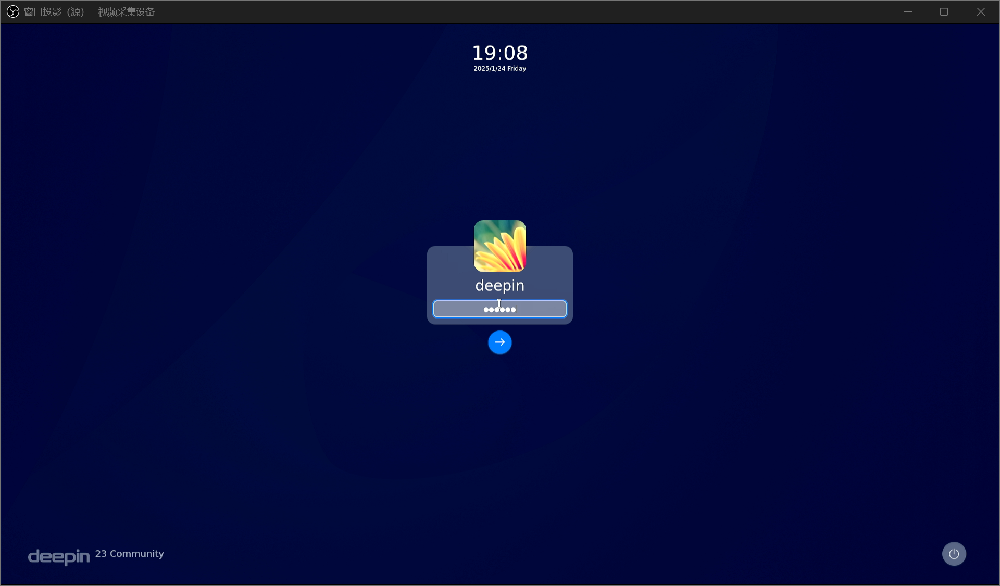


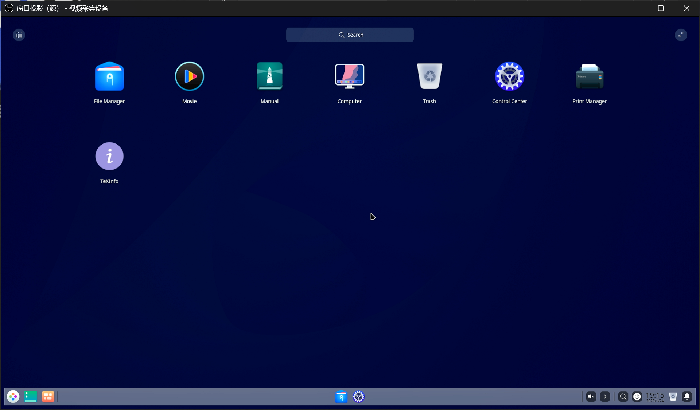

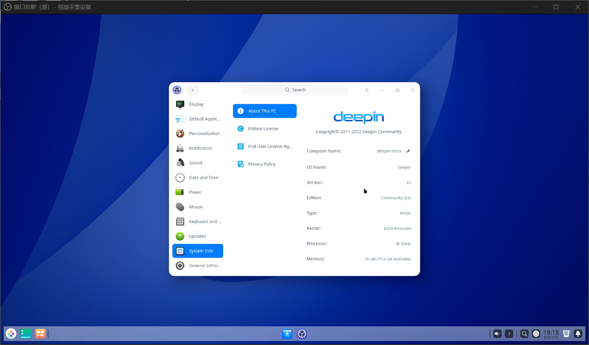

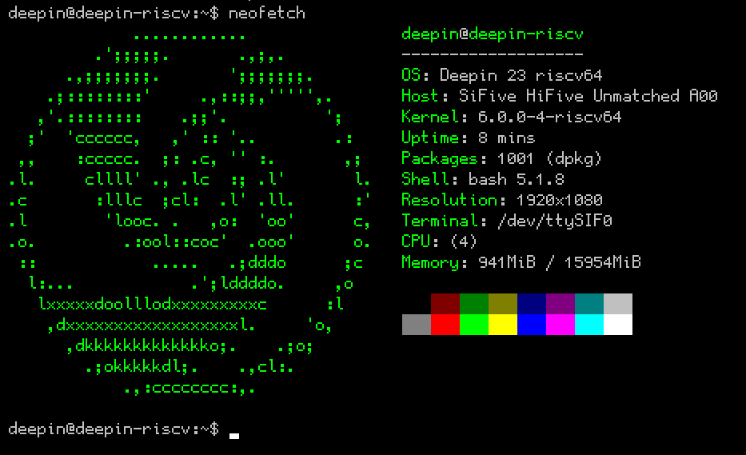

### 浏览器

#### Firefox

Legacy version 105 is available in the package repository.

WebRender GPU accleration is enabled:

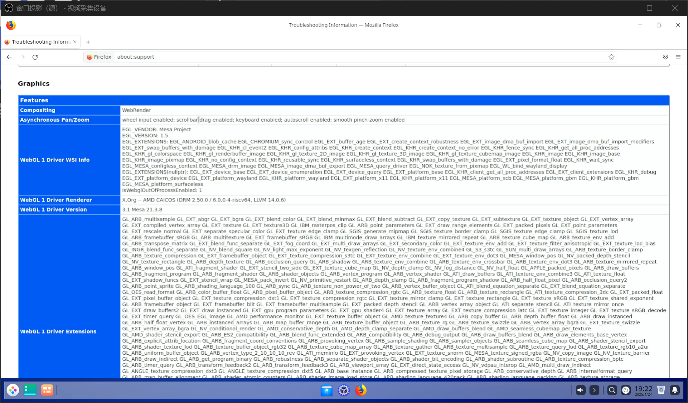

Playback of Bilibili videos (360P 24FPS AV1) saw severe lags under software decoding:

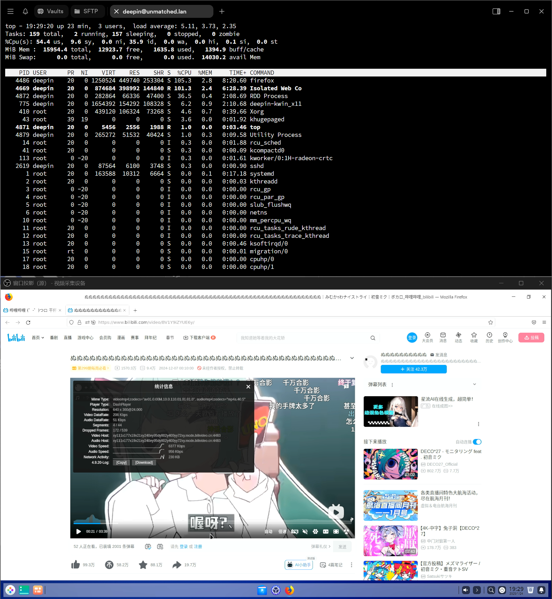

Performance is better under H264, though browser experiences are still painfully sluggish with a load average above 5:

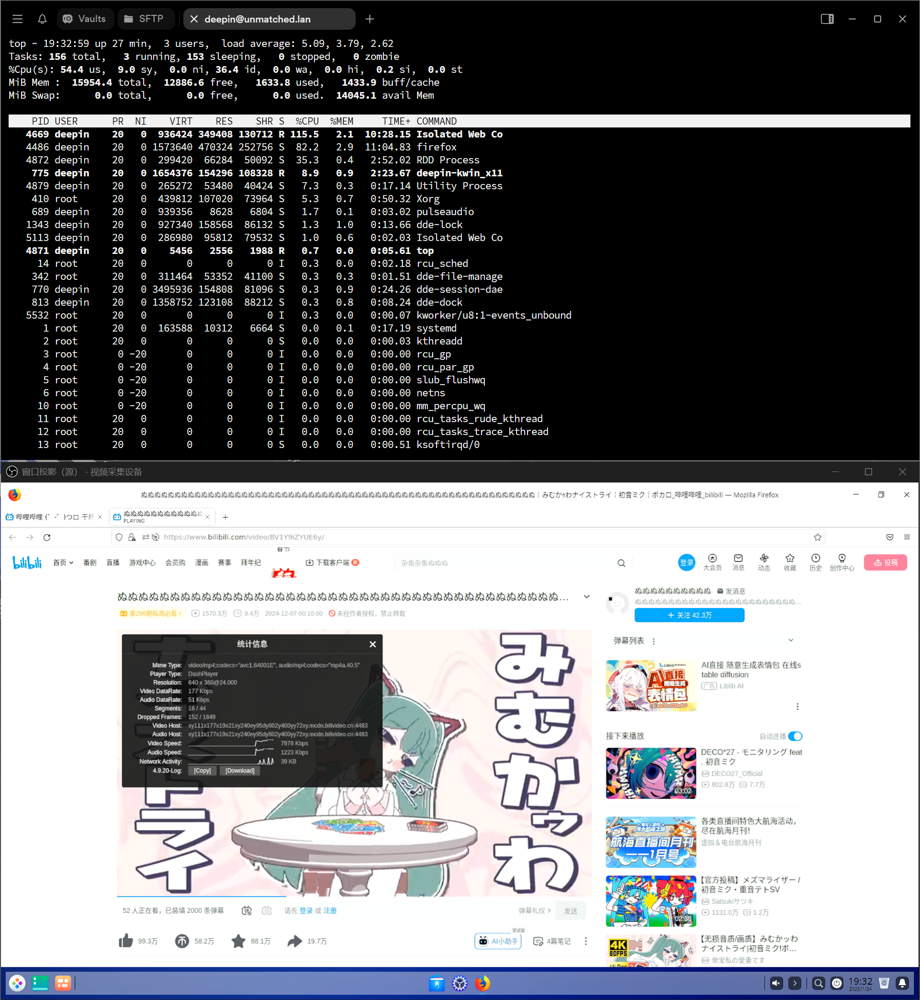

Speedometer 3.0 scores 0.122 ± 0.0048:

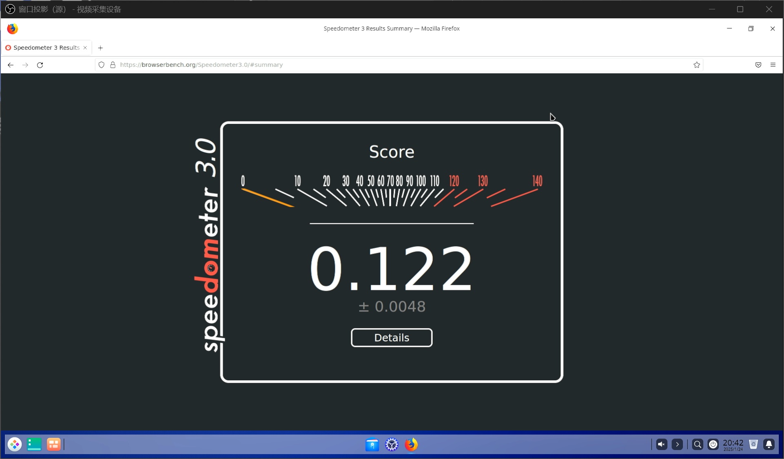

#### Chromium

Legacy version 104 is available in the package repository.

Practically unavailable: All URLs fail to load including `chrome://`.

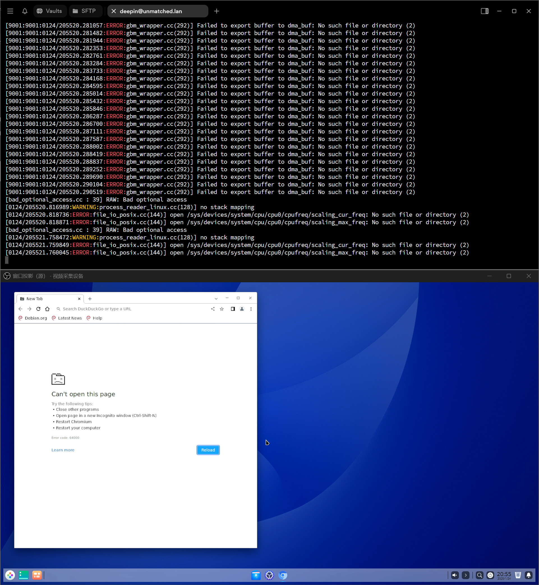

### 视频播放

VLC (`sudo apt install vlc`) fails to install:

```log
Err:1 https://mirror.iscas.ac.cn/deepin-riscv/deepin-stage1 beige/main riscv64 libsdl-image1.2 riscv64 1.2.12-12
  404  Not Found [IP: 210.73.43.1 443]
E: Failed to fetch https://mirror.iscas.ac.cn/deepin-riscv/deepin-stage1/pool/main/s/sdl-image1.2/libsdl-image1.2_1.2.12-12_riscv64.deb  404  Not Found [IP: 210.73.43.1 443]
E: Unable to fetch some archives, maybe run apt-get update or try with --fix-missing?
deepin@deepin-riscv:~$ 
```

mpv is available. It utilised the VA-API hardware codec when playing "Big Buck Bunny" (1080P 60FPS H264) though with noticable frame drops and stutter.

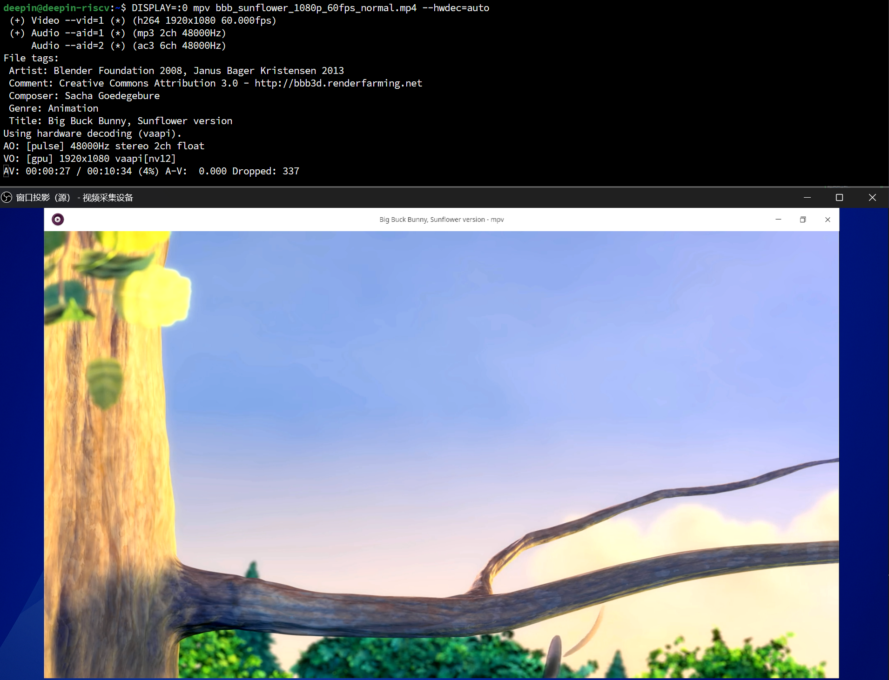

### LibreOffice

Legacy version 7.4.1.2 is available in the package repository.

LibreOffice Writer takes approx. 20s to load, with basic functions intact.

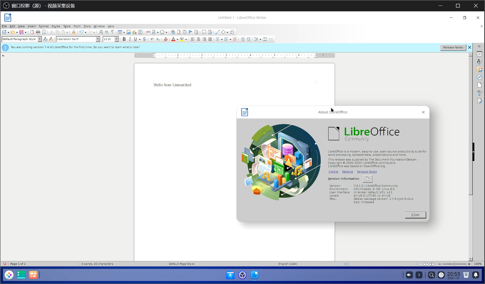

## Test Criteria

Successful: The actual result matches the expected result.

Failed: The actual result does not match the expected result.

## Test Conclusion

Test successful.
