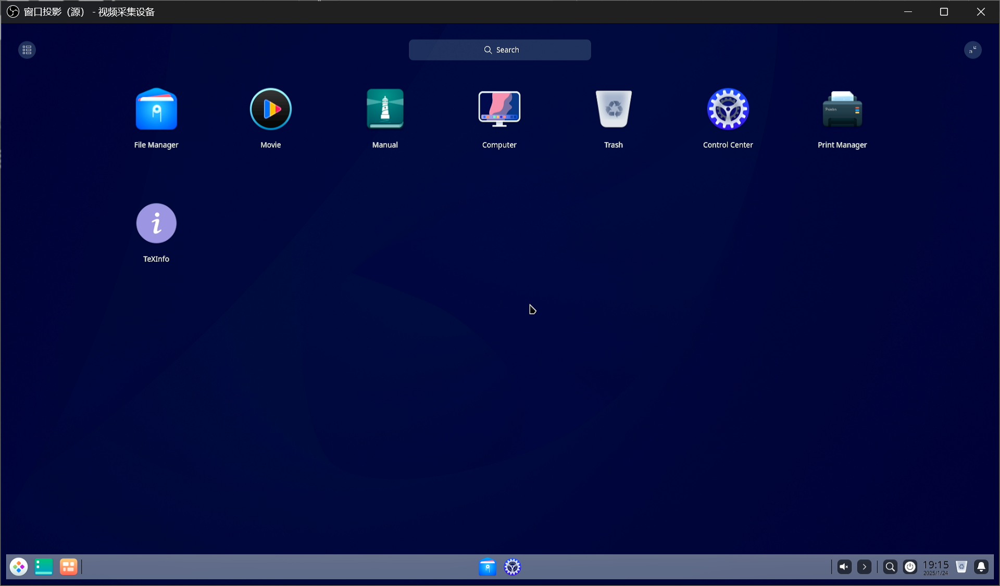
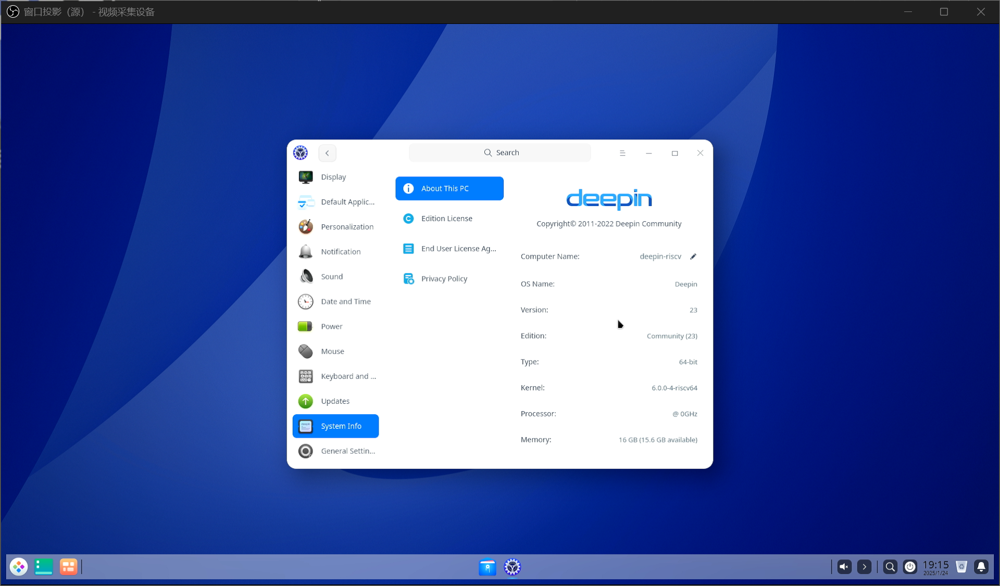
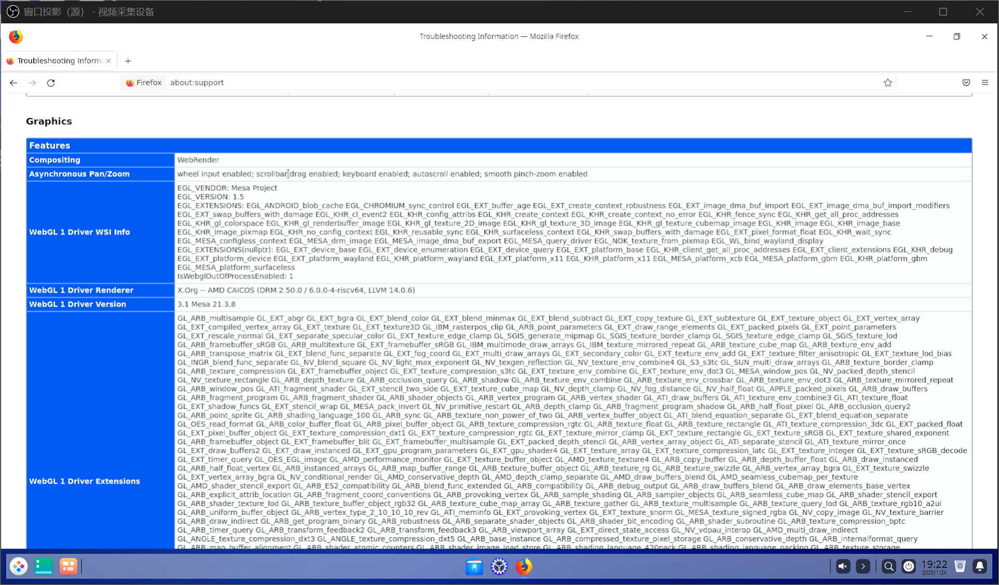
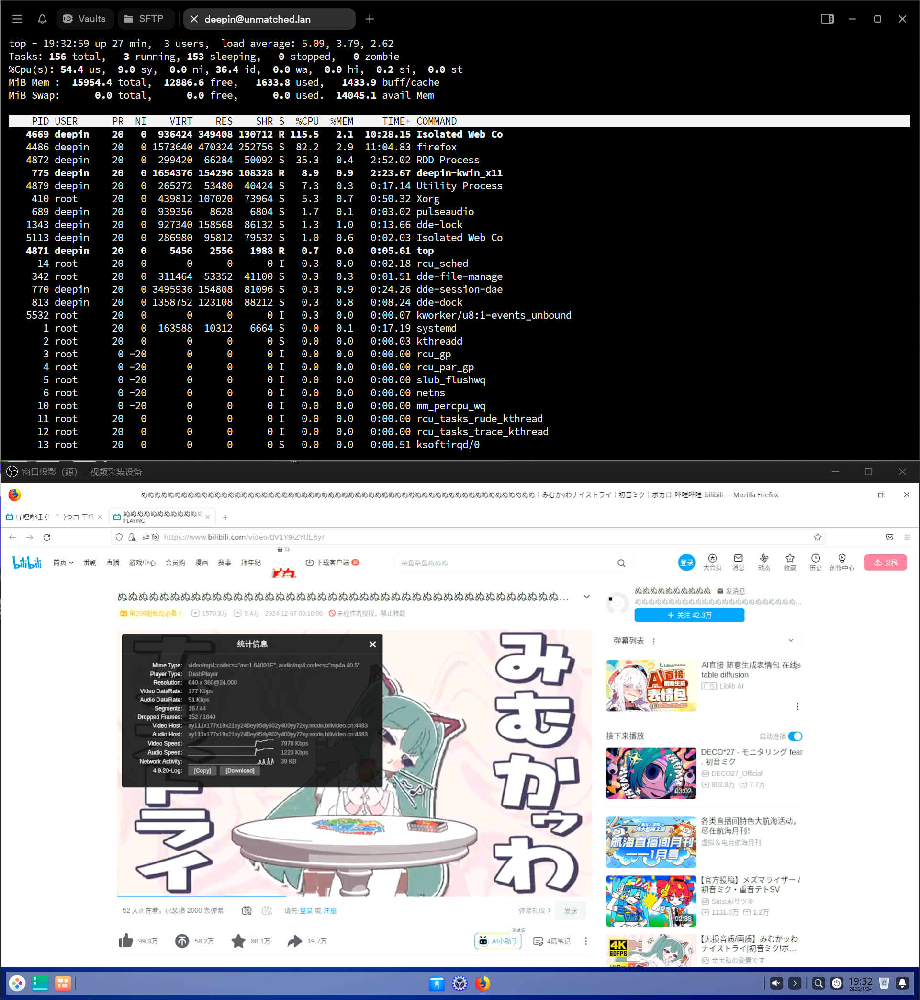
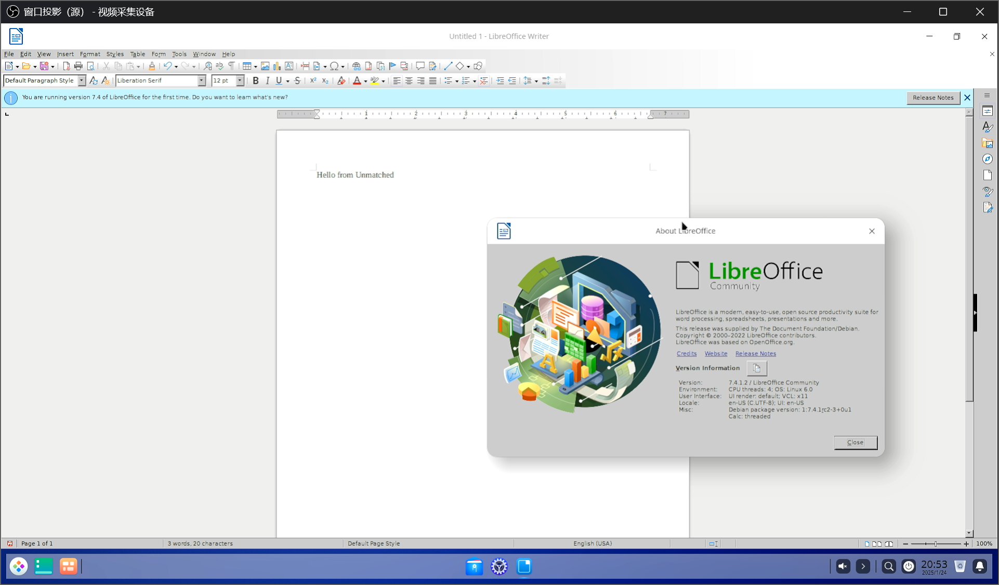

# Deepin HiFive Unmatched 测试报告

## 测试环境

### 系统信息

- 系统版本：Deepin (2022.11.11, 已结束支持)
- 下载链接：https://cdimage.deepin.com/RISC-V/Unmatched-image/deepin-sifive.7z
- 参考安装文档：https://cdimage.deepin.com/RISC-V/Unmatched-image/README.txt

> [!Warning]
> Deepin 已结束对 HiFive Unmatched 的支持。本次版本的最新版本来自 2022.11.11，可能会有潜在安全问题，不建议用于生产环境。

### 硬件信息

- HiFive Unmatched Rev A
- microUSB 线缆一条（随 HiFive Unmatched 附赠）
- ATX 电源一个
- NVMe 硬盘

## 安装步骤

### 刷写镜像

**该镜像并不适用于 SD 卡，需要 NVMe 硬盘**

使用 `7z` 解压镜像。
使用 `dd` 将镜像写入 microSD 卡。

```bash
7z e deepin-sifive.7z
sudo dd if=deepin-sifive.img of=/dev/your/device bs=1M status=progress
```

### 登录系统

通过串口或桌面登录系统。

默认用户名： `root`
默认密码： `Riscv2022#`

默认用户名： `deepin`
默认密码： `deepin`

## 预期结果

系统正常启动，能够通过板载串口和图形界面登录。

## 实际结果

系统正常启动，能够通过板载串口和图形界面登录。

### 启动信息

```log
Verification successful
Linux deepin-riscv 6.0.0-4-riscv64 #1 SMP Debian 6.0.8-1 (2022-11-11) riscv64
Welcome to Deepin 23 GNU/Linux

    * Homepage:https://www.deepin.org/

    * Bugreport:https://bbs.deepin.org/


Last login: Fri Jan 24 19:09:43 2025
deepin@deepin-riscv:~$ cat /etc/os-release 
PRETTY_NAME="Deepin 23"
NAME="Deepin"
VERSION_ID="23"
VERSION="23"
ID=Deepin
HOME_URL="https://www.deepin.org/"
BUG_REPORT_URL="https://bbs.deepin.org"
VERSION_CODENAME=beige
deepin@deepin-riscv:~$ cat /proc/cpuinfo 
processor       : 0
hart            : 1
isa             : rv64imafdc
mmu             : sv39
uarch           : sifive,bullet0

processor       : 1
hart            : 2
isa             : rv64imafdc
mmu             : sv39
uarch           : sifive,bullet0

processor       : 2
hart            : 3
isa             : rv64imafdc
mmu             : sv39
uarch           : sifive,bullet0

processor       : 3
hart            : 4
isa             : rv64imafdc
mmu             : sv39
uarch           : sifive,bullet0

deepin@deepin-riscv:~$ uname -a
Linux deepin-riscv 6.0.0-4-riscv64 #1 SMP Debian 6.0.8-1 (2022-11-11) riscv64 GNU/Linux
deepin@deepin-riscv:~$ 
```







### 浏览器

#### Firefox

系统未预装，软件源内版本为 105，版本较旧。

WebRender GPU 加速已启用：



B 站视频 360P 24FPS AV1 软解播放非常卡顿


切换至 H264 后稍有缓解，但浏览器体验依然非常卡顿，系统负载 > 5



Speedometer 3.0 得分：0.122 ± 0.0048


#### Chromium

系统未预装，软件源内版本为 104，版本较旧。

Chromium 浏览器实际上不可用：包括 `chrome://` 开头的浏览器内部地址在内，任何网址都无法打开。


### 视频播放

尝试安装 VLC (`sudo apt install vlc`) 失败：

```log
Err:1 https://mirror.iscas.ac.cn/deepin-riscv/deepin-stage1 beige/main riscv64 libsdl-image1.2 riscv64 1.2.12-12
  404  Not Found [IP: 210.73.43.1 443]
E: Failed to fetch https://mirror.iscas.ac.cn/deepin-riscv/deepin-stage1/pool/main/s/sdl-image1.2/libsdl-image1.2_1.2.12-12_riscv64.deb  404  Not Found [IP: 210.73.43.1 443]
E: Unable to fetch some archives, maybe run apt-get update or try with --fix-missing?
deepin@deepin-riscv:~$ 
```

尝试安装 mpv 成功，播放 Big Buck Bunny 1080P 60FPS H264 片源，VA-API 硬件解码被 mpv 调用，但仍然较为卡顿，有丢帧情况。


### LibreOffice

从软件源内安装：`sudo apt install -y libreoffice`

版本号 7.4.1.2，版本较旧。

以 LibreOffice Writer 为例：启动耗时约 20s，启动较快。



基础功能正常。

## 测试判定标准

测试成功：实际结果与预期结果相符。

测试失败：实际结果与预期结果不符。

## 测试结论

测试成功。