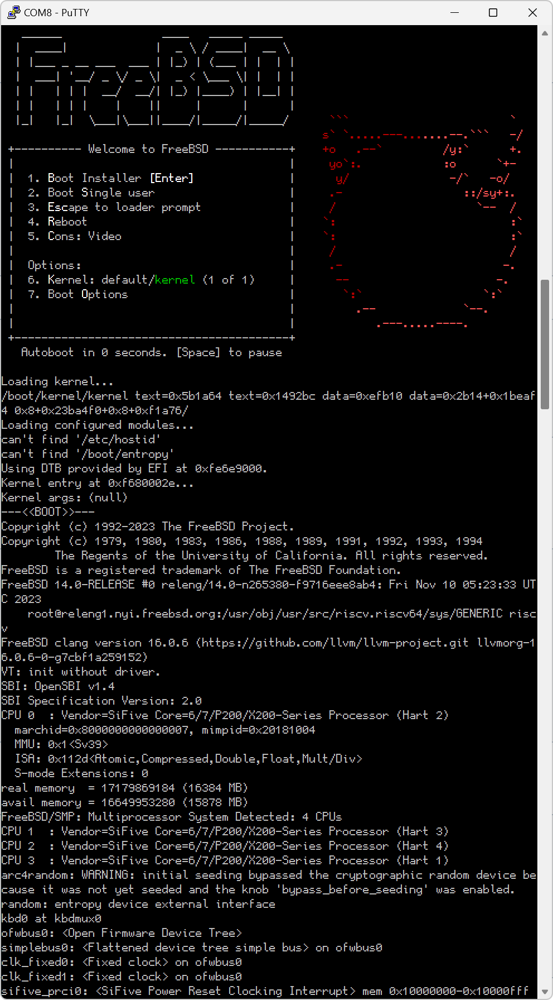
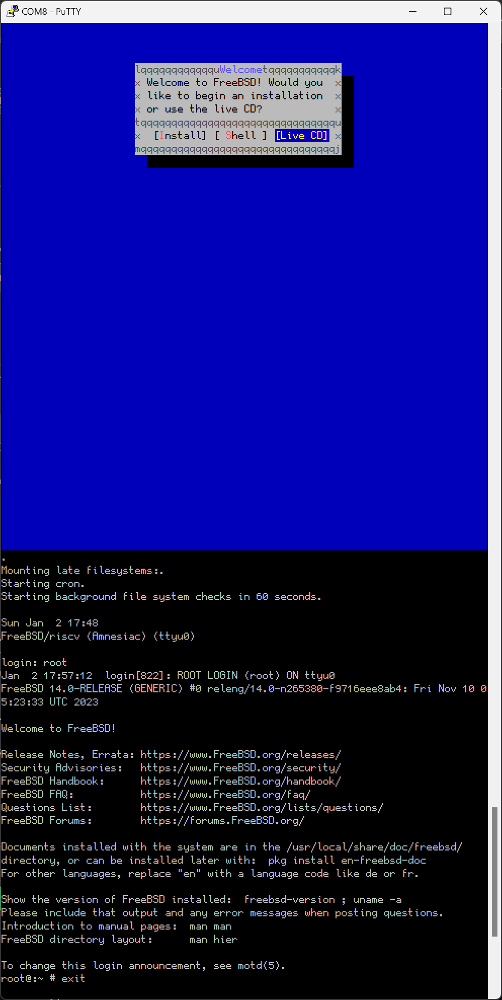

# FreeBSD 14.0 HiFive Unmatched Test Report

## Test Environment

### Operating System Information

- System Version: FreeBSD 14.0
- Download Link (USTC Mirror): https://mirrors.ustc.edu.cn/freebsd/releases/riscv/riscv64/ISO-IMAGES/14.0/FreeBSD-14.0-RELEASE-riscv-riscv64-mini-memstick.img.xz
- Reference Installation Document: https://wiki.freebsd.org/riscv/HiFiveUnmatched

### Hardware Information

- HiFive Unmatched Rev A
- A microUSB Cable (Included with HiFive Unmatched)
- An ATX Power Supply
- A microSD Card (Sandisk Extreme Pro 64G UHS-I), pre-flashed with Freedom U SDK
- A USB Drive (Lexar S25 32G)

## Installation Steps

### Boot Device Selection

Ensure the dip switch is set to boot from the microSD card. If you haven't changed it, the factory default is to boot from the microSD card.

The dip switch should be set as follows: `MSEL[3:0]=1011`

### Flashing Freedom U SDK

Download the demo-coreip-cli-unmatched.rootfs.wic.xz image from [here](https://github.com/sifive/freedom-u-sdk/releases/latest).

Uncompress and flash the image to the microSD card. Here, `/dev/sdc` is the location of the microSD card.

```bash
xz -dk demo-coreip-cli-unmatched.rootfs.wic.xz
sudo dd if=demo-coreip-cli-unmatched.rootfs.wic of=/dev/sdc status=progress
```

### Flashing the Installation Image to the USB Drive

Uncompress the image and use the `dd` command to flash the image to the microSD card.

```bash
xz -dk FreeBSD-14.0-RELEASE-riscv-riscv64-mini-memstick.img.xz
sudo dd if=FreeBSD-14.0-RELEASE-riscv-riscv64-mini-memstick.img of=/dev/sdc status=progress
```

### Logging into the System

Logging into the system via the onboard serial port (using the microUSB cable to connect to another computer).

## Expected Results

The system should boot normally and allow login via the onboard serial port.

## Actual Results

The system booted normally and login via the onboard serial port was successful.

### Boot Log





## Test Criteria

Successful: The actual result matches the expected result.

Failed: The actual result does not match the expected result.

## Test Conclusion

Test successful.
