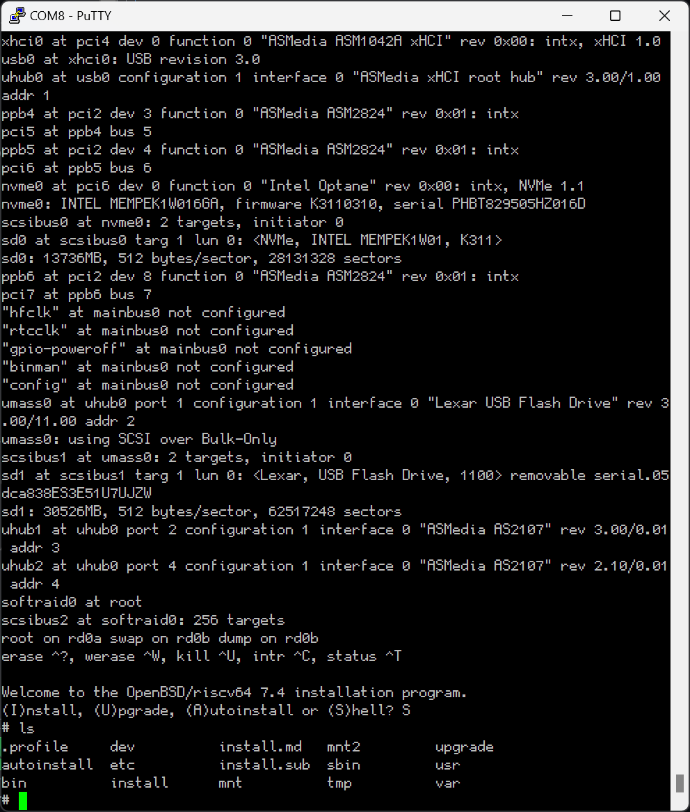

# OpenBSD 7.4 HiFive Unmatched Test Report

## Test Environment

### Operating System Information

- System Version: OpenBSD 7.4
- Download Link (USTC Mirror): https://mirrors.tuna.tsinghua.edu.cn/OpenBSD/7.4/riscv64/install74.img
- Reference Installation Document: https://wiki.freebsd.org/riscv/HiFiveUnmatched

### Hardware Information

- HiFive Unmatched Rev A
- A microUSB cable (included with HiFive Unmatched)
- An ATX power supply
- A microSD card (Sandisk Extreme Pro 64G UHS-I) pre-flashed with Freedom U SDK
- A USB drive (Lexar S25 32G)

## Installation Steps

### Boot Device Selection

Ensure the DIP switches are set to boot from the microSD card. The factory default is to boot from the microSD card if unchanged.

The DIP switch settings should be: `MSEL[3:0]=1011`

### Flashing Freedom U SDK

Download the demo-coreip-cli-unmatched.rootfs.wic.xz image from [here](https://github.com/sifive/freedom-u-sdk/releases/latest).

Decompress and flash the image to the microSD card. Replace `/dev/sdc` with the location of your microSD card.

```bash
xz -dk demo-coreip-cli-unmatched.rootfs.wic.xz
sudo dd if=demo-coreip-cli-unmatched.rootfs.wic of=/dev/sdc status=progress
```

### Flashing Installation Image to USB Drive

Use the `dd` command to flash the image to the USB drive.

```bash
sudo dd if=install74.img of=/dev/sdc status=progress
```

### Logging into the System

Logging into the system via the onboard serial port using the microUSB cable connected to another computer.

## Expected Results

The system should boot normally and allow login via the onboard serial port.

## Actual Results

The system booted successfully and login via the onboard serial port was also successful.

### Boot Log



## Test Criteria

Successful: The actual result matches the expected result.

Failed: The actual result does not match the expected result.

## Test Conclusion

Test successful.
