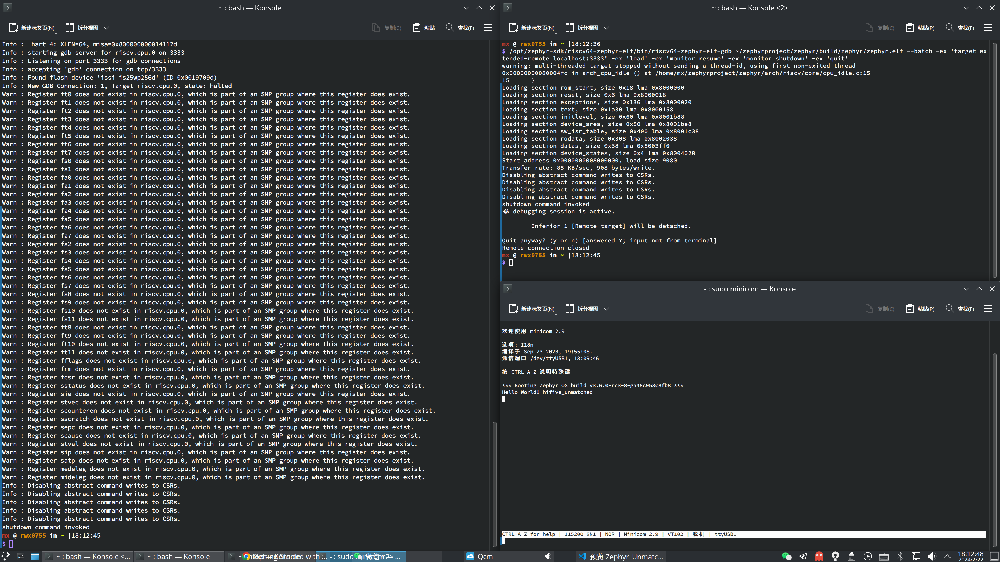

# Zephyr HiFive Unmatched Test Report

## Test Environment

### Operating System Information

- Host: Arch Linux
- Board: Zephyr RTOS
- Reference Installation Document: https://docs.zephyrproject.org/latest/boards/riscv/index.html

### Hardware Information

- HiFive Unmatched Rev A
- A microUSB cable (included with the HiFive Unmatched)
- An ATX power supply

> If you are not using Arch but another distribution, please refer to the Zephyr [official documentation](https://docs.zephyrproject.org/latest/develop/getting_started/index.html) for setting up the environment.

## Installation Steps

### Installing Dependencies

You need to have `paru` or `yay` (AUR Helpers) installed.

```bash
# yay -S python-west zephyr-sdk openocd
paru -S python-west zephyr-sdk openocd pyocd
```

### Compiling Sample Program

```bash
cp /usr/share/zephyr-sdk/zephyrrc ~/.zephyrrc
# Please pay attention to your SDK path
sudo cp /opt/zephyr-sdk/sysroots/x86_64-pokysdk-linux/usr/share/openocd/contrib/60-openocd.rules /etc/udev/rules.d/
sudo udevadm control --reload
python3 -m venv ~/zephyrproject/.venv
pip config set global.index-url https://pypi.tuna.tsinghua.edu.cn/simple
source ~/zephyrproject/.venv/bin/activate
west init ~/zephyrproject/
cd ~/zephyrproject/
west update
west zephyr-export
pip install -r ~/zephyrproject/zephyr/scripts/requirements.txt
west build -p always -b hifive_unmatched samples/hello_world
```

### Running Sample Program

Connect the microUSB cable to the Host PC and power on the HiFive Unmatched.

Open a new terminal and use tools like minicom/screen to open the serial port:

```bash
sudo minicom -D /dev/ttyUSB1 -b 115200
```

> Inserting a microSD card is not necessary. If a microSD card is inserted, press any key to interrupt the boot process after entering U-Boot.

Open a new terminal and start `openocd`:

```bash
openocd -c 'bindto 0.0.0.0' \
        -f ~/zephyrproject/zephyr/boards/riscv/hifive_unmatched/support/openocd_hifive_unmatched.cfg
```

Open another new terminal and perform remote debugging with `gdb`:

```bash
# Please pay attention to your SDK path
/opt/zephyr-sdk/riscv64-zephyr-elf/bin/riscv64-zephyr-elf-gdb ~/zephyrproject/zephyr/build/zephyr/zephyr.elf \
--batch -ex 'target extended-remote localhost:3333' \
-ex 'load' -ex 'monitor resume' -ex 'monitor shutdown' -ex 'quit'
```

## Expected Results

The system boots up normally and prints the Hello World message.

## Actual Results

The system booted up normally and printed the Hello World message.

### Boot Log

```log
*** Booting Zephyr OS build v3.6.0-rc3-8-ga48c958c8fb8 ***
Hello World! hifive_unmatched
```



## Reference Installation Document / Credits

- [Zephyr on HiFive Unmatched](https://github.com/KevinMX/PLCT-Tarsier-Works/blob/main/misc/month10/Zephyr_Unmatched.md)
- [SiFive HiFive Unmatched - Zephyr Project](https://docs.zephyrproject.org/latest/boards/riscv/hifive_unmatched/doc/index.html)
- [Getting Started Guide - Zephyr Project Documentation](https://docs.zephyrproject.org/latest/develop/getting_started/index.html)
- [Getting Started with Zephyr RTOS v1.13.0 On RISC-V - SiFive Blog](https://www.sifive.cn/blog/getting-started-with-zephyr-rtos-v1.13.0-on-risc-v)

## Test Criteria

Successful: The actual result matches the expected result.

Failed: The actual result does not match the expected result.

## Test Conclusion

Test successful.
