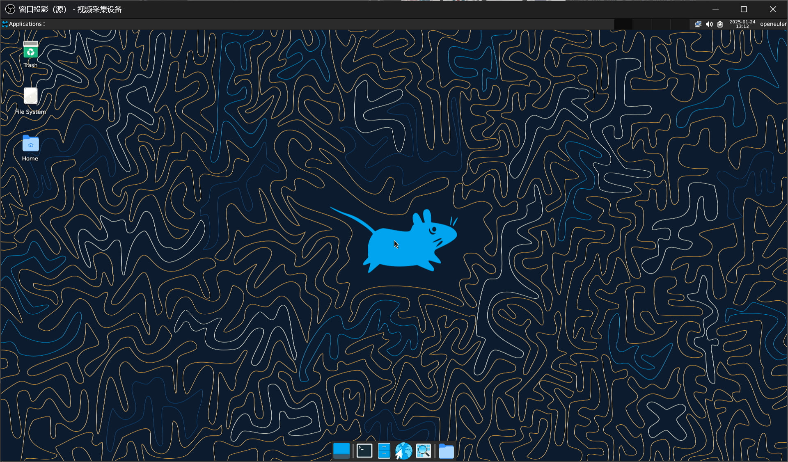

# openEuler RISC-V 24.09 HiFive Unmatched Test Report

## Test Environment

### Operating System Information

- System Version: openEuler 24.09 testing, 20241105 (Xfce)
- Download Link: https://mirror.iscas.ac.cn/openeuler-sig-riscv/openEuler-RISC-V/testing/20241105/v0.1/Unmatched/
- Reference Installation Document: https://mirror.iscas.ac.cn/openeuler-sig-riscv/openEuler-RISC-V/testing/20241105/v0.1/Unmatched/README.Unmatched.txt

> [!NOTE]
> This is not an official release image, but one of the CI/dev version images by openEuler RISC-V SIG we found directly on their server, which is NOT listed on oERV SIG's [image download website](https://images.oerv.ac.cn/).
> oERV SIG is working on a newer release, while this is the last known bootable image on a real Unmatched board so far as we've tested.
> More information [here](https://github.com/ruyisdk/support-matrix/issues/228#issuecomment-2785789283).

### Hardware Information

- HiFive Unmatched Rev A
- A microUSB cable (included with HiFive Unmatched)
- An ATX power supply
- A microSD card (Sandisk Extreme Pro 64G UHS-I)

The following are for users expecting a desktop experience:
- A PCIe video card
- USB Keyboard & Mouse
- HDMI Display / Capture Card & Cable
- M.2 NVMe SSD (Optional, follow the installation document)

## Installation Steps

### Boot Device Selection

Ensure the dip switch is set to boot from the microSD card. If not changed, the factory default is to boot from the microSD card.

The dip switch should be set as follows: `MSEL[3:0]=1011`

### Use `dd` to Flash the Image to the microSD Card

```shell
wget https://mirror.iscas.ac.cn/openeuler-sig-riscv/openEuler-RISC-V/testing/20241105/v0.1/Unmatched/openEuler-24.09-V1-xfce-unmatched-testing.img.zst
zstd -T0 -dkv openEuler-24.09-V1-xfce-unmatched-testing.img.zst
sudo dd if=openEuler-24.09-V1-xfce-unmatched-testing.img of=/dev/sdX bs=1M status=progress; sync
```

### Notes

See the installation document for instructions on booting with SSD. If U-Boot is flashed into the onboard SPI Flash, microSD-free boot setups could be achieved by editing the drive configurations in `extlinux.conf`.

Remember to toggle the DIP switch (boot mode) accordingly.

Refer to the U-Boot official documentation for flashing instructions: https://docs.u-boot.org/en/latest/board/sifive/unmatched.html

### Logging into the System

Log into the system via the onboard serial port (using the microUSB cable connected to another computer).

Default username: `openeuler` or `root`
Default password: `openEuler12#$`

## Expected Results

The system should boot normally and allow login through the onboard serial port.

## Actual Results

The system booted successfully and login through the onboard serial port was successful.

### Boot Log

```log
Welcome to 6.6.0-41.0.0.51.oe2409.riscv64

System information as of time:  Fri Jan 24 09:09:15 PM CST 2025

System load:    2.36
Memory used:    2.5%
Swap used:      0.0%
Usage On:       22%
IP address:     10.0.0.120
Users online:   2
To run a command as administrator(user "root"),use "sudo <command>".
[openeuler@openeuler-riscv64 ~]$
```



See https://github.com/QA-Team-lo/oscompare/blob/main/openEuler/Unmatched/README.md for our report on its desktop experience.

## Test Criteria

Successful: The actual result matches the expected result.

Failed: The actual result does not match the expected result.

## Test Conclusion

Test successful.
