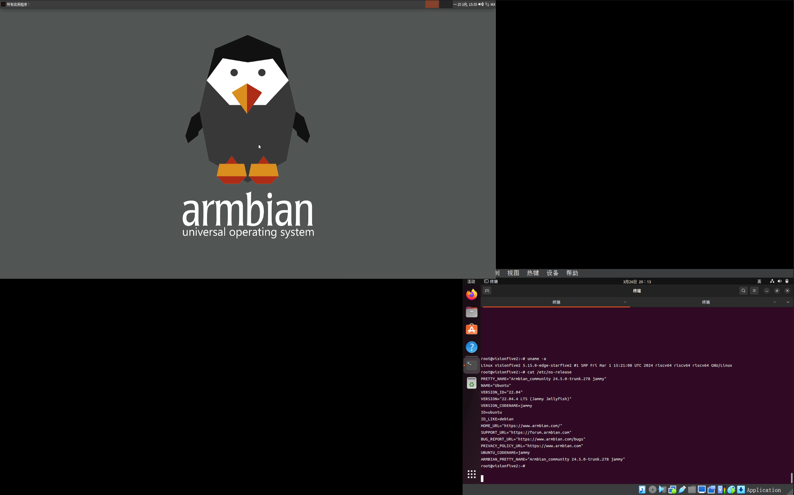

# Armbian VisionFive 2 Test Report

## Test Environment

### Operating System Information

- System Version: Armbian Noble Minimal & Armbian Jammy Xfce
- Download Link: https://www.armbian.com/visionfive2/
- Reference Installation Documentation: https://www.armbian.com/visionfive2/

### Hardware Information

- StarFive VisionFive 2
- A USB Power Adapter
- A USB-A to C or USB-C to C Cable
- A microSD Card
- A USB to UART Debugger (e.g., CH340, CH341, FT2232, etc.)
- Three Dupont Cables
- Optional: Monitor/Capture Card & HDMI Cable (for testing the Jammy version with Xfce desktop)

## Installation Steps

### Decompress and Flash Image to microSD Card

Assume `/dev/sdc` is the storage card.

```bash
wipefs -af /dev/sdc
# Jammy Xfce
xzcat Armbian_community_24.5.0-trunk.278_Visionfive2_jammy_edge_5.15.0_xfce_desktop.img.xz | sudo dd of=/dev/sdc iflag=fullblock status=progress bs=4M
# Edge minimal
xzcat Armbian_community_24.5.0-trunk.278_Visionfive2_noble_edge_5.15.0_minimal.img.xz | sudo dd of=/dev/sdc iflag=fullblock status=progress bs=4M
```

### Boot Mode Selection

StarFive VisionFive 2 provides multiple boot modes, which can be configured via onboard dip switches before powering on; the board itself is also silk-screened for reference.

To boot the Armbian image, select the 1-bit QSPI Nor Flash mode (`RGPIO_0 = 0`, `RGPIO_1 = 0`). Note that this mode may require you to update the firmware in the Flash beforehand. If the boot fails, please refer to the official documentation for firmware upgrades: [Updating SPL and U-Boot](https://doc.rvspace.org/VisionFive2/Quick_Start_Guide/VisionFive2_QSG/spl_u_boot_0.html)

### Logging into the System

Log into the system via the serial port.

Upon startup, the system will prompt the user to configure the username, password, timezone, language, etc.

For the Xfce version, configuration completion is required before entering the desktop.

Configuration can be done through the serial port. If a keyboard and monitor are connected, configuration can also be done via the keyboard.

## Expected Results

The system boots normally and allows login through the graphical interface or serial port.

## Actual Results

Both the Xfce and Minimal versions of the system booted normally, and logins via the graphical interface or serial port were successful.

### Boot Log

```log
root@visionfive2:~# uname -a
Linux visionfive2 5.15.0-edge-starfive2 #1 SMP Fri Mar 1 15:21:08 UTC 2024 riscv64 riscv64 riscv64 GNU/Linux
root@visionfive2:~# cat /etc/os-release 
PRETTY_NAME="Armbian_community 24.5.0-trunk.278 noble"
NAME="Ubuntu"
VERSION_ID="24.04"
VERSION="24.04 (Noble Numbat)"
VERSION_CODENAME=noble
ID=ubuntu
ID_LIKE=debian
HOME_URL="https://github.com/armbian/build"
SUPPORT_URL="https://community.armbian.com/"
BUG_REPORT_URL="https://github.com/armbian/community/issues"
PRIVACY_POLICY_URL="https://duckduckgo.com/"
UBUNTU_CODENAME=noble
LOGO="armbian-logo"
ARMBIAN_PRETTY_NAME="Armbian_community 24.5.0-trunk.278 noble"
root@visionfive2:~# 
```

Xfce version screen recording (from flashing image to system login):

[](https://asciinema.org/a/pCI6icBzsw2UrqNN5kL20LUxH)

Xfce screenshot:



Screen recording:

https://github.com/ruyisdk/support-matrix/assets/17025286/14c27bbd-5477-426b-a3e4-85cca5f5eabd

Minimal version screen recording (from flashing image to system login):

[](https://asciinema.org/a/kLOG9FnxGs9AnXpZqpjDJeiNo)

## Test Criteria

Successful: The actual result matches the expected result.

Failed: The actual result does not match the expected result.

## Test Conclusion

Test successful.

