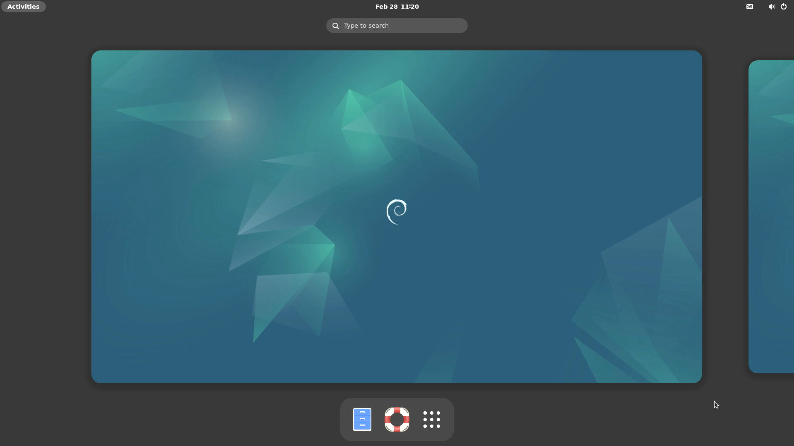

# Debian VisionFive 2 Test Report

## Test Environment

### Operating System Information

- System Version: Debian bookworm (starfive-jh7110-202403-SD-minimal-desktop-wayland.img.bz2)
- Download Link: https://debian.starfivetech.com/
- Reference Installation Document: https://doc.rvspace.org/VisionFive2/Quick_Start_Guide/

### Hardware Information

- StarFive VisionFive 2
- A USB power adapter
- A USB-A to C or C to C cable
- A microSD card
- A USB to UART debugger (e.g., CH340, CH341, FT2232, etc.)
- Three Dupont wires

## Installation Steps

### Decompress and Flash Image to microSD Card

Assuming `/dev/sdc` is the storage card.

```bash
bzip2 -dk starfive-jh7110-202409-SD-minimal-desktop-wayland.img.bz2 
sudo dd if=starfive-jh7110-202409-SD-minimal-desktop-wayland.img of=/dev/sdX bs=1M status=progress
```

### Boot Mode Selection

StarFive VisionFive 2 offers multiple boot modes, configurable via onboard DIP switches before powering on. The board itself also has silk-screen labels.

To boot the original Debian image, select the 1-bit QSPI Nor Flash mode (i.e., `RGPIO_0 = 0`, `RGPIO_1 = 0`). Note that this mode may require updating the firmware in the Flash beforehand. If the boot is unsuccessful, please refer to the official documentation for firmware upgrade details: [Updating SPL and U-Boot](https://doc.rvspace.org/VisionFive2/Quick_Start_Guide/VisionFive2_QSG/spl_u_boot_0.html)

If not updating the firmware, choose the microSD card boot mode (i.e., `RGPIO_0 = 1`, `RGPIO_1 = 0`).

> Note: There is a slight chance that the system may fail to boot in this mode. If boot failure occurs, the serial output might resemble the following:
>
>```log
>dwmci_s: Response Timeout.                                                                                            
>dwmci_s: Response Timeout.                                                                                            
>BOOT fail,Error is 0xffffffff
>```
>
> You can try repowering the development board or pressing the button near the USB Type-C power port. This usually resolves the boot issue.

### Logging into the System

Log into the system via the serial port.

Default username: `user`
Default password: `starfive`

## Expected Results

The system should boot up normally and allow login via the serial port.

## Actual Results

The system booted up successfully, and login via the serial port was successful.

### Boot Log

```log
Debian GNU/Linux trixie/sid starfive ttyS0

starfive login: [   37.039220] mipi_0p9: disabling

starfive login: user
Password: 
Linux starfive 6.6.20-starfive #41SF SMP Fri Sep 20 17:48:26 CST 2024 riscv64

The programs included with the Debian GNU/Linux system are free software;
the exact distribution terms for each program are described in the
individual files in /usr/share/doc/*/copyright.

Debian GNU/Linux comes with ABSOLUTELY NO WARRANTY, to the extent
permitted by applicable law.
user@starfive:~$ uname -a
Linux starfive 6.6.20-starfive #41SF SMP Fri Sep 20 17:48:26 CST 2024 riscv64 GNU/Linux
user@starfive:~$ cat /etc/os-release 
PRETTY_NAME="Debian GNU/Linux trixie/sid"
NAME="Debian GNU/Linux"
VERSION_CODENAME=trixie
ID=debian
HOME_URL="https://www.debian.org/"
SUPPORT_URL="https://www.debian.org/support"
BUG_REPORT_URL="https://bugs.debian.org/"
BUILD_ID=32
BUILD_DATE=T2024-09-23
user@starfive:~$ cat /proc/cpuinfo 
processor       : 0
hart            : 1
isa             : rv64imafdc_zicntr_zicsr_zifencei_zihpm_zba_zbb
mmu             : sv39
uarch           : sifive,u74-mc
mvendorid       : 0x489
marchid         : 0x8000000000000007
mimpid          : 0x4210427

processor       : 1
hart            : 2
isa             : rv64imafdc_zicntr_zicsr_zifencei_zihpm_zba_zbb
mmu             : sv39
uarch           : sifive,u74-mc
mvendorid       : 0x489
marchid         : 0x8000000000000007
mimpid          : 0x4210427

processor       : 2
hart            : 3
isa             : rv64imafdc_zicntr_zicsr_zifencei_zihpm_zba_zbb
mmu             : sv39
uarch           : sifive,u74-mc
mvendorid       : 0x489
marchid         : 0x8000000000000007
mimpid          : 0x4210427

processor       : 3
hart            : 4
isa             : rv64imafdc_zicntr_zicsr_zifencei_zihpm_zba_zbb
mmu             : sv39
uarch           : sifive,u74-mc
mvendorid       : 0x489
marchid         : 0x8000000000000007
mimpid          : 0x4210427

user@starfive:~$ 
```



Screen recording (from flashing the image to system login):

[](https://asciinema.org/a/CCoYSyfdX7TWoiXM8Kct8nTVF)

## Test Criteria

Successful: The actual result matches the expected result.

Failed: The actual result does not match the expected result.

## Test Conclusion

Test successful.
