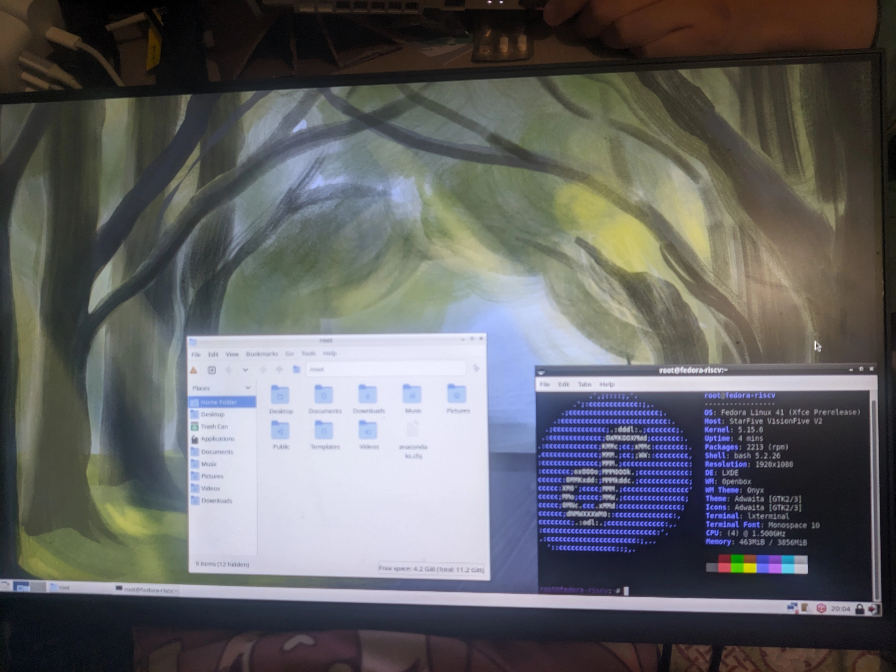

# Fedora VisionFive 2 测试报告

## 测试环境

### 系统信息

- 系统版本：Fedora 41
- 下载链接：https://mirror.iscas.ac.cn/fedora-riscv/dl/StarFive/visionfive2/images/latest/fedora-disk-multi-desktops_starfive_vf2-sda.raw.gz
- 参考安装文档：https://images.fedoravforce.com/how-to-burn-images-to-sd-cards

### 硬件信息

- Starfive VisionFive 2
- 电源适配器
- microSD 卡一张
- microSD 读卡器一个
- USB to UART 调试器一个

## 安装步骤

### 刷写镜像至 SD 卡

下载并解压镜像后，使用 `dd` 将镜像写入 microSD 卡。

```bash
wget https://mirror.iscas.ac.cn/fedora-riscv/dl/StarFive/visionfive2/images/latest/fedora-disk-multi-desktops_starfive_vf2-sda.raw.gz
gzip -d fedora-disk-multi-desktops_starfive_vf2-sda.raw.gz
sudo dd if=fedora-disk-multi-desktops_starfive_vf2-sda.raw of=/dev/your-device bs=4M status=progress
```

### 登录系统

通过串口或图形界面登录系统。

默认用户名： `root`
默认密码： `riscv`

## 预期结果

系统正常启动，能够通过串口或图形界面登录。

## 实际结果

系统正常启动，成功通过串口及图形界面登录。图形界面工作正常。

### 启动信息

镜像内提供的默认桌面环境为 LXDE。



```log
[   47.258002] broken atomic modeset userspace detected, disabling atomic
[   47.616949] starfive-eth-plat 16040000.ethernet: Failed to reset the dma
[   47.623679] starfive-eth-plat 16040000.ethernet end1: stmmac_hw_setup: DMA engine initialization failed
[   47.633130] starfive-eth-plat 16040000.ethernet end1: stmmac_open: Hw setup failed
[   47.780845] starfive-eth-plat 16040000.ethernet end1: PHY [stmmac-1:00] driver [YT8531 Gigabit Ethernet] (irq=POLL)
[   48.265884] starfive-eth-plat 16040000.ethernet end1: Register MEM_TYPE_PAGE_POOL RxQ-0
[   49.276978] starfive-eth-plat 16040000.ethernet: Failed to reset the dma
[   49.283696] starfive-eth-plat 16040000.ethernet end1: stmmac_hw_setup: DMA engine initialization failed
[   49.293154] starfive-eth-plat 16040000.ethernet end1: stmmac_open: Hw setup failed
[   49.323544] starfive-eth-plat 16040000.ethernet end1: PHY [stmmac-1:00] driver [YT8531 Gigabit Ethernet] (irq=POLL)
[   49.334577] starfive-eth-plat 16040000.ethernet end1: Register MEM_TYPE_PAGE_POOL RxQ-0
[   50.347902] starfive-eth-plat 16040000.ethernet: Failed to reset the dma
[   50.354665] starfive-eth-plat 16040000.ethernet end1: stmmac_hw_setup: DMA engine initialization failed
[   50.364205] starfive-eth-plat 16040000.ethernet end1: stmmac_open: Hw setup failed
[   50.389657] starfive-eth-plat 16040000.ethernet end1: PHY [stmmac-1:00] driver [YT8531 Gigabit Ethernet] (irq=POLL)
[   50.400462] starfive-eth-plat 16040000.ethernet end1: Register MEM_TYPE_PAGE_POOL RxQ-0
[   50.856949] dwmac4: Master AXI performs fixed burst length
[   50.862465] starfive-eth-plat 16040000.ethernet end1: No Safety Features support found
[   50.870429] starfive-eth-plat 16040000.ethernet end1: IEEE 1588-2008 Advanced Timestamp supported
[   50.879776] starfive-eth-plat 16040000.ethernet end1: configuring for phy/rgmii-id link mode

Welcome to the Fedora RISC-V disk image
https://openkoji.iscas.ac.cn/koji/

Build date: Fri Jul 12 11:45:54 UTC 2024

Kernel 5.15.0 on an riscv64 (ttyS0)

The root password is 'riscv'.
root password logins are disabled in SSH starting Fedora.

If DNS isn’t working, try editing ‘/etc/yum.repos.d/fedora-riscv.repo’.

For updates and latest information read:
https://fedoraproject.org/wiki/Architectures/RISC-V

Fedora RISC-V
-------------
fedora-riscv login: root
Password: 
[root@fedora-riscv ~]# uname -a
Linux fedora-riscv 5.15.0 #2 SMP Thu Jun 20 02:20:24 EDT 2024 riscv64 GNU/Linux
[root@fedora-riscv ~]# cat /etc/os-release 
NAME="Fedora Linux"
VERSION="41 (Xfce Prerelease)"
ID=fedora
VERSION_ID=41
VERSION_CODENAME=""
PLATFORM_ID="platform:f41"
PRETTY_NAME="Fedora Linux 41 (Xfce Prerelease)"
ANSI_COLOR="0;38;2;60;110;180"
LOGO=fedora-logo-icon
CPE_NAME="cpe:/o:fedoraproject:fedora:41"
DEFAULT_HOSTNAME="fedora"
HOME_URL="https://fedoraproject.org/"
DOCUMENTATION_URL="https://docs.fedoraproject.org/en-US/fedora/rawhide/system-administrators-guide/"
SUPPORT_URL="https://ask.fedoraproject.org/"
BUG_REPORT_URL="https://bugzilla.redhat.com/"
REDHAT_BUGZILLA_PRODUCT="Fedora"
REDHAT_BUGZILLA_PRODUCT_VERSION=rawhide
REDHAT_SUPPORT_PRODUCT="Fedora"
REDHAT_SUPPORT_PRODUCT_VERSION=rawhide
SUPPORT_END=2025-05-13
VARIANT="Xfce"
VARIANT_ID=xfce
[root@fedora-riscv ~]# 
```

## 测试判定标准

测试成功：实际结果与预期结果相符。

测试失败：实际结果与预期结果不符。

## 测试结论

成功
