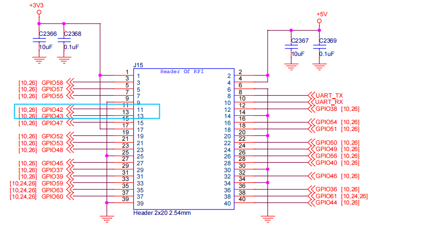

# RT-Thread VisionFive 2 测试报告

## 测试环境

### 系统信息

- Host: Arch Linux
- 参考安装文档：[https://doc.rvspace.org/VisionFive2/Application_Notes/RT-Thread/index.html](https://doc.rvspace.org/VisionFive2/Application_Notes/RT-Thread/index.html)

### 硬件信息

- StarFive VisionFive2
- 电源适配器
- USB to UART 调试器两个（分别用于连接 Linux 和 RT-Thread）

## 安装步骤

### 编译系统

获取工具链：scons

```bash
sudo pacman -Syu scons
# sudo apt-get install scons
```

下载代码：

```bash
git clone https://github.com/starfive-tech/VisionFive2.git
cd VisionFive2
git checkout --track origin/rtthread_AMP
git submodule update --init --recursive
```

初始化仓库：

```bash
cd buildroot && git checkout --track origin/JH7110_VisionFive2_devel && cd ..
cd u-boot && git checkout --track origin/rtthread_AMP && cd ..
cd linux && git checkout --track origin/rtthread_AMP && cd ..
cd opensbi && git checkout rtthread_AMP && cd ..
cd soft_3rdpart && git checkout JH7110_VisionFive2_devel && cd ..
cd rtthread && git checkout rtthread_AMP && cd ..
```

下载工具链：

```bash
wget https://github.com/starfive-tech/rt-thread/blob/rtthread_AMP/toolchain/tool-root1.tar.gz
sudo tar xf rtthread/toolchain/tool-root1.tar.gz -C /opt/
```

请确保环境中安装并启用了 git-lfs！否则会编译错误 (issue #5)[https://github.com/starfive-tech/VisionFive2/issues/5]

编译：
```bash
# scons --menuconfig # 若需配置再运行
make -j($nproc)
```

**注：编译时间较长，保持良好网络连接并耐心等待数小时**

### 运行系统

连接两个调试串口，RTOS 的如图：


> Pin9、Pin11 和 Pin13 组成一个完整的串口：
> Pin9 (GND)
> Pin11 (GPIO42): UART1 RX
> Pin13 (GPIO43): UART1 TX

烧写编译出的 `u-boot-spl.bin.normal.out` 和 `visionfive2_fw_payload.img` 文件。官方教程为烧写到 flash，可以参考[更新 uboot 和 spl](https://doc.rvspace.org/VisionFive2/Quick_Start_Guide/VisionFive2_SDK_QSG/updating_spl_and_u_boot%20-%20vf2.html#updating_spl_and_u_boot-vf2__section_y3j_yp5_yvb)。

也可以烧写到 sd 卡以避免覆盖原有的 boot。但由于 visionfive2_fw_payload.img 超过了 4M 不能直接替换，此种方法还需要构建 rootfs。
以下为烧写到 sd 卡的示例。需要首先准备好 VisionFive2 的 SD 卡镜像。

```bash
make buildroot_rootfs -j$(nproc)
make img
```

接下来将镜像烧录：
```bash
sudo dd if=work/sdcard.img of=/dev/ of=/dev/your-device bs=1M status=progress
sync
```

注意此种方式需要将 boot 选为从 sd 卡启动。

## 预期结果

系统正常启动，成功通过串口登录。

## 实际结果

系统正常启动，成功通过串口登录。

```log
SBI: OpenSBI v1.2
SBI Specification Version: 1.0
heap: [0x6f000000 - 0x70000000]

 \ | /
- RT -     Thread Operating System
 / | \     5.1.0 build Mar 28 2024 14:25:42
 2006 - 2022 Copyright by RT-Thread team
lwIP-2.0.3 initialized!
Hello RISC-V
Hello Starfive RT-Thread! CPU_ID(4)
rpmsg linux test: receive data from linux then send back
rpmsg remote: remote core cpu_id-4
rpmsg remote: shmem_base-0x6e410000 shmem_end-0x6e7fffff
```

## 测试判定标准

测试成功：实际结果与预期结果相符。

测试失败：实际结果与预期结果不符。

## 测试结论

测试成功。
