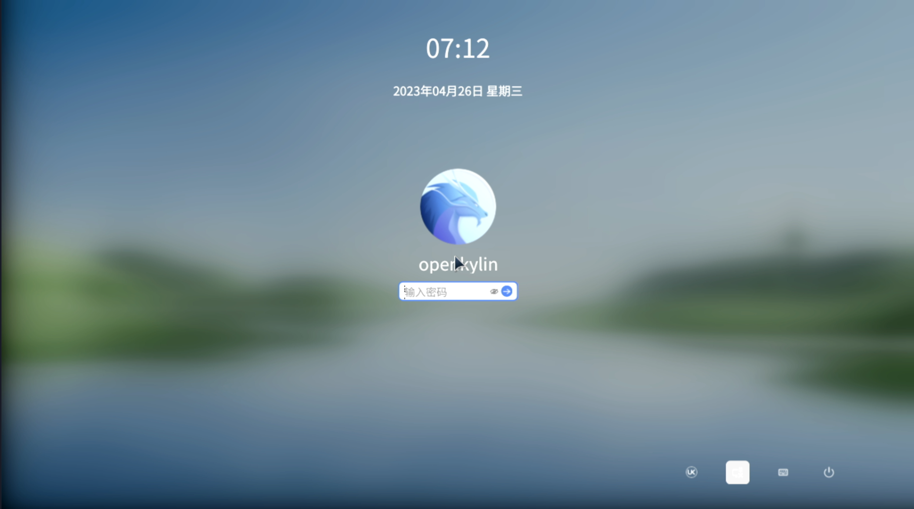

# openKylin 2.0 VisionFive 2 版本测试报告

## 测试环境

### 操作系统信息

- 系统版本：openKylin 2.0 SP1
- 下载链接：https://www.openkylin.top/downloads/index-en.html
- 参考安装文档：https://docs.openkylin.top/zh/01_%E5%AE%89%E8%A3%85%E5%8D%87%E7%BA%A7%E6%8C%87%E5%8D%97/%E5%9C%A8riscv%E4%B8%8A%E5%AE%89%E8%A3%85/%E5%9C%A8VisionFive2%E4%B8%8A%E5%AE%89%E8%A3%85openKylin

### 硬件信息

- StarFive VisionFive 2
- USB 电源适配器一个
- USB-A to C 或 C to C 线缆一条
- microSD 卡一张
- USB to UART 调试器一个（如：CH340, CH341, FT2232 等）
- 杜邦线三根

## 安装步骤

### 解压并刷写镜像到 microSD 卡

假定 `/dev/sdc` 为存储卡。

```bash
xz -d openKylin-Embedded-V2.0-SP1-visionfive2-riscv64.img.xz
sudo dd if=openKylin-Embedded-V2.0-SP1-visionfive2-riscv64.img of=/dev/sdc bs=1M status=progress
```

### 引导模式选择

StarFive VisionFive 2 提供了多种引导模式，可在上电前通过板载拨码开关进行配置；开发板本体上亦有丝印标注。

为了启动 openKylin 镜像，选择 1-bit QSPI Nor Flash 模式（即：`RGPIO_0 = 0`, `RGPIO_1 = 0`）。注意，此模式可能需要提前更新 Flash 内的固件，若启动不成功，请参考官方文档进行固件升级：[更新 SPL 和 U-Boot](https://doc.rvspace.org/VisionFive2/Quick_Start_Guide/VisionFive2_QSG/spl_u_boot_0.html)

### 登录系统

通过串口登录系统。

默认用户名：`openkylin`
默认密码：`openkylin`

## 预期结果

系统正常启动，能够通过图形界面登录。

## 实际结果

系统正常启动，成功通过图形界面登录。

### 启动信息

```log
openKylin 2.0 openkylin ttyS0

openkylin login: openkylin
密码： 
Welcome to openKylin 2.0 (GNU/Linux 6.6.20 riscv64)

 * Support:        https://openkylin.top

The programs included with the openKylin system are free software;
the exact distribution terms for each program are described in the
individual files in /usr/share/doc/*/copyright.

openKylin comes with ABSOLUTELY NO WARRANTY, to the extent permitted by
applicable law.

You do not have any new mail.
load environment: QT_ACCESSIBILITY=1
load environment: PATH=/usr/local/sbin:/usr/local/bin:/usr/sbin:/usr/bin:/sbin:/bin:/usr/games:/usr/local/games:/snap/bin
openkylin@openkylin:~$ uname -a
Linux openkylin 6.6.20 #1 SMP Tue May 28 14:19:33 CST 2024 riscv64 riscv64 riscv64 GNU/Linux
openkylin@openkylin:~$ cat /etc/os-release 
NAME="openKylin"
FULL_NAME="openKylin"
VERSION="2.0 (nile)"
VERSION_US="2.0 (nile)"
ID=openkylin
PRETTY_NAME="openKylin 2.0"
VERSION_ID="2.0"
HOME_URL="https://www.openkylin.top/"
VERSION_CODENAME=nile
PRODUCT_FEATURES=3
openkylin@openkylin:~$ cat /proc/cpuinfo 
processor       : 0
hart            : 3
isa             : rv64imafdc_zicntr_zicsr_zifencei_zihpm_zba_zbb
mmu             : sv39
uarch           : sifive,u74-mc
mvendorid       : 0x489
marchid         : 0x8000000000000007
mimpid          : 0x4210427

processor       : 1
hart            : 1
isa             : rv64imafdc_zicntr_zicsr_zifencei_zihpm_zba_zbb
mmu             : sv39
uarch           : sifive,u74-mc
mvendorid       : 0x489
marchid         : 0x8000000000000007
mimpid          : 0x4210427

processor       : 2
hart            : 2
isa             : rv64imafdc_zicntr_zicsr_zifencei_zihpm_zba_zbb
mmu             : sv39
uarch           : sifive,u74-mc
mvendorid       : 0x489
marchid         : 0x8000000000000007
mimpid          : 0x4210427

processor       : 3
hart            : 4
isa             : rv64imafdc_zicntr_zicsr_zifencei_zihpm_zba_zbb
mmu             : sv39
uarch           : sifive,u74-mc
mvendorid       : 0x489
marchid         : 0x8000000000000007
mimpid          : 0x4210427
```



## 测试判定标准

测试成功：实际结果与预期结果相符。

测试失败：实际结果与预期结果不符。

## 测试结论

测试成功。
