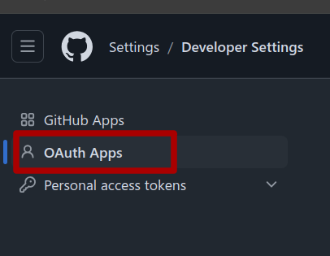
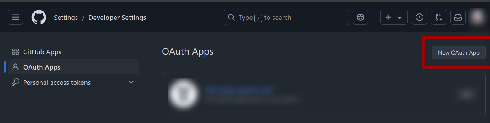
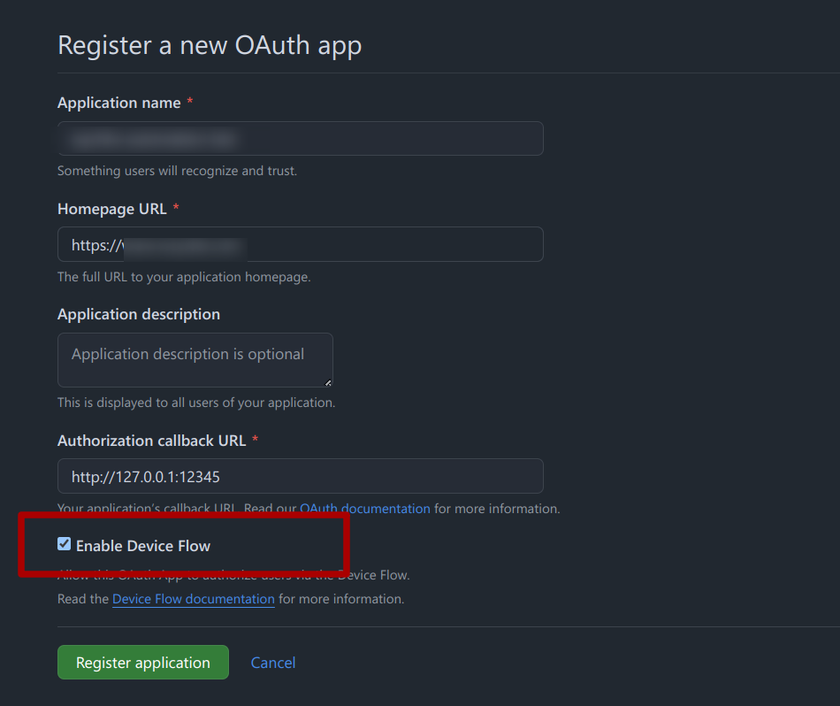
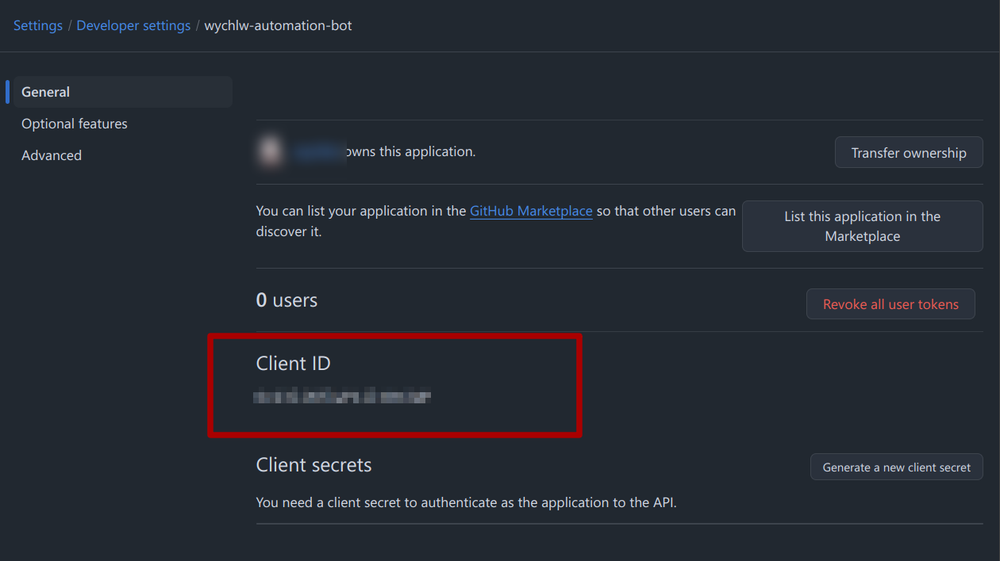

## Ruyi Index Updater

This tool automatically updates the index file for mirrors in the ruyi tool, synchronizing the support matrix with the ruyi index.

### How to Use

You need to set the environment variable `GITHUB_TOKEN`, and this token must have read, write, and PR permissions for the relevant repository. Alternatively, you can enable permissions to allow the tool to fork the repository automatically.

**Note!** Tokens get directly from Github settings are personal tokens, which will be rejected when making PRs to organization repositories. You need to use an OAuth app token. The easiest way to distinguish them is by format: personal tokens start with `ghp`, while OAuth app tokens start with `gho`. 

If want to test only, you can use the `gh` command-line tool to get one. **Be careful not to leak the token, it has all permission of your account if you get it from `gh` tool.**; Create an OAuth app and use it as described below.

By default, the tool operates in a temporary directory, which might involve downloading many mirror files each time. You can set the environment variable `CACHE_DIR` to specify a cache directory, and the tool will store everything there.

The `renew_ruyi_index.py` script encapsulates all operations, and you can run this script directly. The parameters are as follows:
- `-c` or `--config`: Path to the configuration file.
- `-p` or `--path`: Path to the support matrix.
- `-i` or `--index`: Path to the new ruyi index to be uploaded (excluding the `ruyi-index` part). If not specified, a new one will be cloned in the temporary folder.
- `--pr`: Whether to directly submit a PR. If not specified, the PR content will be displayed in the console. **Since the PR includes an identifier to prevent duplicate PRs, please make sure to include this identifier!**

### Plugin Development Guide

#### Structure of an Index File

For images, the structure is as follows:
```
Device as vendor (eg: LicheePi-4A as sipeed-lpi4a)
    |
    |--- Board Variants as board_var (eg: 4g ver as 4g)
    |       |
    |       |--- System Variant as sys (eg: RevyOS as revyos)
    |       |       |
    |       |       |--- File as file (eg: uboot as uboot)
    |       |       |
    |       |       |--- File (eg: boot)
    |       |       |
    |       |       |--- File (eg: root)
    |       |
    |       |--- System Variant (eg: openKylin)
    |               |
    |               |--- File (eg: uboot)
    |               |
    |               |--- File (eg: boot)
    |               |
    |               |--- File (eg: root)
    |
    |--- Board Variants (eg: 8g ver)
            |
            |--- System Variant (eg: RevyOS)
            |       |
            |       |--- File (eg: uboot)
            |       |
            |       |--- File (eg: boot)
            |       |
            |       |--- File (eg: root)
            |
            |--- System Variant (eg: openKylin)
                    |
                    |--- File (eg: uboot)
                    |
                    |--- File (eg: boot)
                    |
                    |--- File (eg: root)
```

The vendor, board_variant, system, and system_variant fields are defined in the metadata of each test report. They respectively represent the board and its type (e.g., Lichee Pi 4A's 8G and 16G versions), as well as the system and system version (e.g., base, xfce images). These four elements uniquely define an image.

The file refers to all the files that need to be flashed into a system. It may be a single large img file or multiple files, possibly requiring some pre-processing. The ruyi package manager organizes these as follows:

```
System Image (eg: lpi4a-8g)
|
|--- Package
|       |
|       |--- File and operation (eg: lpi4a-8g uboot into ram)
|       |
|       |--- File (eg: lpi4a-8g uboot)
|
|--- Package
|       |
|       |--- File and operation (eg: lpi4a-8g boot)
|       |
|       |--- File (eg: lpi4a-8g root)
```

The job of this tool is to convert the above metadata and configuration file information into a ruyi configuration file.

#### General Explanation

##### Synchronization Methods

For an image configuration, the synchronization method must be specified. Currently, the following synchronization methods are supported:

- `doc_only`: Placeholder, used only to remove any unsynchronized indicators.
- `github_release_simple`: Downloads image files from GitHub release (simple version).
- `github_release_std`: Downloads image files from GitHub release (standard version).
- `mirrorsite_getter_simple`: Downloads image files from a mirror source (simple version).
- `mirrorsite_getter_std`: Downloads image files from a mirror source (standard version).

##### Using Configuration Schema Files

This folder contains schema files for configurations. If you use any YAML syntax tool, you can configure it to use `schemas/config.schema.json` to enable auto-completion, validation, and annotations.

###### General Definition

Common data formats:

- `filter`: Filtering conditions.
  - `type`: Matching method, currently supports `regex` and `lambda`.
  - `filter`: Regular expression or Python lambda function.

- `mapper`: Mapping rules.
  - `type`: Mapping method, currently supports `regex` and `lambda`.
  - `mapper`: Format string or Python lambda function.

- `generator`: String generator.
  - *Reuses part of `mapper` definitions.*
  - `mapper`: Format string or Python lambda function.

###### github_release_simple

- `repo`: GitHub repository.
- `release_filter`: Filter to select releases.
- `version_mapper`: Maps metadata versions to semantic versions.
- `asset_filter`: Selects files to use.
- `desc_mapper`: Generates descriptions.

###### mirrorsite_getter_simple

- `url`: Mapper that maps to the mirror URL.
- `file_filter`: Filter to select release files.
- `version_mapper`: Maps metadata versions to semantic versions.
- `asset_filter`: Selects files to use.
- `desc_mapper`: Generates descriptions.

###### .*_std

For std-type tools, the following definitions need to be explained:

files: Mirror files  

fileset: File set  

There is a many-to-many relationship between these two: a fileset contains multiple files, and a file can also exist in multiple filesets.  

fileset:  
- id: Unique, used to reference the fileset. If null, it means it is referenced by all files.  
- perpend: *Optional* Added before the file name; generally left blank unless there is a conflict.  
- append: *Optional* Added after the file name; generally left blank unless there is a conflict.  
- board_variants: Specifies which board variants this fileset can be used for; null means all.  
- desc_mapper: *Optional* Generates a description.  

file:  
- id: *Optional* No special use.  
- fileset: Fill in `array{fileset.id}` to indicate which filesets it belongs to. Null means all.  
- **For the rest, see specific sync configurations.**  
- partition_map: *Default is disk*, see the ruyi tool doc.  

top:  
- board_variants: Specifies which board variants this configuration can be used for; null means all.  
- fileset: array(fileset)  
- files: array(files)  
- strategy: *Default is dd_v1*, see the ruyi tool doc.  
- partition_map: *Default is disk*, see the ruyi tool doc.  
- version_mapper: Maps the version in metadata to a semantic version number.  

Note: The same fields at a more specific level will override those at a higher level. If a field appears at a higher level, it can be omitted at a lower level.  

###### github_release_std  

top:  
- repo: GitHub repository  
- release_filter: A filter used to select releases.  

file:  
- repo: GitHub repository  
- release_filter: A filter used to select releases.  
- asset_filter: Filters out the files you want to use.  
- desc_mapper: Generates a description.  

###### mirrorsite_getter_std  

top:  
- url: Mapper that maps to the mirror URL.  

file:  
- url: Mapper that maps to the mirror URL.  
- file_filter: A filter used to select mirror files.  
- desc_mapper: Generates a description.  

### Plugin Development

Due to the complexity of mirror mapping (a single report might correspond to multiple files or indices) and version numbers that need manual handling, creating plugins for each mirror is currently necessary. In the future, generic plugin development may be considered.

To add a new plugin, simply create a new file in the `ruyi_index_updator/upload_plugin` directory. You can directly import the `prelude` from the current folder for some typing helpers.

A `register` function is mandatory in the file. If it returns `Null`, it indicates that the plugin should not be loaded (you can add logic checks if needed). Otherwise, it should return an instance of `UploadPluginBase`.

## How to Use an OAuth APP

The following explains how to use an OAuth APP and obtain a token.

### Confirm the Type of Account You Want to Use

Due to Github's permission limitation, all permissions are **bound to users** (including organizations). This means you cannot have a token for an organization but only for your user account. Therefore, for the Github account you authorize, make sure it is a user account, not an organization account.

If you do not want to use your main account, feel free to create a new account. Github provides a special exception for bot accounts, which does not violate the one account per person policy:
> User accounts are intended for humans, but you can create accounts to automate activity on GitHub. This type of account is called a machine user. For example, you can create a machine user account to automate continuous integration (CI) workflows.

### Create an OAuth APP

Open your account settings and find Developer settings:


Enter and select OAuth Apps:


Click New OAuth App:


Fill in the information as needed. The Authorization callback URL can be anything, such as `http://127.0.0.1:12345`. **Be sure to check Enable Device Flow**:


Register the APP, get the Client ID:


### Use the OAuth APP

In `src/ruyi_index_updator/github_auth.py` is a separate script that is used to obtain a token. Simply run it and follow the prompts to input the required information.
```python
python assets/src/ruyi_index_updator/github_auth.py
```
