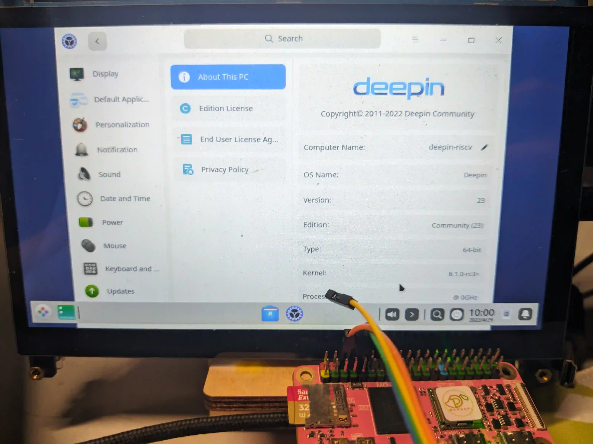

# Deepin MangoPi MQ Pro Test Report

## Test Environment

### System Information

- System Version: Deepin 23 beige 20221209
- Download Link: https://github.com/deepin-community/deepin-riscv-board/releases/download/v20221209/deepin-d1-20221208175445.img.zst.0
- Reference Installation Document: https://github.com/deepin-community/deepin-riscv-board/

### Hardware Information

- MangoPi MQ Pro
- Power Adapter
- A microSD card
- A USB to UART Debugger

## Installation Steps

### Logging into the System

Login to the system via serial port or GUI.

Default username for serial: `root`
Password: `Riscv2022#`

Default username for GUI: `deepin`
Password: `deepin`

## Expected Results

The system should boot successfully, allowing login via the onboard serial console.

## Actual Results

The system boots up successfully, and login via onboard serial port is successful.

Video output works as well, and login via the desktop GUI is also successful (but will take quite a few minutes).

### Boot Log

```log
deepin-riscv login:
deepin-riscv login: root
Password:
Verification successful
Linux deepin-riscv 6.1.0-rc3+ #1 PREEMPT Thu Dec  8 17:52:42 UTC 2022 riscv64
Welcome to Deepin 23 GNU/Linux

    * Homepage:https://www.deepin.org/

    * Bugreport:https://bbs.deepin.org/


Last login: Fri Apr 29 08:30:58 UTC 2022 on ttyS0
root@deepin-riscv:~# �
root@deepin-riscv:~# uname -a
Linux deepin-riscv 6.1.0-rc3+ #1 PREEMPT Thu Dec  8 17:52:42 UTC 2022 riscv64 GNU/Linux
root@deepin-riscv:~# cat /etc/os-release
PRETTY_NAME="Deepin 23"
NAME="Deepin"
VERSION_ID="23"
VERSION="23"
ID=Deepin
HOME_URL="https://www.deepin.org/"
BUG_REPORT_URL="https://bbs.deepin.org"
VERSION_CODENAME=beige
root@deepin-riscv:~# lscpu
Architecture:          riscv64
  Byte Order:          Little Endian
CPU(s):                1
  On-line CPU(s) list: 0
root@deepin-riscv:~# cat /proc/cpuinfo
processor       : 0
hart            : 0
isa             : rv64imafdc
mmu             : sv39
uarch           : thead,c906
mvendorid       : 0x5b7
marchid         : 0x0
mimpid          : 0x0

root@deepin-riscv:~#
```



## Test Criteria

Successful: The actual result matches the expected result.

Failed: The actual result does not match the expected result.

## Test Conclusion

Test successful.
